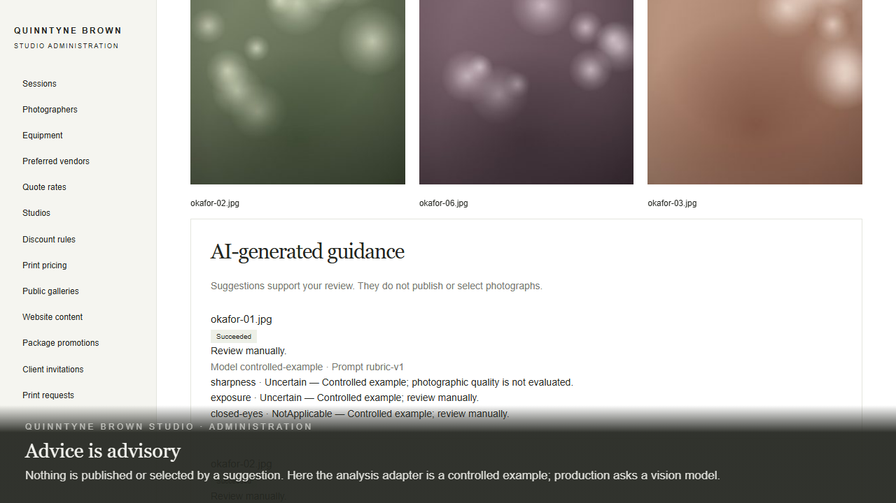
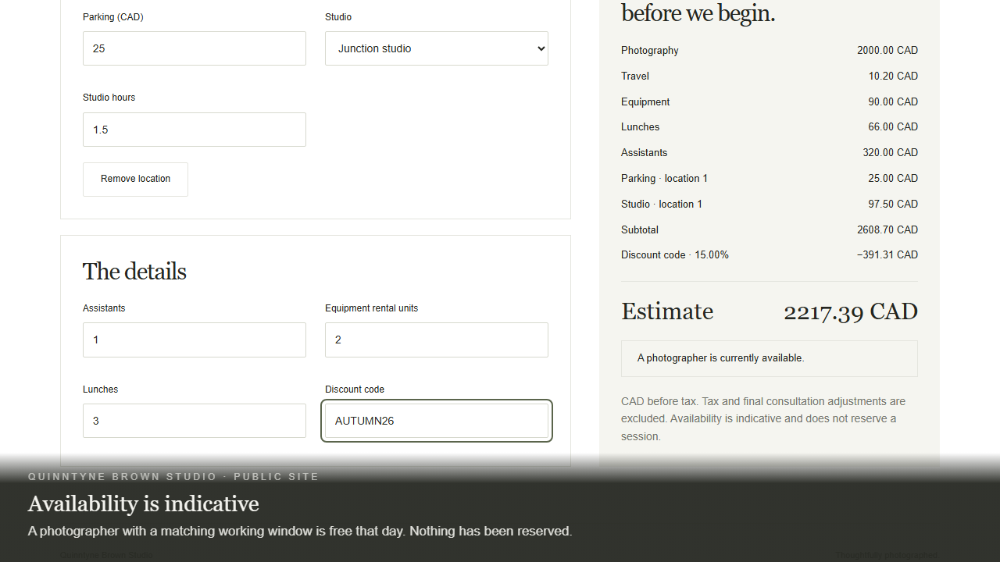
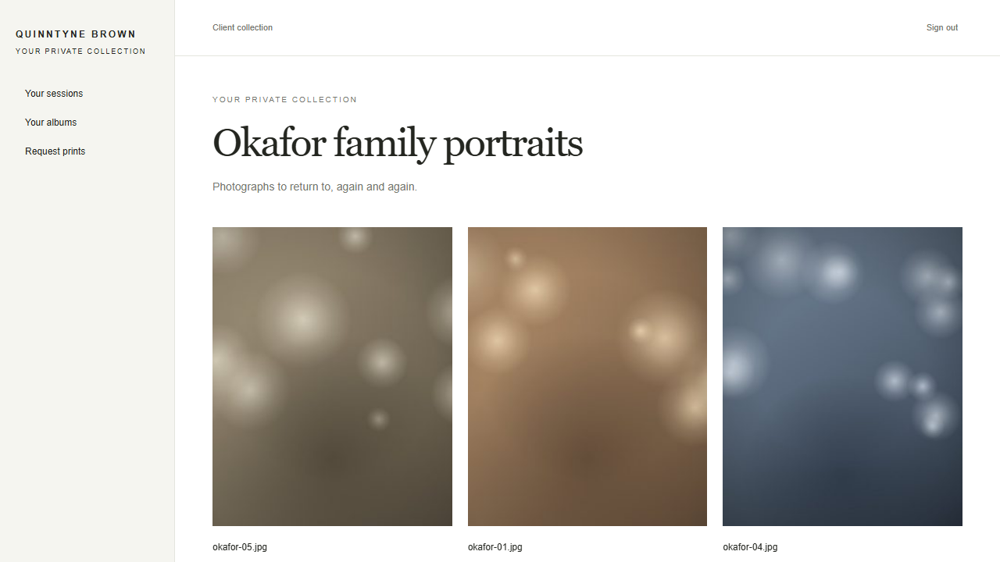

# The demonstrations

Three recordings of the studio platform, made in one sitting against one database, in this order:

| | Recording | Length | Size |
|---|---|---|---|
| 1 | [**Studio administration**](studio-administration.webm) — the admin application | 3 min 54 s | 11.4 MB |
| 2 | [**The public site**](marketing-site.webm) — the marketing application | 1 min 52 s | 6.0 MB |
| 3 | [**The client's collection**](client-delivery.webm) — the client application, then the studio's review | 2 min 03 s | 5.3 MB |

All three are 1280 × 720 WebM. GitHub will not play a video inline, so the links download it; each
plays in Chrome, Edge, Firefox, Safari 16.4+, and in VS Code. Watch them in order: the second and
third show what the first set up.

## What they are

The real applications, driving themselves, in continuous takes.

There is no compositing, no screen capture of somebody clicking, and no second attempt at a scene
that went wrong. Every screen in the recordings was rendered by the packaged Angular applications;
every rule they demonstrate was enforced by the published ASP.NET Core API; every row they show
came out of SQL Server Express LocalDB. The captions are injected into the page as it runs, which
is why they are pinned to the bottom of the frame rather than floating over it.

They are produced by [`e2e/demo/demo.spec.ts`](../../e2e/demo/demo.spec.ts), a Playwright script
that uses the same page objects as the acceptance suite. It asserts as it goes, so a recording
cannot show something that did not happen: the quote's total, the print request's total, the
count of photographs on each screen and every saved confirmation are checked before the caption
that describes them appears. If the product breaks, the recording fails rather than lying.

The three walkthroughs run in order against one freshly migrated database. Administration
configures the studio and invites a client; the public site shows what was published and prices
a wedding from the configured rates; the client accepts that invitation, builds an album, requests
prints, and the studio reviews the request and then revokes her access. The names and figures
typed in one recording and seen in another live in [`demo-data.ts`](../../e2e/demo/demo-data.ts).

## 1 · Studio administration

**[`studio-administration.webm`](studio-administration.webm)** — 3 min 54 s, 11.4 MB.

[](studio-administration.webm)

| | | |
|---|---|---|
| 0:00 | **A demonstration — Studio administration** | What the studio's workspace is for. |
| 0:04 | **One — Signing in** | A provisioned administrator signs in. There is no sign-up form, and the workspace opens on an empty list of sessions. |
| 0:20 | **Two — Pricing** | Four hourly rates and the session expenses; advance, weekday and code discounts of which only the largest applies; a studio saved as a resolved address and made the travel base. |
| 1:06 | **Three — People and time** | A photographer with two working windows in Toronto time, a lighting kit with a reference rental rate, and a make-up artist among the preferred vendors. |
| 1:36 | **Four — A session and its photographs** | A family portrait session whose photographer must be free. Six photographs hashed in the browser, uploaded in blocks and converted by the worker; suggestions requested for two of them and shown as advice, not decisions. |
| 2:38 | **Five — Publishing** | A gallery of four photographs with an explicit order and cover, published on purpose; two print options; a package with its consultation notice; the home page's copy, published as a revision. |
| 3:18 | **Six — Inviting a client** | A client invited by email, the link captured in the development mailbox, and the session assigned to her. |
| 3:49 | **Studio administration — Set up, in one take** | What was set up, and where the other recordings go from here. |

## 2 · The public site

**[`marketing-site.webm`](marketing-site.webm)** — 1 min 52 s, 6.0 MB.

[](marketing-site.webm)

| | | |
|---|---|---|
| 0:00 | **A demonstration — The public site** | What a couple or a family sees. |
| 0:04 | **One — The front page** | The published heading and the published gallery's cover on the front page. |
| 0:19 | **Two — The portfolio** | The portfolio, the four public photographs of the six, and a preview that names the gallery rather than the file. |
| 0:36 | **Three — Services, prints and packages** | Services, the print catalog at the studio's prices, and the package with its consultation notice. |
| 0:56 | **Four — A live quote** | A Saturday wedding next summer at a resolved address: itemised lines, a round-trip travel charge, the automatic advance discount, parking, studio time, assistants, equipment and lunches, then a code that beats the automatic discount, and an availability notice. |
| 1:48 | **The public site — Nothing here was typed twice** | Everything on the site came from administration. |

## 3 · The client's collection

**[`client-delivery.webm`](client-delivery.webm)** — 2 min 03 s, 5.3 MB.

[](client-delivery.webm)

| | | |
|---|---|---|
| 0:00 | **A demonstration — The client's collection** | Amara Okafor was invited by the studio. |
| 0:04 | **One — Accepting the invitation** | The invitation link sets a password once and opens her sessions. |
| 0:19 | **Two — The gallery** | Her gallery holds all six photographs, not the four the public saw. |
| 0:34 | **Three — An album** | An album of three, reordered, saved, and kept in that order. |
| 0:50 | **Four — Requesting prints** | Two photographs chosen for print, priced by the API as the options and quantities change, and submitted with a note. No payment, no fulfilment. |
| 1:19 | **Five — The studio reviews it** | The studio opens the submitted request, sees exactly what she saw, and marks it reviewed. |
| 1:34 | **Six — Access is revocable** | The studio unticks her on the session. Her session list is empty and her album keeps its shape with placeholders. |
| 1:58 | **The client's collection — Access is a decision, at every boundary** | Invitation, assignment, server-priced prints, an immutable review and revocation, in one database. |

## Re-recording them

```powershell
./scripts/record-demo.ps1
```

It publishes the API in Release, migrates a disposable LocalDB database named `QbsDemo_<timestamp>`,
provisions an administrator with a random password, exports the development certificate, starts
the API and the HTTPS gateway on ports 7463 and 7464, and runs
[`e2e/demo.playwright.config.ts`](../../e2e/demo.playwright.config.ts). The recordings and their
poster frames are written straight into this folder; the chapter timings behind the tables above
land in `.artifacts/demo/chapters/`. When it finishes it stops both processes and drops the
database. Pass `-KeepRunning` to leave the recorded studio up for a look, and `-Dotnet` to point at
a .NET 10 SDK that is not the one on `PATH`.

It expects what the rest of the repository expects: the three applications built into
`frontend/dist` (`npm run build:libs` and `npm run build:apps` in `frontend`), `npm ci` and
`npx playwright install chromium` in `e2e`, the `MSSQLLocalDB` instance, and the .NET SDK named in
`global.json`. It never touches `QbsDevelopment` or the smoke run's database and ports.

Roughly ten minutes of wall clock, most of it the recording itself. The pacing lives in
two places: the configuration sets `slowMo` so a viewer can follow each click, and
[`narrate.ts`](../../e2e/demo/narrate.ts) decides how long each caption stays up from how much
there is to read. The photographs are drawn in the browser by
[`photographs.ts`](../../e2e/demo/photographs.ts): gradients, out-of-focus light and a vignette,
so that the real upload, hashing, block transfer and preview conversion have something worth
looking at. Nothing in them is licensed from anybody.

The demonstration is not part of the acceptance suites. It lives outside `e2e/specs`, has its own
configuration, and gates nothing.

## Why WebM

It is what Playwright records, and the ffmpeg that ships with Playwright builds VP8 into WebM and
nothing else. Converting to MP4 would mean adding an encoder to the toolchain for three files.
WebM plays in every current browser and in most editors, so the conversion buys little.

## Three things the recordings found

The address lookup, the AI guidance and the outgoing mail are the development adapters, and the
recordings say so where they appear. The routing adapter answers every lookup with a single
candidate labelled *Controlled example: …*, the analysis adapter recommends manual review of every
photograph, and invitations land in a mailbox the administrator can read. Production binds Azure
Maps, a vision model and a mail service in their place, and the qualification of those services is
tracked separately in the [evidence register](../specs/decisions.md#evidence-register).

The first take of the public site hung. The script asked to open *okafor-03.jpg* in the published
gallery, and there is no such button: the public API names every photograph for its gallery
(*Photograph from Family portraits, autumn light*) so a file name never leaks to a visitor. That
is the product working. What the hang exposed was in the take itself: with no action timeout, a
click on a button that will never exist waits out the whole walkthrough. The configuration now
fails any single step within thirty seconds. It is also worth noting for the accessibility
backlog that the four *View …* buttons in a public gallery therefore carry the same accessible
name, which a screen-reader user cannot tell apart; the recordings do not change that.

The second take of the client's collection asked for a total of 285.00 CAD and was shown 360.00.
Nothing had been mis-priced: the print review screen starts every line on whichever option the
catalog lists first, and the catalog does not promise an order, so in that database the gallery
print came first and both lines began on it. The script now chooses both lines on purpose. The
observation for the backlog is that the default a client sees depends on record order rather than
on a choice the studio made, and a studio with several print options may want to name one as the
default.
