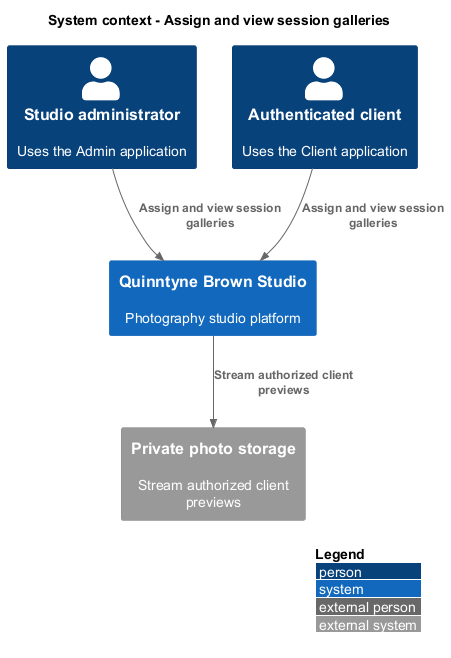
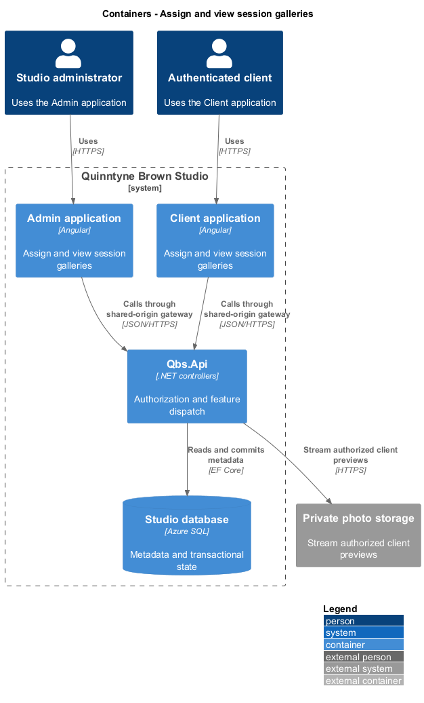
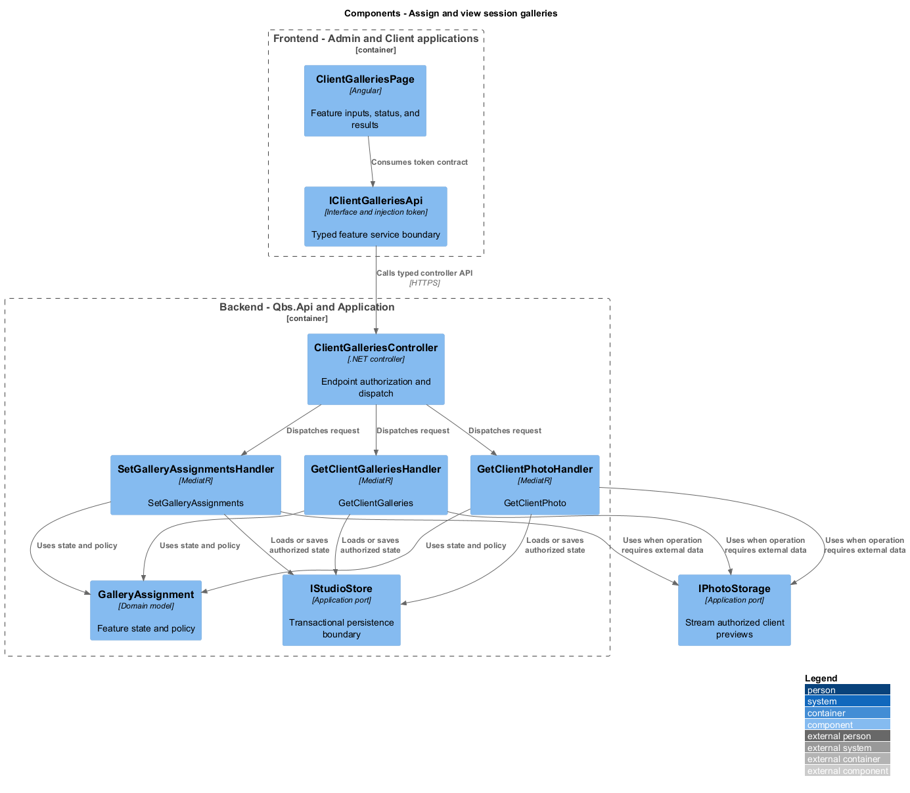
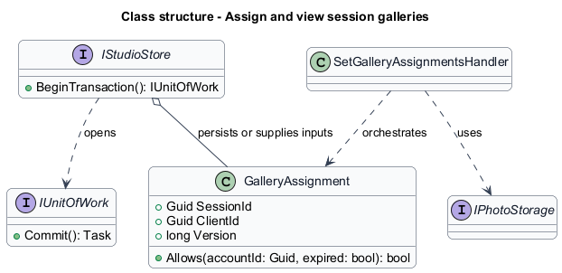
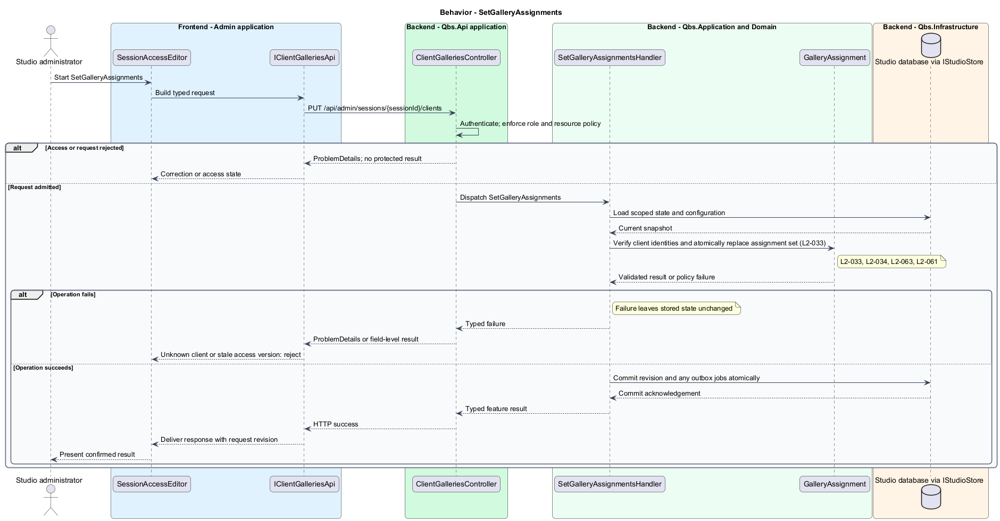
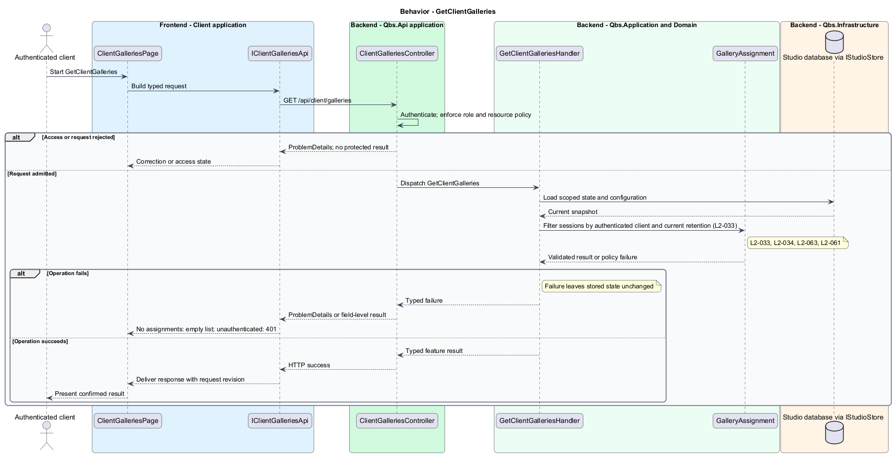
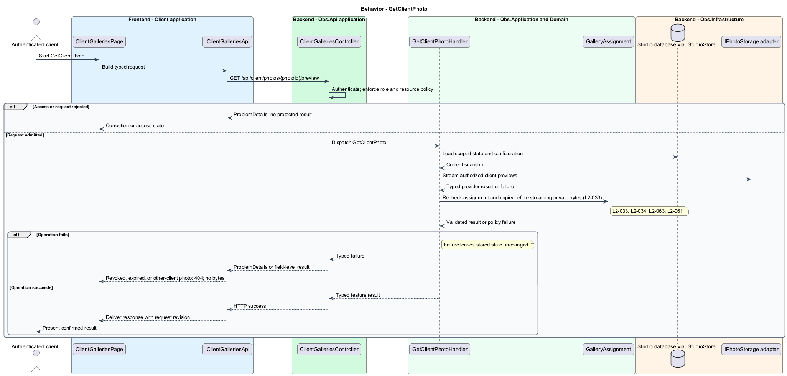

# Assign and view session galleries

## Overview

Quinntyne Brown Studio supports photography discovery, studio administration, and client deliverables. A session gallery is the collection of ready photos from a session assigned to a client. An assignment is an explicit link between that session and an authenticated client. The client sees only active assignments whose retention has not expired.

## Description

Status: proposed production slice. The repository contains standalone HTML mocks; the Angular and .NET names below identify the components introduced by this design.

`SessionAccessEditor` in Admin adds or revokes client assignments. `ClientGalleriesPage` lists authorized sessions and `ClientGalleryPage` browses their ready photos. `SetGalleryAssignmentsHandler` verifies the selected accounts are clients and commits the assignment set with a session access version.

`GetClientGalleriesHandler` derives the client from authentication and applies assignment and expiry filters in the store query. Individual gallery and photo handlers repeat that authorization for direct requests. `PhotosController` streams private derivatives only after the same check, using no-store responses without reusable storage read URLs.

The gallery list returns an empty collection when no sessions qualify. Inaccessible identifiers return 404 without metadata. Revocation or expiry affects subsequent metadata and image requests; previously received bytes cannot be recalled. Albums and print operations invoke the same authorization service.

Acceptance covers two clients, direct identifier substitution, unauthenticated byte access, revocation between list and image fetch, expiry, and a client with no galleries.

`IClientGalleriesApi` is the Angular service interface consumed through its injection token. Its HTTP implementation calls `ClientGalleriesController`. The controller dispatches the operations below to the corresponding named handlers.

**Interfaces**

- `PUT /api/admin/sessions/{sessionId}/clients ← clientIds[], expectedVersion → assignment set`
- `GET /api/client/galleries → ClientGallerySummary[]`
- `GET /api/client/galleries/{sessionId} → ready photo page`
- `GET /api/client/photos/{photoId}/preview → authorized no-store JPEG stream`

**Behavior ownership**

| Operation | Owner | Responsibility |
| --- | --- | --- |
| `SetGalleryAssignments` | `SetGalleryAssignmentsHandler` | Verify client identities and atomically replace assignment set. |
| `GetClientGalleries` | `GetClientGalleriesHandler` | Filter sessions by authenticated client and current retention. |
| `GetClientPhoto` | `GetClientPhotoHandler` | Recheck assignment and expiry before streaming private bytes. |

The [shared architecture](../../architecture.md) defines authorization, wire conventions, persistence, environment boundaries, and delivery constraints. The [decision baseline](../../../specs/decisions.md) supplies exact policies and remaining evidence gates. Shared architecture requirements `L2-038` through `L2-045` and delivery requirements `L2-049` through `L2-054` apply to the implemented layers of this slice.

**Acceptance mapping**

The [acceptance register](../../acceptance.md) lists each applicable scenario with its implementing layer and current status. Feature tests exercise the success and failure behaviors described here. No production acceptance test exists merely because its scenario is designed.

## Requirements

Source: [L2 requirements](../../../specs/L2.md). Shared interface and delivery obligations have primary coverage in the engineering-delivery slice.

| L2 ID | Refines (L1) | Requirement |
| --- | --- | --- |
| `L2-001` | `L1-001` | The public and administrative applications shall support their specified tasks across the agreed desktop, tablet, and mobile viewport matrix. |
| `L2-002` | `L1-001` | The platform's interfaces shall use generous white space, clear task hierarchy, and controls limited to the specified workflows. |
| `L2-003` | `L1-001` | The platform shall restrict administrative content and operations to authorized studio administrators. This is a derived access requirement for the administrative application. |
| `L2-033` | `L1-010` | Authenticated clients shall be able to view galleries and photos from sessions made available to them. |
| `L2-034` | `L1-010` | Client authorization shall be enforced for protected galleries, photos, albums, and print-request operations, including direct requests that bypass the interface. |
| `L2-061` | `L1-008` | The platform shall support configurable session retention initially 12 calendar months after upload, administrator notice 30 days before expiry, client-access expiry, extensions, and administrator-confirmed deletion. |
| `L2-063` | `L1-010` | Administrators shall be able to assign and revoke client access to selected session galleries, with authorization enforced for gallery metadata and photo delivery. |
| `L2-066` | `L1-001` | Platform interfaces shall follow the approved HTML prototype at 390, 768, and 1440 CSS-pixel widths across Chromium, Firefox, and WebKit, with keyboard-operable controls and readable validation and failure states. |

## Diagrams

The context identifies the people and systems involved in this capability. External services participate only where the description requires their data or effects.

The container view locates the participating applications and their deployed dependencies. It preserves the separation between browser interaction and persisted or background work.

The component view assigns the feature responsibilities to their architectural homes. `GalleryAssignment` provides the domain structure described in this slice.

The class view shows the fields and behavior of `GalleryAssignment` with the application boundaries used by this slice.

`SetGalleryAssignments`: Verify client identities and atomically replace assignment set. Unknown client or stale access version: reject.

`GetClientGalleries`: Filter sessions by authenticated client and current retention. No assignments: empty list; unauthenticated: 401.

`GetClientPhoto`: Recheck assignment and expiry before streaming private bytes. Revoked, expired, or other-client photo: 404; no bytes.

