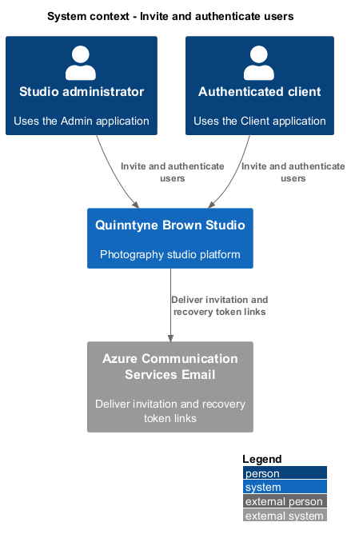
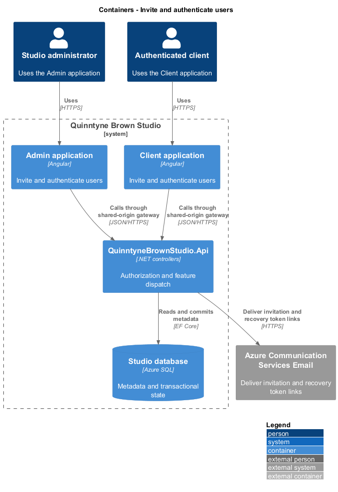
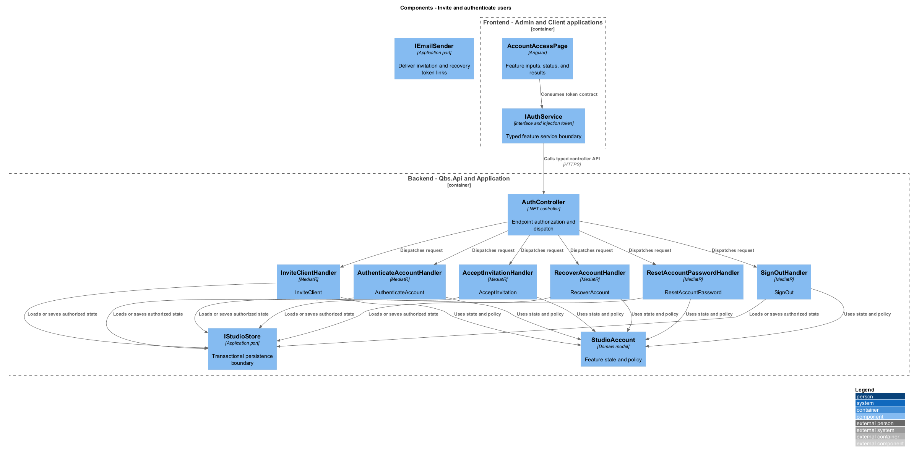
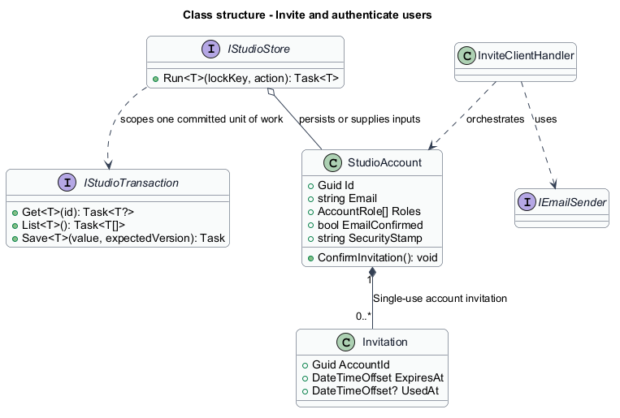
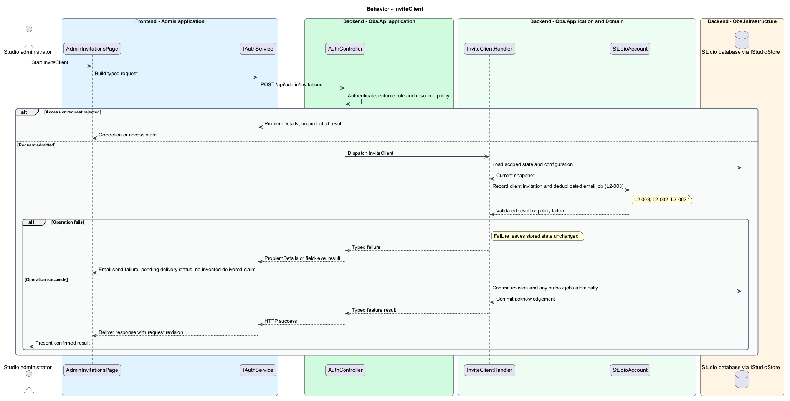
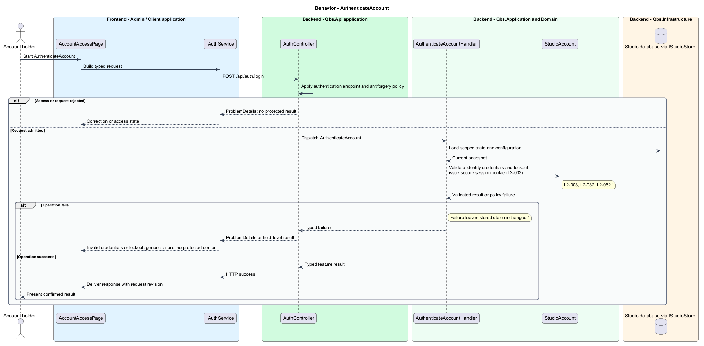
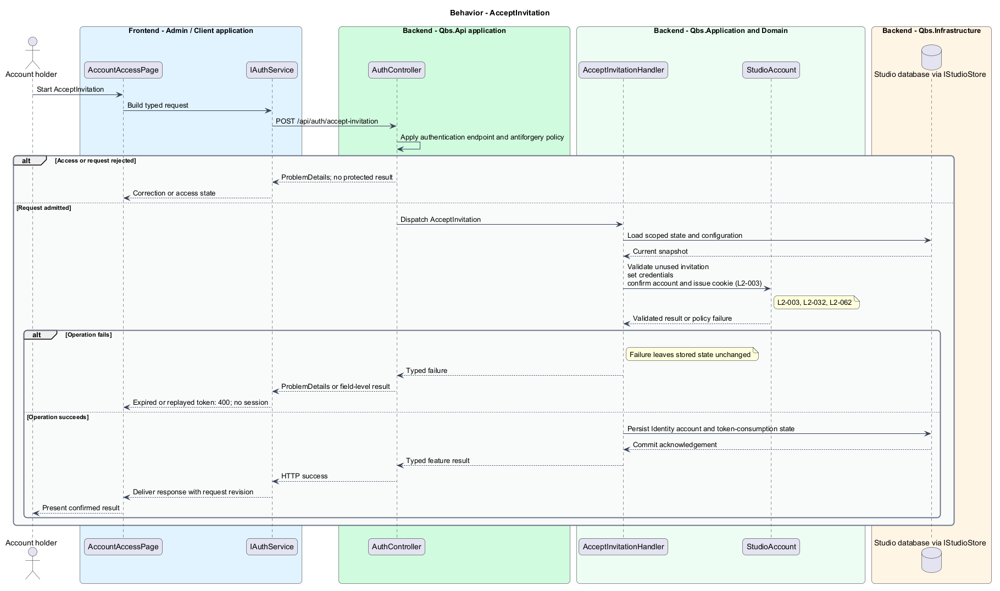
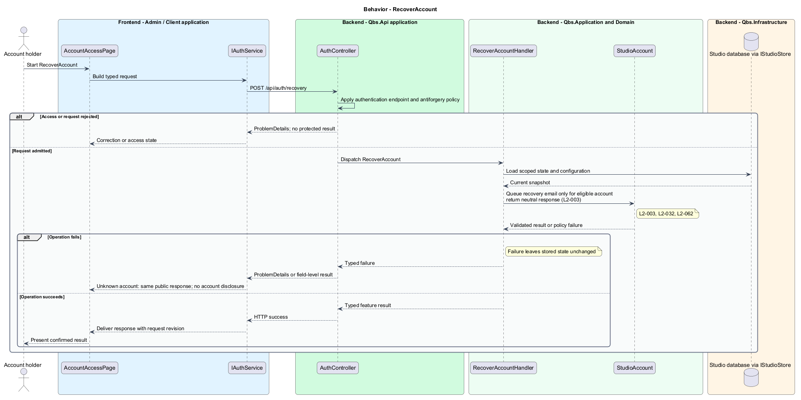
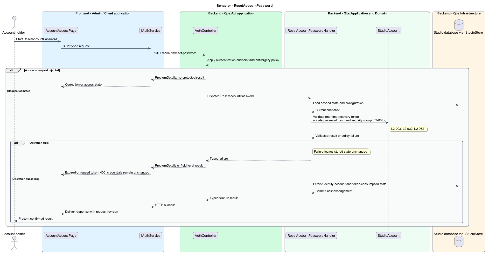
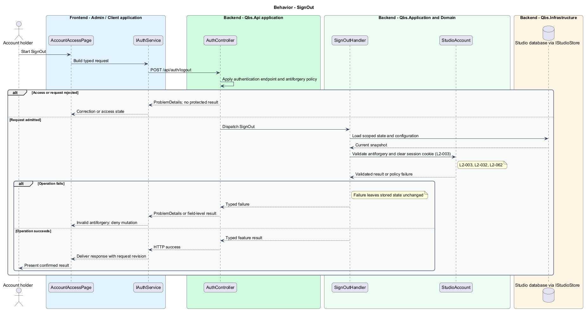

# Invite and authenticate users

## Overview

Quinntyne Brown Studio supports photography discovery, studio administration, and client deliverables. An invited account identifies a client who can authenticate to the studio platform. Administrators issue invitations; session assignments separately determine visible galleries. Administrators also authenticate before using studio operations.

## Description

Status: designed for production and implemented in this repository. Delivered handler and service names consolidate some participants shown below; the [implementation report](../../../implementation/README.md) and the [acceptance register](../../acceptance.md) record the delivered structure and the evidence that remains open.

`AccountAccessPage` supplies login, invitation acceptance, and recovery screens in the appropriate application. `AdminInvitationsPage` requests client invitations. `AuthController` dispatches handlers through an `IIdentityAccounts` application port implemented using ASP.NET Core Identity. Credentials are hashed by Identity and never stored in domain records or logs as plaintext.

`InviteClientHandler` records a pending client and an email outbox item with a single-use invitation token. Token lifetime is 24 hours. Recovery tokens expire after one hour. The email adapter uses Azure Communication Services Email; the verified sender remains G-ENV evidence. Generic recovery responses and controlled login errors prevent account enumeration. Invalid tokens never establish a cookie.

Successful authentication creates a host-only HttpOnly Secure cookie. State-changing endpoints validate antiforgery tokens. Five failed sign-ins trigger a 15-minute account lockout; recovery responses remain neutral during lockout. Sign-out clears the cookie, and password reset updates the security stamp. Initial administrator provisioning occurs through an operator-only deployment command. No public registration endpoint exists.

Acceptance covers invitation/recovery expiry and replay, neutral responses, role denial, failed credentials, cookie settings, antiforgery, and protected-resource access before and after sign-in.

`IAuthService` is the Angular service interface consumed through its injection token. Its HTTP implementation calls `AuthController`. The controller dispatches its route operations to the corresponding named handlers. Shared-route delegation follows the [interface catalog](../../contracts.md#route-ownership); worker operations execute from durable jobs.

**Interfaces**

- `POST /api/admin/invitations ← email → invitationId and queued status`
- `POST /api/auth/accept-invitation ← token, password → authenticated session`
- `POST /api/auth/login ← email, password → session; POST /api/auth/logout → signed-out result`
- `POST /api/auth/recovery ← email → neutral accepted response`
- `POST /api/auth/reset-password ← token, password → reset outcome`
- `GET /api/auth/session → current account projection; GET /api/auth/antiforgery → request token`

**Behavior ownership**

| Operation | Owner | Responsibility |
| --- | --- | --- |
| `InviteClient` | `InviteClientHandler` | Record client invitation and deduplicated email job. |
| `AuthenticateAccount` | `AuthenticateAccountHandler` | Validate Identity credentials and lockout; issue secure session cookie. |
| `AcceptInvitation` | `AcceptInvitationHandler` | Validate unused invitation; set credentials; confirm account and issue cookie. |
| `RecoverAccount` | `RecoverAccountHandler` | Queue recovery email only for eligible account; return neutral response. |
| `ResetAccountPassword` | `ResetAccountPasswordHandler` | Validate one-time recovery token; update password hash and security stamp. |
| `SignOut` | `SignOutHandler` | Validate antiforgery and clear session cookie. |

The [shared architecture](../../architecture.md) defines authorization, wire conventions, persistence, environment boundaries, and delivery constraints. The [decision baseline](../../../specs/decisions.md) supplies exact policies and remaining evidence gates. Shared architecture requirements `L2-038` through `L2-045` and delivery requirements `L2-049` through `L2-054` apply to the implemented layers of this slice.

**Acceptance mapping**

The [acceptance register](../../acceptance.md) lists each applicable scenario with its implementing layer and current status. Feature tests exercise the success and failure behaviors described here. No production acceptance test exists merely because its scenario is designed.

## Requirements

Source: [L2 requirements](../../../specs/L2.md). Shared interface and delivery obligations have primary coverage in the engineering-delivery slice.

| L2 ID | Refines (L1) | Requirement |
| --- | --- | --- |
| `L2-001` | `L1-001` | The public and administrative applications shall support their specified tasks across the agreed desktop, tablet, and mobile viewport matrix. |
| `L2-002` | `L1-001` | The platform's interfaces shall use generous white space, clear task hierarchy, and controls limited to the specified workflows. |
| `L2-003` | `L1-001` | The platform shall restrict administrative content and operations to authorized studio administrators. This is a derived access requirement for the administrative application. |
| `L2-032` | `L1-010` | The client site shall authenticate clients before granting access to protected client content. |
| `L2-062` | `L1-010` | The platform shall use ASP.NET Core Identity with administrator-issued client invitations, protected credentials, and email-based account recovery. |
| `L2-066` | `L1-001` | Platform interfaces shall follow the approved HTML prototype at 390, 768, and 1440 CSS-pixel widths across Chromium, Firefox, and WebKit, with keyboard-operable controls and readable validation and failure states. |

## Diagrams

The context identifies the people and systems involved in this capability. External services participate only where the description requires their data or effects.

The container view locates the participating applications and their deployed dependencies. It preserves the separation between browser interaction and persisted or background work.

The component view assigns the feature responsibilities to their architectural homes. `StudioAccount` provides the domain structure described in this slice.

The class view shows typed fields and relationships for `StudioAccount`. `Invitation` describes the related structure used by the feature.

`InviteClient`: Record client invitation and deduplicated email job. Email send failure: pending delivery status; no invented delivered claim.

`AuthenticateAccount`: Validate Identity credentials and lockout; issue secure session cookie. Invalid credentials or lockout: generic failure; no protected content.

`AcceptInvitation`: Validate unused invitation; set credentials; confirm account and issue cookie. Expired or replayed token: 400; no session.

`RecoverAccount`: Queue recovery email only for eligible account; return neutral response. Unknown account: same public response; no account disclosure.

`ResetAccountPassword`: Validate one-time recovery token; update password hash and security stamp. Expired or reused token: 400; credentials remain unchanged.

`SignOut`: Validate antiforgery and clear session cookie. Invalid antiforgery: deny mutation.

