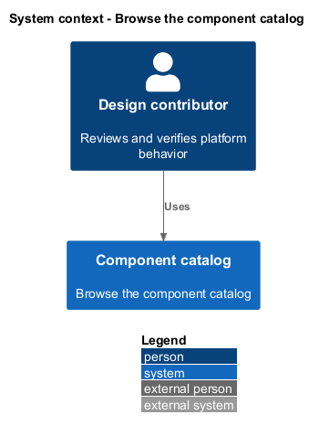
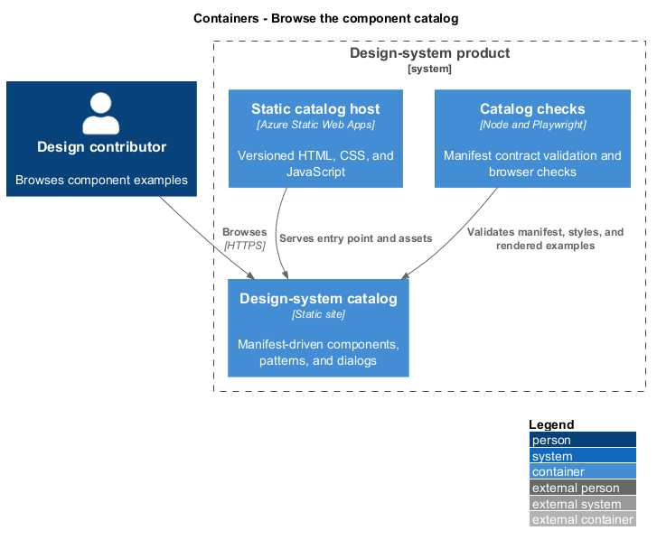
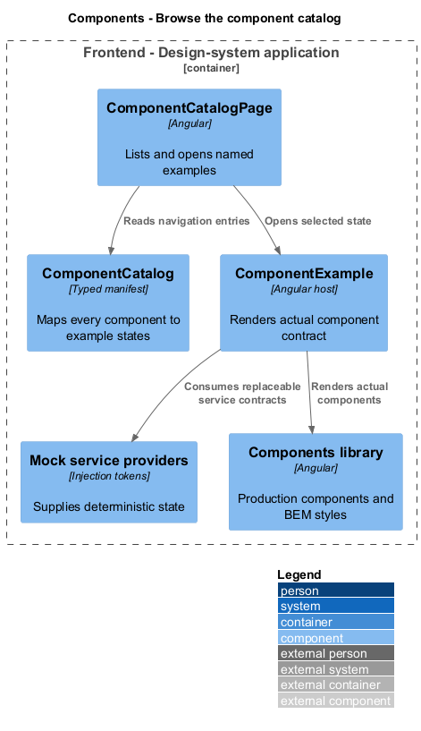
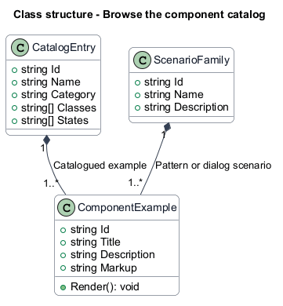
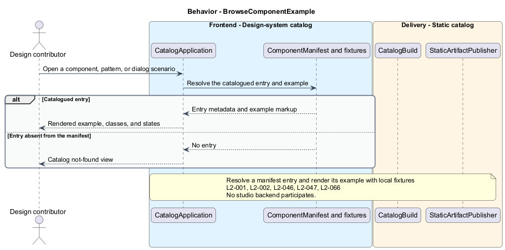

# Browse the component catalog

## Overview

Quinntyne Brown Studio supports photography discovery, studio administration, and client deliverables. The component catalog is a contributor-facing application showing the platform UI inventory. Each entry demonstrates an actual reusable component or composed page. Examples make the approved visual language and task states reviewable without studio data.

## Description

Status: proposed production slice. The repository contains standalone HTML mocks; the Angular and .NET names below identify the components introduced by this design.

`ComponentCatalogPage` lists named entries from `ComponentCatalog`. `ComponentExample` identifies a component, example state, and navigation route. The manifest covers all production UI components, including composed feature pages, through isolated host examples. A coverage check compares exported component metadata and the manifest; adding a component without an example fails the catalog build check.

Examples use the same components library as the product and bind service tokens to deterministic mocks. States include loading, empty, validation, dependency failure, success, and dialogs when relevant. Names and state inventory follow `MockCatalog` in the existing HTML prototype, but demo authentication and business defaults do not become production contracts.

The catalog applies OD-08 viewport and keyboard checks. It documents component inputs, outputs, and BEM names beside rendered examples. The source-referenced Saturdaze design-system directory provides organizational guidance; unrelated product features are excluded.

Acceptance covers complete component inventory, recognizable examples, mock-service substitution, keyboard dialogs, error readability, and the nine browser/viewport combinations.

**Interfaces**

- `Local catalog manifest ← componentName, exampleName, state, route → navigable rendered example`
- `Angular component interfaces ← typed inputs and outputs; no production HTTP API`

**Behavior ownership**

| Operation | Owner | Responsibility |
| --- | --- | --- |
| `BrowseComponentExample` | `BrowseComponentExample` | Resolve manifest entry and render real component with mock providers. |

The [shared architecture](../../architecture.md) defines authorization, wire conventions, persistence, environment boundaries, and delivery constraints. The [decision baseline](../../../specs/decisions.md) supplies exact policies and remaining evidence gates. Shared architecture requirements `L2-038` through `L2-045` and delivery requirements `L2-049` through `L2-054` apply to the implemented layers of this slice.

**Acceptance mapping**

The [acceptance register](../../acceptance.md) lists each applicable scenario with its implementing layer and current status. Feature tests exercise the success and failure behaviors described here. No production acceptance test exists merely because its scenario is designed.

## Requirements

Source: [L2 requirements](../../../specs/L2.md). Shared interface and delivery obligations have primary coverage in the engineering-delivery slice.

| L2 ID | Refines (L1) | Requirement |
| --- | --- | --- |
| `L2-001` | `L1-001` | The public and administrative applications shall support their specified tasks across the agreed desktop, tablet, and mobile viewport matrix. |
| `L2-002` | `L1-001` | The platform's interfaces shall use generous white space, clear task hierarchy, and controls limited to the specified workflows. |
| `L2-046` | `L1-014` | The design system shall be a maintained deliverable with its own entry point and build/deployment instructions, using the [referenced example](https://github.com/QuinntyneBrown/saturdaze/tree/main/design-system) as guidance. |
| `L2-047` | `L1-014` | The design system shall list every platform UI component with a recognizable name and a viewable example, and shall be updated when components are added or changed. |
| `L2-066` | `L1-001` | Platform interfaces shall follow the approved HTML prototype at 390, 768, and 1440 CSS-pixel widths across Chromium, Firefox, and WebKit, with keyboard-operable controls and readable validation and failure states. |

## Diagrams

The context identifies the people and systems involved in this capability. External services participate only where the description requires their data or effects.

The container view locates the participating applications and their deployed dependencies. It preserves the separation between browser interaction and persisted or background work.

The component view separates the catalog or acceptance host from the controlled providers used to exercise it.

The class view shows typed fields and relationships for `ComponentExample`. `ComponentContract` describes the related structure used by the feature.

`BrowseComponentExample`: Resolve manifest entry and render real component with mock providers. Unknown example: catalog not-found view; mock failure: controlled component state. This behavior has no studio backend participant; delivery tooling is shown separately.

