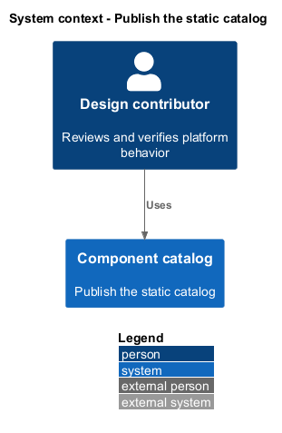
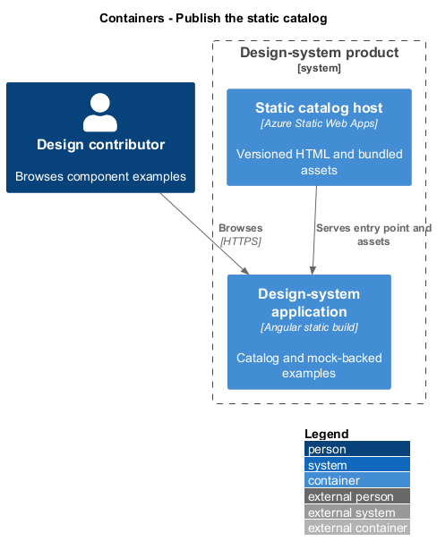
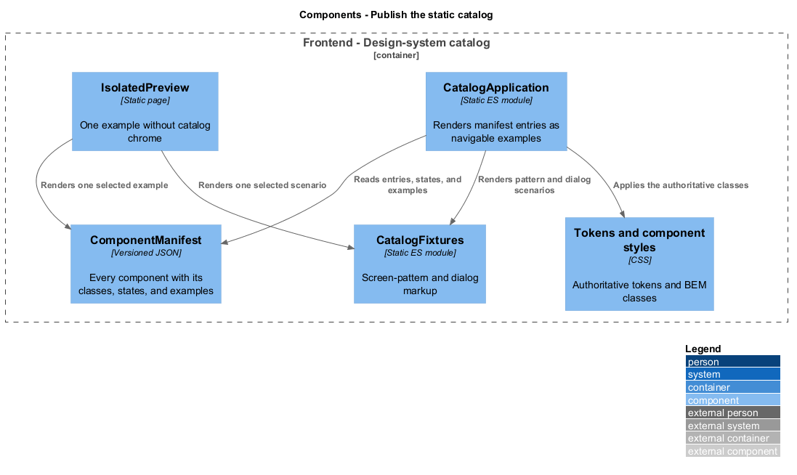
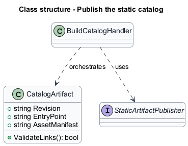
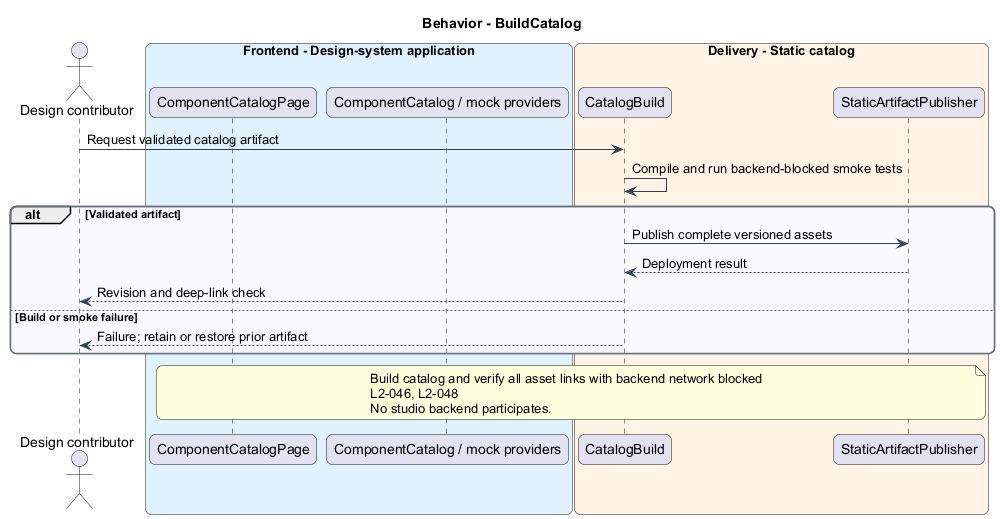
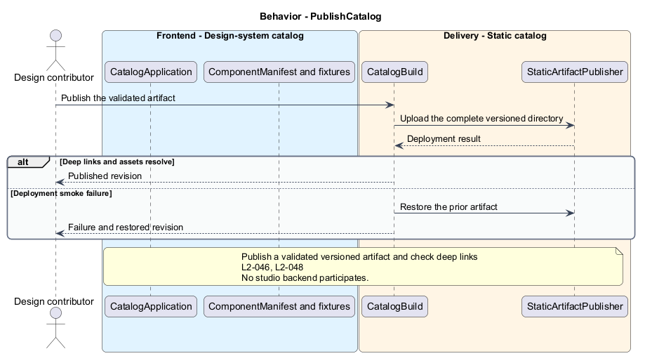

# Publish the static catalog

## Overview

Quinntyne Brown Studio supports photography discovery, studio administration, and client deliverables. A catalog artifact is the built static HTML, JavaScript, CSS, and assets for the root-level `design-system` product. Contributors can publish it independently from the studio backend. A static host serves its navigation and component examples.

## Description

Status: proposed production slice. The repository contains standalone HTML mocks; the Angular and .NET names below identify the components introduced by this design.

`CatalogBuild` compiles the standalone `design-system` product against the built `components` library artifact, with deterministic mock providers. `CatalogArtifact` identifies the source revision and asset manifest. The build excludes product secrets and private-photo URLs. An offline-backend smoke test opens deep links and representative component states with all product API requests blocked.

The proposed build command is `npm run build` inside `design-system`. The artifact directory is `design-system/dist`; deployment copies that complete directory to Azure Static Web Apps with navigation fallback to `index.html`. Hash-named assets use immutable caching; the entry point and navigation configuration use revalidation.

`PublishCatalog` in the delivery pipeline validates links and browser checks before publishing the artifact. A failed build or smoke check does not replace the deployed revision. Rollback selects the prior artifact. Hosting identifiers remain G-ENV evidence.

Acceptance covers documented build prerequisites, direct deep-link navigation, missing asset failure, backend isolation, and returning to the prior artifact.

**Interfaces**

- `CLI npm run build in design-system → design-system/dist`
- `Static HTTP GET / and /components/... → catalog entry point and bundled assets`

**Behavior ownership**

| Operation | Owner | Responsibility |
| --- | --- | --- |
| `BuildCatalog` | `BuildCatalog` | Build catalog and verify all asset links with backend network blocked. |
| `PublishCatalog` | `PublishCatalog` | Publish validated versioned artifact and check deep links. |

The [shared architecture](../../architecture.md) defines authorization, wire conventions, persistence, environment boundaries, and delivery constraints. The [decision baseline](../../../specs/decisions.md) supplies exact policies and remaining evidence gates. Shared architecture requirements `L2-038` through `L2-045` and delivery requirements `L2-049` through `L2-054` apply to the implemented layers of this slice.

**Acceptance mapping**

The [acceptance register](../../acceptance.md) lists each applicable scenario with its implementing layer and current status. Feature tests exercise the success and failure behaviors described here. No production acceptance test exists merely because its scenario is designed.

## Requirements

Source: [L2 requirements](../../../specs/L2.md). Shared interface and delivery obligations have primary coverage in the engineering-delivery slice.

| L2 ID | Refines (L1) | Requirement |
| --- | --- | --- |
| `L2-001` | `L1-001` | The public and administrative applications shall support their specified tasks across the agreed desktop, tablet, and mobile viewport matrix. |
| `L2-002` | `L1-001` | The platform's interfaces shall use generous white space, clear task hierarchy, and controls limited to the specified workflows. |
| `L2-046` | `L1-014` | The design system shall be a maintained deliverable with its own entry point and build/deployment instructions, using the [referenced example](https://github.com/QuinntyneBrown/saturdaze/tree/main/design-system) as guidance. |
| `L2-048` | `L1-014` | The design system shall be deployable and browsable as a static web application without a running studio backend. |
| `L2-066` | `L1-001` | Platform interfaces shall follow the approved HTML prototype at 390, 768, and 1440 CSS-pixel widths across Chromium, Firefox, and WebKit, with keyboard-operable controls and readable validation and failure states. |

## Diagrams

The context identifies the people and systems involved in this capability. External services participate only where the description requires their data or effects.

The container view locates the participating applications and their deployed dependencies. It preserves the separation between browser interaction and persisted or background work.

The component view separates the catalog or acceptance host from the controlled providers used to exercise it.

The class view shows typed fields and relationships for `CatalogArtifact`. Application ports separate the model from provider implementations.

`BuildCatalog`: Build catalog and verify all asset links with backend network blocked. Compile or isolated smoke-test failure: stop publication. This behavior has no studio backend participant; delivery tooling is shown separately.

`PublishCatalog`: Publish validated versioned artifact and check deep links. Deployment smoke failure: restore prior artifact. This behavior has no studio backend participant; delivery tooling is shown separately.

