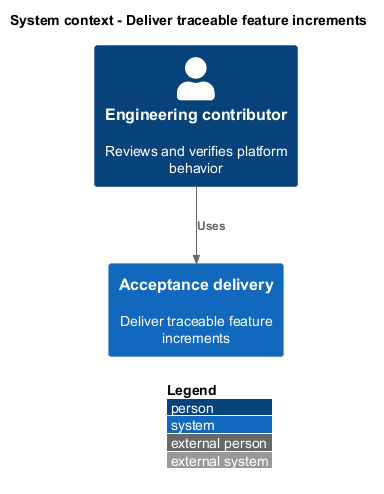
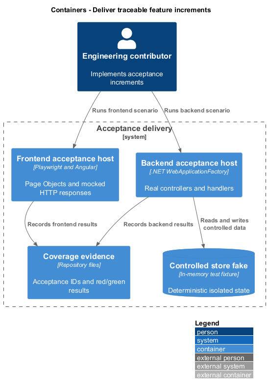
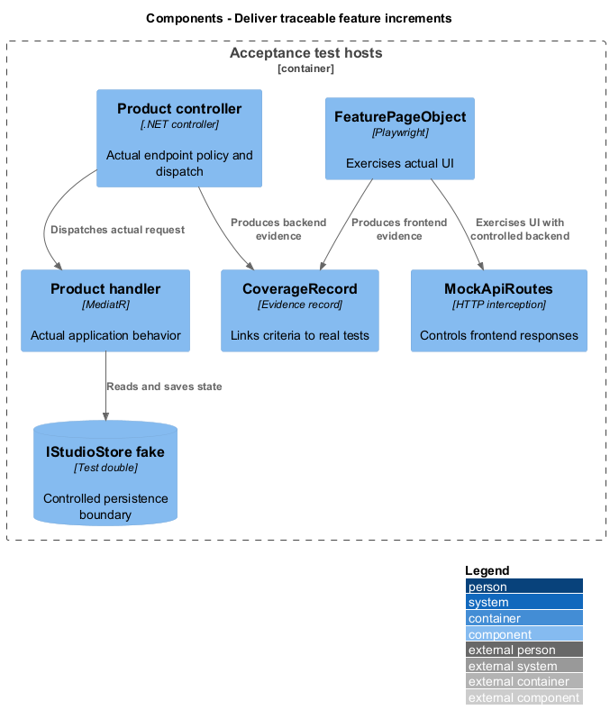
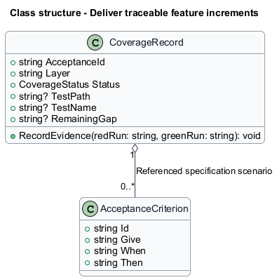
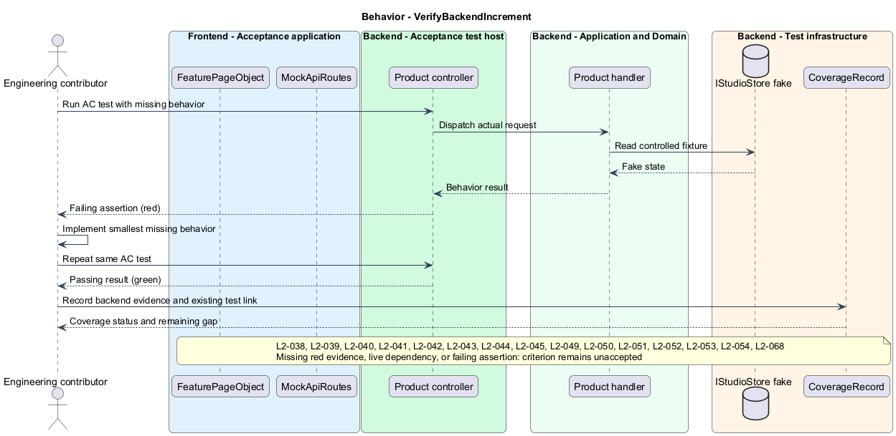
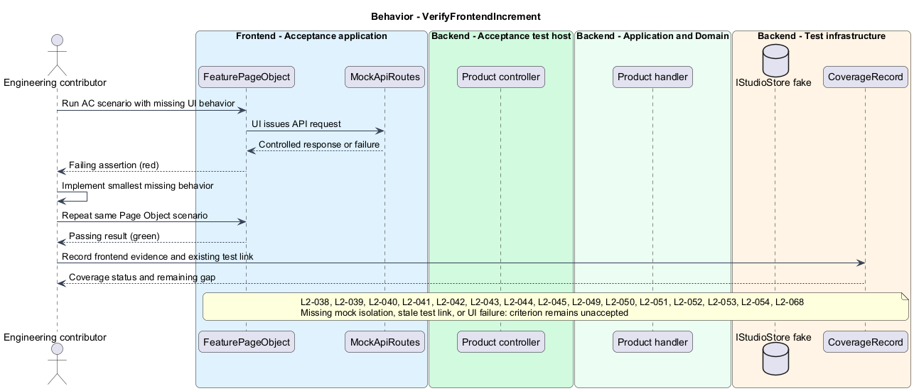

# Deliver traceable feature increments

## Overview

Quinntyne Brown Studio supports photography discovery, studio administration, and client deliverables. A feature increment is a behavior change tied to an acceptance criterion. Backend integration tests and frontend browser tests establish missing behavior before implementation. Coverage records connect the finished behavior to existing tests and identify gaps.

## Description

Status: proposed production slice. The repository contains standalone HTML mocks; the Angular and .NET names below identify the components introduced by this design.

`AcceptanceScenario` retains the specification's GIVE, WHEN, and THEN wording and acceptance ID. `BackendAcceptanceHost` uses WebApplicationFactory to exercise real controllers, authentication policies, handlers, and domain behavior with a controlled `IStudioStore` fake. External routing, storage, email, time, and AI ports use deterministic fakes. Production credentials and live databases are absent from these tests.

`FrontendAcceptanceHost` runs Playwright through feature Page Objects. Network routing provides controlled API responses, including response delays and failures. A separate provider-substitution check verifies that unchanged consumers work with mock implementations bound to the same injection tokens. Every implemented criterion records layer status, real relative test path, test name, remaining gap, and red/green execution evidence.

Architecture checks inspect project references, controller route registration, BEM names, file separation, signal state, and component catalog coverage. Framework lockfiles follow OD-09. RxJS use includes an API-boundary justification. The MediatR package is selected only after G-MEDIATR evidence; no assumption about license eligibility substitutes for that check.

`CoverageRecord` begins as Not implemented. Documentation does not assert production test coverage. SQL transaction and Azure integration checks supplement acceptance fakes before rollout; fakes alone do not prove database locks, blob grants, or camera conversion. The shared architecture describes environment isolation and rollout.

Acceptance covers known red-to-green evidence, existing test links, both-layer criteria, partial gaps, no-live-service operation, and rejection of architecture violations.

**Interfaces**

- `CoverageRecord ← acceptanceId, layer, status, existing relative testPath, testName, remainingGap, redRun, greenRun`
- `Test host HTTP → real controller/application behavior with fake infrastructure`
- `Playwright Page Object → actual frontend with mocked API responses`

**Behavior ownership**

| Operation | Owner | Responsibility |
| --- | --- | --- |
| `VerifyBackendIncrement` | `VerifyBackendIncrement` | Run failing controller integration test; implement criterion; record passing run and coverage. |
| `VerifyFrontendIncrement` | `VerifyFrontendIncrement` | Run failing Page Object scenario with API mock; implement; record passing evidence. |

The [shared architecture](../../architecture.md) defines authorization, wire conventions, persistence, environment boundaries, and delivery constraints. The [decision baseline](../../../specs/decisions.md) supplies exact policies and remaining evidence gates. Shared architecture requirements `L2-038` through `L2-045` and delivery requirements `L2-049` through `L2-054` apply to the implemented layers of this slice.

**Acceptance mapping**

The [acceptance register](../../acceptance.md) lists each applicable scenario with its implementing layer and current status. Feature tests exercise the success and failure behaviors described here. No production acceptance test exists merely because its scenario is designed.

## Requirements

Source: [L2 requirements](../../../specs/L2.md). Shared interface and delivery obligations have primary coverage in the engineering-delivery slice.

| L2 ID | Refines (L1) | Requirement |
| --- | --- | --- |
| `L2-038` | `L1-012` | The backend shall use .NET with separation of domain, application, infrastructure, and HTTP presentation responsibilities; domain and application logic shall not depend on concrete infrastructure or presentation implementations. |
| `L2-039` | `L1-012` | The backend shall use the latest MediatR version freely usable for the intended project at dependency-selection time, with the selected version and supporting licensing evidence recorded. |
| `L2-040` | `L1-012` | Backend product HTTP operations shall be exposed through .NET controllers rather than minimal API endpoint handlers. |
| `L2-041` | `L1-013` | The frontend shall use an Angular workspace with separate projects for reusable components, API integration, domain types, and application composition covering the public, administrative, and client experiences. |
| `L2-042` | `L1-013` | Frontend types shall be defined in separate files, and Angular components shall separate their TypeScript, templates, and styles rather than use single-file components. |
| `L2-043` | `L1-013` | Authored component CSS class names shall use the Block, Element, Modifier convention. |
| `L2-044` | `L1-013` | Frontend reactive state and derived UI values shall prefer Angular signals. RxJS use shall be limited to documented cases where an observable API or stream operation is needed. |
| `L2-045` | `L1-013` | Frontend service consumers shall depend on interfaces and Angular injection tokens so production services can be replaced by mocks without changing consumer code, following the [source-referenced pattern](https://github.com/QuinntyneBrown/interface-driven-service-consumption). |
| `L2-049` | `L1-015` | Each backend behavior increment shall begin with an integration acceptance test that fails because the required behavior is missing, followed by the simplest implementation that makes it pass. |
| `L2-050` | `L1-015` | Backend integration acceptance tests shall exercise the application behavior with the database replaced by a controlled fake. |
| `L2-051` | `L1-015` | Every acceptance criterion whose behavior is implemented fully or partially in the backend shall link to its corresponding backend acceptance test coverage and identify any remaining gap. |
| `L2-052` | `L1-016` | Each frontend behavior increment shall begin with a failing Playwright end-to-end acceptance test, followed by the simplest implementation that makes the test pass. |
| `L2-053` | `L1-016` | Frontend Playwright acceptance tests shall use the Page Object Model and a mocked backend to exercise frontend behavior under controlled responses and failures. |
| `L2-054` | `L1-016` | Every acceptance criterion whose behavior is implemented fully or partially in the frontend shall link to its corresponding frontend acceptance test coverage and identify any remaining gap. |
| `L2-068` | `L1-012` | The platform shall separate development, staging, and production Azure resources, including application hosts, metadata storage, private photo storage, queues, identity data, and secrets. |

## Diagrams

The context identifies the people and systems involved in this capability. External services participate only where the description requires their data or effects.

The container view locates the participating applications and their deployed dependencies. It preserves the separation between browser interaction and persisted or background work.

The component view separates the catalog or acceptance host from the controlled providers used to exercise it.

The class view shows typed fields and relationships for `CoverageRecord`. `AcceptanceCriterion` describes the related structure used by the feature.

`VerifyBackendIncrement`: Run failing controller integration test; implement criterion; record passing run and coverage. Missing red evidence, live dependency, or failing assertion: criterion remains unaccepted.

`VerifyFrontendIncrement`: Run failing Page Object scenario with API mock; implement; record passing evidence. Missing mock isolation, stale test link, or UI failure: criterion remains unaccepted.

