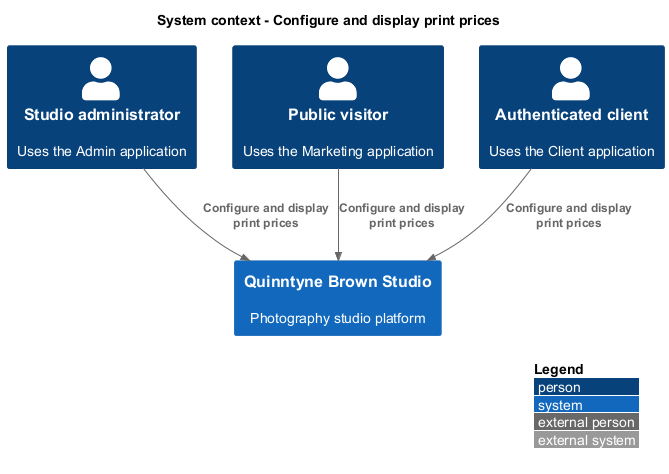
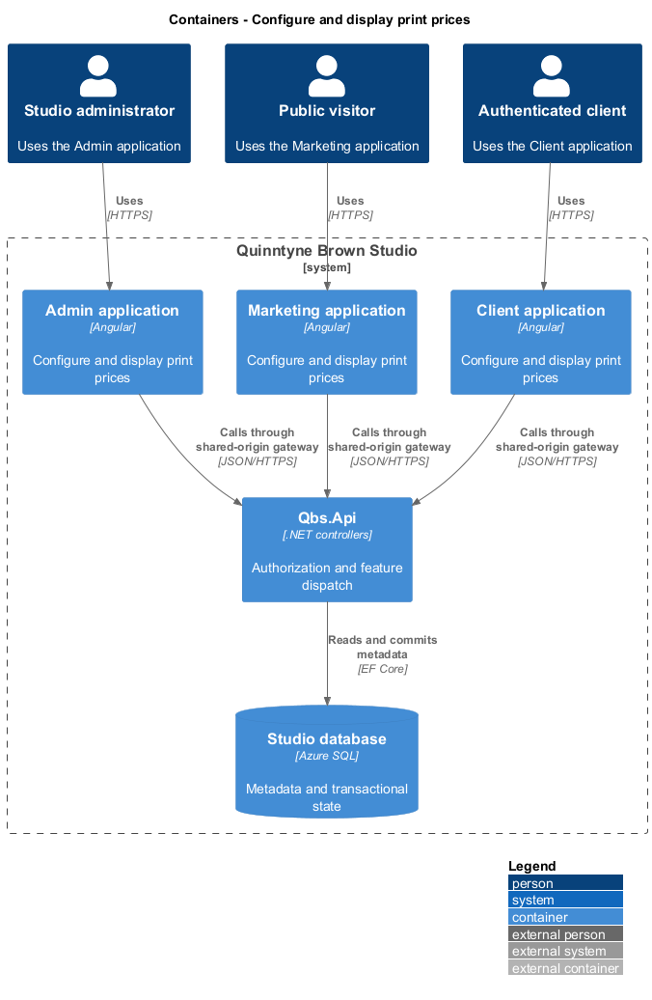
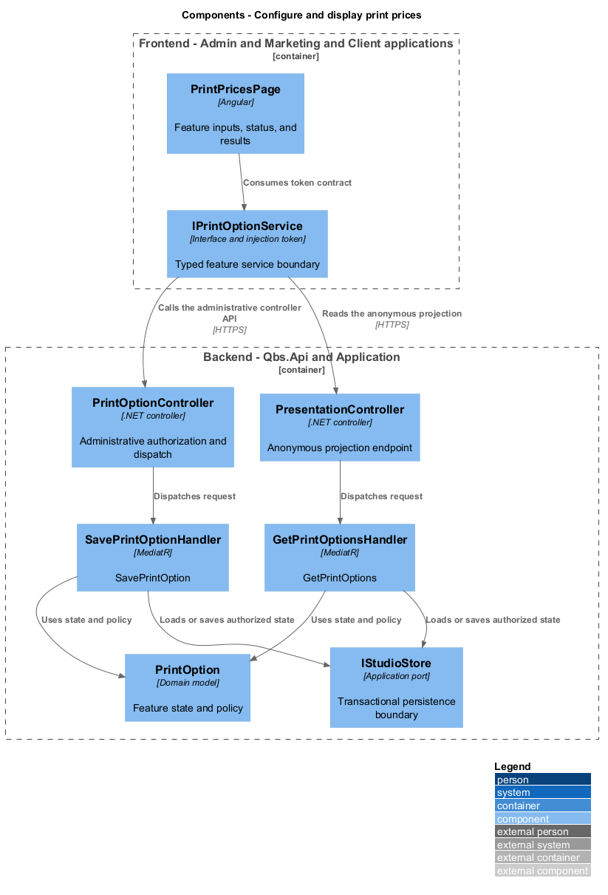
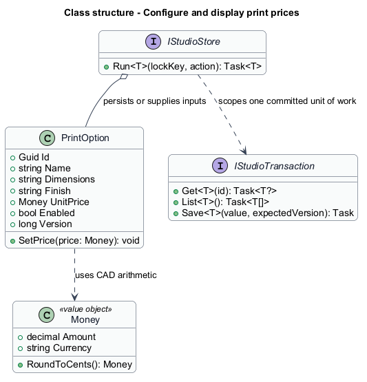
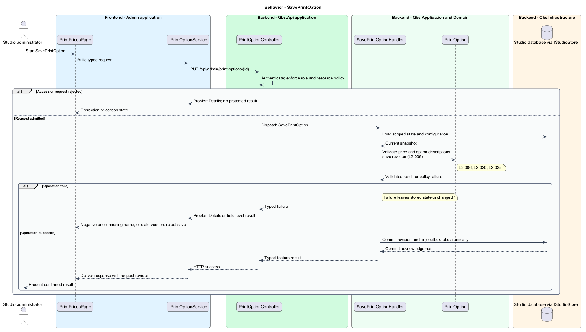
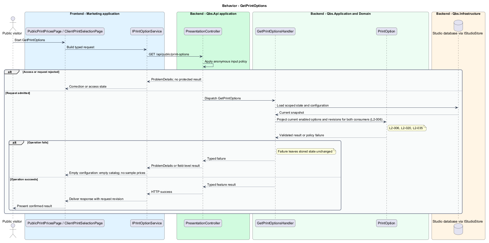

# Configure and display print prices

## Overview

Quinntyne Brown Studio supports photography discovery, studio administration, and client deliverables. A print option describes a printable size and finish with an administrator-set price. The same option catalog supplies public browsing and client selection. A photo selection is authorized separately from the public price list.

## Description

Status: designed for production and implemented in this repository. Delivered handler and service names consolidate some participants shown below; the [implementation report](../../../implementation/README.md) and the [acceptance register](../../acceptance.md) record the delivered structure and the evidence that remains open.

`PrintPricesPage` maintains option names, dimensions, finish descriptions, prices, and enabled state. `PublicPrintPricesPage` and `ClientPrintSelectionPage` read the same enabled projection. `SavePrintOptionHandler` validates nonnegative decimal prices and required descriptions. Initial production configuration contains no fictional print prices.

Each option exposes its revision with the public price. Client selections carry that revision to request preparation. A changed or disabled option requires a refreshed confirmation instead of silently accepting a different charge. Submitted requests retain their original snapshot and do not change when the catalog changes.

Acceptance covers one price edit appearing on both sites, disabled options, empty catalog, invalid prices, and authorization before a client selects a private photo.

`IPrintOptionService` is the Angular service interface consumed through its injection token. Its HTTP implementation calls `PrintOptionController` for administration and `PresentationController` for the public price list. The controller dispatches its route operations to the corresponding named handlers. Shared-route delegation follows the [interface catalog](../../contracts.md#route-ownership); worker operations execute from durable jobs.

**Interfaces**

- `GET /api/admin/print-options → PrintOption[]`
- `GET /api/admin/print-options/{id} → PrintOption for its editor`
- `POST /api/admin/print-options; PUT /api/admin/print-options/{id} ← name, dimensions, finish, unitPrice, enabled, expectedVersion → PrintOption`
- `GET /api/public/print-options → enabled PrintOptionView[]; client pricing uses this same route`

**Behavior ownership**

| Operation | Owner | Responsibility |
| --- | --- | --- |
| `SavePrintOption` | `SavePrintOptionHandler` | Validate price and option descriptions; save revision. |
| `GetPrintOptions` | `GetPrintOptionsHandler` | Project current enabled options and revisions for both consumers. |

The [shared architecture](../../architecture.md) defines authorization, wire conventions, persistence, environment boundaries, and delivery constraints. The [decision baseline](../../../specs/decisions.md) supplies exact policies and remaining evidence gates. Shared architecture requirements `L2-038` through `L2-045` and delivery requirements `L2-049` through `L2-054` apply to the implemented layers of this slice.

**Acceptance mapping**

The [acceptance register](../../acceptance.md) lists each applicable scenario with its implementing layer and current status. Feature tests exercise the success and failure behaviors described here. No production acceptance test exists merely because its scenario is designed.

## Requirements

Source: [L2 requirements](../../../specs/L2.md). Shared interface and delivery obligations have primary coverage in the engineering-delivery slice.

| L2 ID | Refines (L1) | Requirement |
| --- | --- | --- |
| `L2-001` | `L1-001` | The public and administrative applications shall support their specified tasks across the agreed desktop, tablet, and mobile viewport matrix. |
| `L2-002` | `L1-001` | The platform's interfaces shall use generous white space, clear task hierarchy, and controls limited to the specified workflows. |
| `L2-003` | `L1-001` | The platform shall restrict administrative content and operations to authorized studio administrators. This is a derived access requirement for the administrative application. |
| `L2-006` | `L1-002` | The public application shall display administrator-configured print options and their prices. |
| `L2-020` | `L1-005` | Administrators shall be able to maintain print options and prices that supply both public price displays and client print-request experiences. |
| `L2-034` | `L1-010` | Client authorization shall be enforced for protected galleries, photos, albums, and print-request operations, including direct requests that bypass the interface. |
| `L2-035` | `L1-011` | Clients shall be able to select an accessible session photo for a print request and view the configured print options and prices before submission. |
| `L2-066` | `L1-001` | Platform interfaces shall follow the approved HTML prototype at 390, 768, and 1440 CSS-pixel widths across Chromium, Firefox, and WebKit, with keyboard-operable controls and readable validation and failure states. |

## Diagrams

The context identifies the people and systems involved in this capability. External services participate only where the description requires their data or effects.

The container view locates the participating applications and their deployed dependencies. It preserves the separation between browser interaction and persisted or background work.

The component view assigns the feature responsibilities to their architectural homes. `PrintOption` provides the domain structure described in this slice.

The class view shows typed fields and relationships for `PrintOption`. Application ports separate the model from provider implementations.

`SavePrintOption`: Validate price and option descriptions; save revision. Negative price, missing name, or stale version: reject save.

`GetPrintOptions`: Project current enabled options and revisions for both consumers. Empty configuration: empty catalog; no sample prices.

