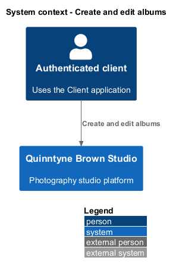
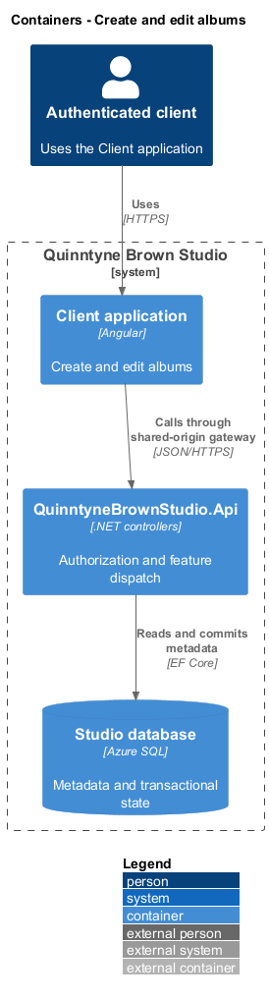
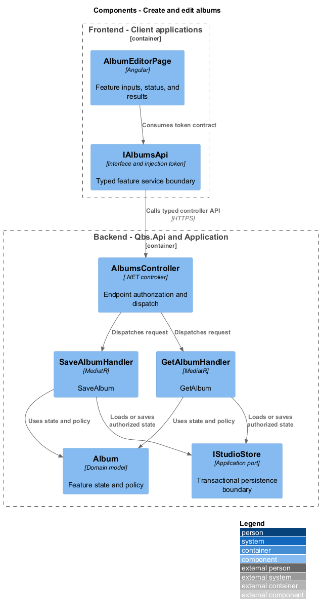
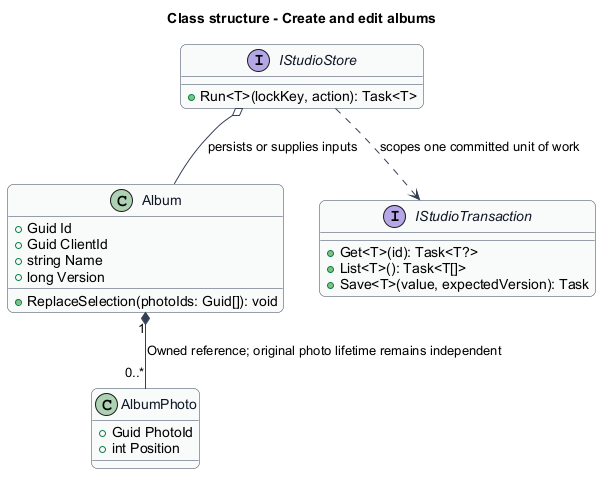
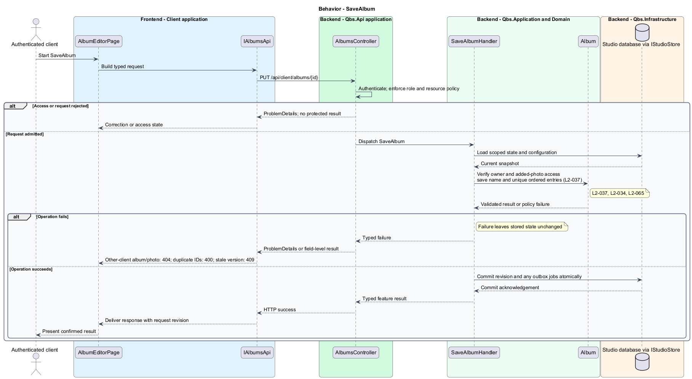
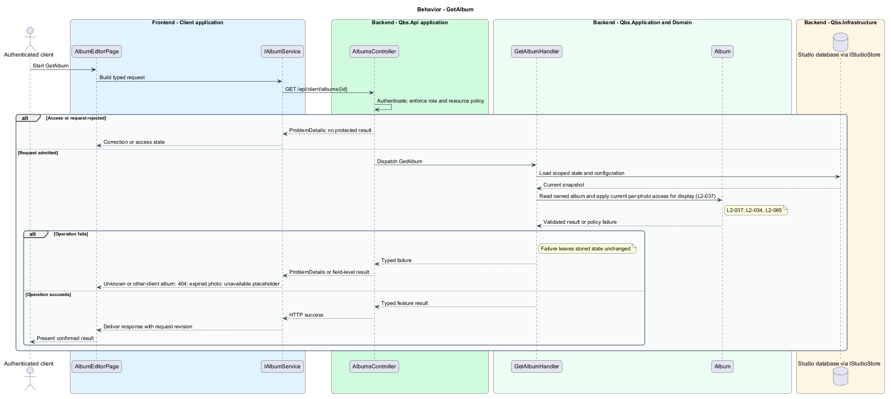

# Create and edit albums

## Overview

Quinntyne Brown Studio supports photography discovery, studio administration, and client deliverables. An album is a client-owned named and ordered collection of accessible session photos. It references existing images without duplicating original files. Clients organize selections across their authorized galleries.

## Description

Status: proposed production slice. The repository contains standalone HTML mocks; the Angular and .NET names below identify the components introduced by this design.

`AlbumEditorPage` keeps draft name and ordered photo identifiers in signals. `SaveAlbumHandler` derives ownership from authentication, verifies the existing album owner, and authorizes every newly added photo. It rejects duplicate photo IDs and stale versions. Creation requires a nonempty name and at least one photo; later removal of all photos leaves an empty album.

`GetAlbumHandler` authorizes ownership before returning any metadata. It rechecks each photo's current assignment and retention. Previously saved entries that are no longer accessible appear as unavailable placeholders without private bytes. Reordering existing unavailable entries does not grant image access; adding inaccessible photos is denied.

Selection order is stored as unique sequential positions in the album transaction. Save failures retain the draft and never show a false success. Acceptance covers reopening, rename, add/remove/reorder, cross-client reads and writes, revoked photo access, empty-after-edit, and concurrent editing.

`IAlbumsApi` is the Angular service interface consumed through its injection token. Its HTTP implementation calls `AlbumsController`. The controller dispatches its route operations to the corresponding named handlers. Shared-route delegation follows the [interface catalog](../../contracts.md#route-ownership); worker operations execute from durable jobs.

**Interfaces**

- `GET /api/client/albums → AlbumSummary[]; GET /api/client/albums/{id} → AlbumView with authorized photos or placeholders`
- `POST /api/client/albums ← name, photoIds[] → Album`
- `PUT /api/client/albums/{id} ← name, orderedPhotoIds[], expectedVersion → Album`

**Behavior ownership**

| Operation | Owner | Responsibility |
| --- | --- | --- |
| `SaveAlbum` | `SaveAlbumHandler` | Verify owner and added-photo access; save name and unique ordered entries. |
| `GetAlbum` | `GetAlbumHandler` | Read owned album and apply current per-photo access for display. |

The [shared architecture](../../architecture.md) defines authorization, wire conventions, persistence, environment boundaries, and delivery constraints. The [decision baseline](../../../specs/decisions.md) supplies exact policies and remaining evidence gates. Shared architecture requirements `L2-038` through `L2-045` and delivery requirements `L2-049` through `L2-054` apply to the implemented layers of this slice.

**Acceptance mapping**

The [acceptance register](../../acceptance.md) lists each applicable scenario with its implementing layer and current status. Feature tests exercise the success and failure behaviors described here. No production acceptance test exists merely because its scenario is designed.

## Requirements

Source: [L2 requirements](../../../specs/L2.md). Shared interface and delivery obligations have primary coverage in the engineering-delivery slice.

| L2 ID | Refines (L1) | Requirement |
| --- | --- | --- |
| `L2-001` | `L1-001` | The public and administrative applications shall support their specified tasks across the agreed desktop, tablet, and mobile viewport matrix. |
| `L2-002` | `L1-001` | The platform's interfaces shall use generous white space, clear task hierarchy, and controls limited to the specified workflows. |
| `L2-034` | `L1-010` | Client authorization shall be enforced for protected galleries, photos, albums, and print-request operations, including direct requests that bypass the interface. |
| `L2-037` | `L1-011` | Clients shall be able to create and subsequently view albums containing selected photos from their accessible session galleries. |
| `L2-065` | `L1-011` | Clients shall be able to rename their albums and add, reorder, or remove accessible photos while retaining ownership and access checks. |
| `L2-066` | `L1-001` | Platform interfaces shall follow the approved HTML prototype at 390, 768, and 1440 CSS-pixel widths across Chromium, Firefox, and WebKit, with keyboard-operable controls and readable validation and failure states. |

## Diagrams

The context identifies the people and systems involved in this capability. External services participate only where the description requires their data or effects.

The container view locates the participating applications and their deployed dependencies. It preserves the separation between browser interaction and persisted or background work.

The component view assigns the feature responsibilities to their architectural homes. `Album` provides the domain structure described in this slice.

The class view shows typed fields and relationships for `Album`. `AlbumPhoto` describes the related structure used by the feature.

`SaveAlbum`: Verify owner and added-photo access; save name and unique ordered entries. Other-client album/photo: 404; duplicate IDs: 400; stale version: 409.

`GetAlbum`: Read owned album and apply current per-photo access for display. Unknown or other-client album: 404; expired photo: unavailable placeholder.

