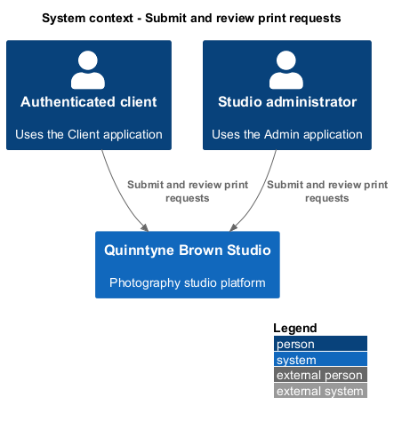
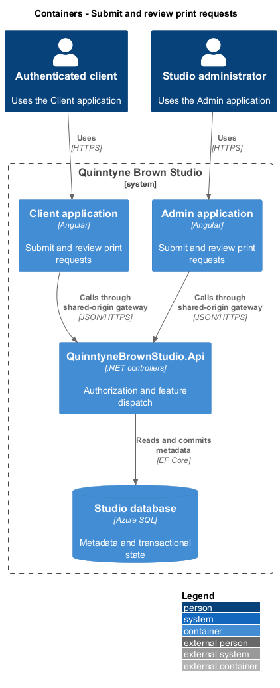
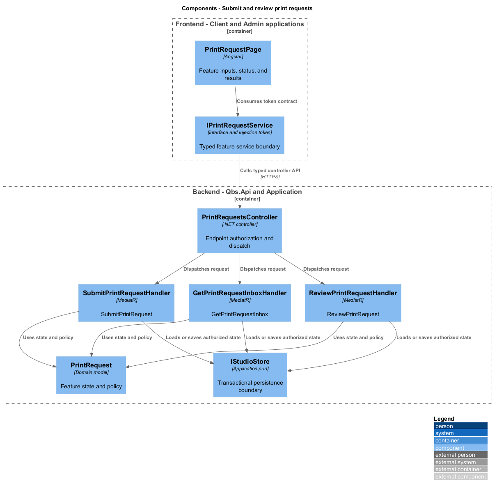
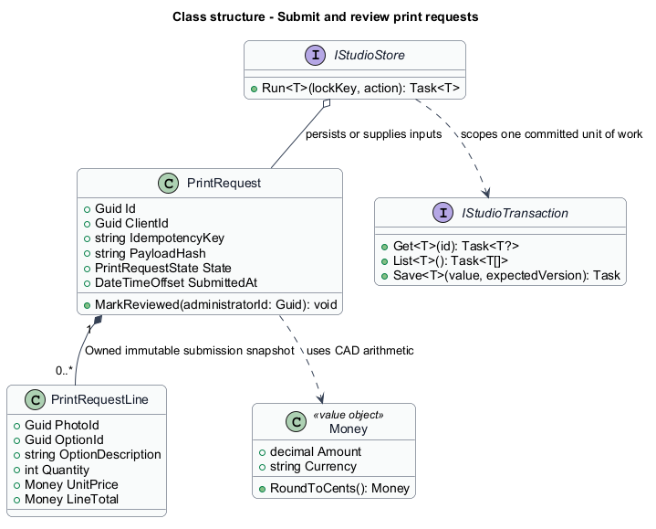
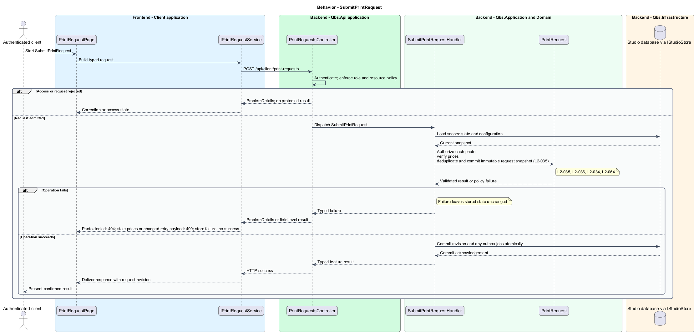
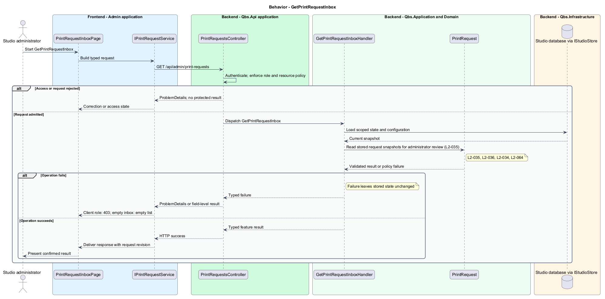
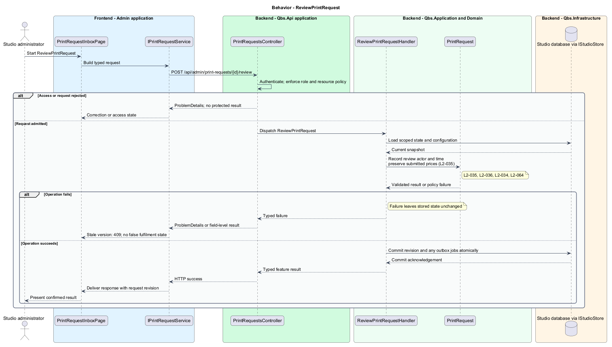

# Submit and review print requests

## Overview

Quinntyne Brown Studio supports photography discovery, studio administration, and client deliverables. A print request records a client selection for studio review. It contains photo choices, print options, quantities, and the submitted price snapshot. The administrator inbox acknowledges receipt and review without representing payment or fulfilment.

## Description

Status: designed for production and implemented in this repository. Delivered handler and service names consolidate some participants shown below; the [implementation report](../../../implementation/README.md) and the [acceptance register](../../acceptance.md) record the delivered structure and the evidence that remains open.

`PrintRequestPage` displays an authorized photo selection and server-priced summary. `SubmitPrintRequestHandler` validates every photo against current client assignment and expiry. It loads enabled print options and checks the displayed revisions. A price change produces 409 with a refresh instruction; the client reviews the revised summary before resubmission.

The handler stores immutable option descriptions, quantities, unit prices, and rounded line totals. A unique constraint on client ID and idempotency key prevents duplicate requests. Repeating the same canonical payload returns the original result after a lost response; a changed payload with the same key returns 409. The client identity never comes from submitted JSON.

`PrintRequestInboxPage` lists Submitted and Reviewed requests for administrators. `ReviewPrintRequestHandler` records administrator and review timestamp. Unreviewed references block photo deletion. Reviewed requests retain their snapshots after eligible deletion and identify unavailable photos without broken private URLs.

Acceptance covers inaccessible photos, disabled options, quantity validation, stale prices, response loss, duplicate concurrent submission, save failure, inbox access, and review persistence.

`IPrintRequestService` is the Angular service interface consumed through its injection token. Its HTTP implementation calls `PrintRequestsController`. The controller dispatches its route operations to the corresponding named handlers. Shared-route delegation follows the [interface catalog](../../contracts.md#route-ownership); worker operations execute from durable jobs.

**Interfaces**

- `POST /api/client/print-requests ← idempotencyKey, lines[{photoId,optionId,quantity,optionRevision}], notes? → requestId, price snapshot`
- `GET /api/admin/print-requests?state=... → request summaries; GET /api/admin/print-requests/{id} → request snapshot`
- `GET /api/client/print-requests/{id} → the requesting client's own snapshot`
- `POST /api/admin/print-requests/{id}/review ← expectedVersion → Reviewed request`

**Behavior ownership**

| Operation | Owner | Responsibility |
| --- | --- | --- |
| `SubmitPrintRequest` | `SubmitPrintRequestHandler` | Authorize each photo; verify prices; deduplicate and commit immutable request snapshot. |
| `GetPrintRequestInbox` | `GetPrintRequestInboxHandler` | Read stored request snapshots for administrator review. |
| `ReviewPrintRequest` | `ReviewPrintRequestHandler` | Record review actor and time; preserve submitted prices. |

The [shared architecture](../../architecture.md) defines authorization, wire conventions, persistence, environment boundaries, and delivery constraints. The [decision baseline](../../../specs/decisions.md) supplies exact policies and remaining evidence gates. Shared architecture requirements `L2-038` through `L2-045` and delivery requirements `L2-049` through `L2-054` apply to the implemented layers of this slice.

**Acceptance mapping**

The [acceptance register](../../acceptance.md) lists each applicable scenario with its implementing layer and current status. Feature tests exercise the success and failure behaviors described here. No production acceptance test exists merely because its scenario is designed.

## Requirements

Source: [L2 requirements](../../../specs/L2.md). Shared interface and delivery obligations have primary coverage in the engineering-delivery slice.

| L2 ID | Refines (L1) | Requirement |
| --- | --- | --- |
| `L2-001` | `L1-001` | The public and administrative applications shall support their specified tasks across the agreed desktop, tablet, and mobile viewport matrix. |
| `L2-002` | `L1-001` | The platform's interfaces shall use generous white space, clear task hierarchy, and controls limited to the specified workflows. |
| `L2-003` | `L1-001` | The platform shall restrict administrative content and operations to authorized studio administrators. This is a derived access requirement for the administrative application. |
| `L2-034` | `L1-010` | Client authorization shall be enforced for protected galleries, photos, albums, and print-request operations, including direct requests that bypass the interface. |
| `L2-035` | `L1-011` | Clients shall be able to select an accessible session photo for a print request and view the configured print options and prices before submission. |
| `L2-036` | `L1-011` | Clients shall be able to submit print requests for authorized photos with the required print selections, and shall receive an accurate submission outcome. |
| `L2-064` | `L1-011` | The platform shall store print requests containing photo, print-option, quantity, and price-snapshot details for administrator review, and shall prevent duplicate records for retried submissions. |
| `L2-066` | `L1-001` | Platform interfaces shall follow the approved HTML prototype at 390, 768, and 1440 CSS-pixel widths across Chromium, Firefox, and WebKit, with keyboard-operable controls and readable validation and failure states. |

## Diagrams

The context identifies the people and systems involved in this capability. External services participate only where the description requires their data or effects.

The container view locates the participating applications and their deployed dependencies. It preserves the separation between browser interaction and persisted or background work.

The component view assigns the feature responsibilities to their architectural homes. `PrintRequest` provides the domain structure described in this slice.

The class view shows typed fields and relationships for `PrintRequest`. `PrintRequestLine` describes the related structure used by the feature.

`SubmitPrintRequest`: Authorize each photo; verify prices; deduplicate and commit immutable request snapshot. Photo denied: 404; stale prices or changed retry payload: 409; store failure: no success.

`GetPrintRequestInbox`: Read stored request snapshots for administrator review. Client role: 403; empty inbox: empty list.

`ReviewPrintRequest`: Record review actor and time; preserve submitted prices. Stale version: 409; no false fulfilment state.

