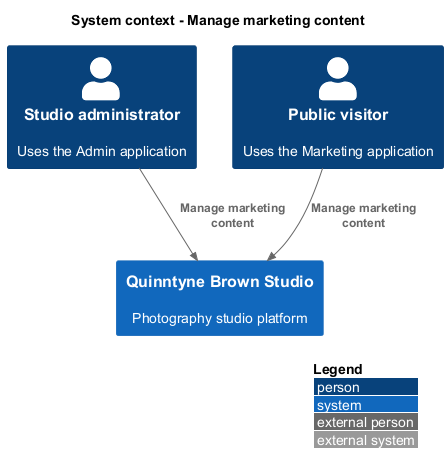
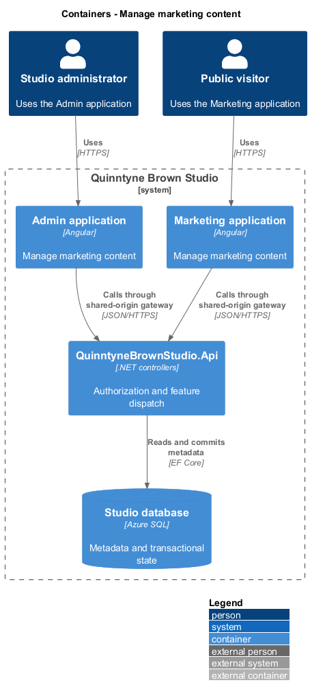
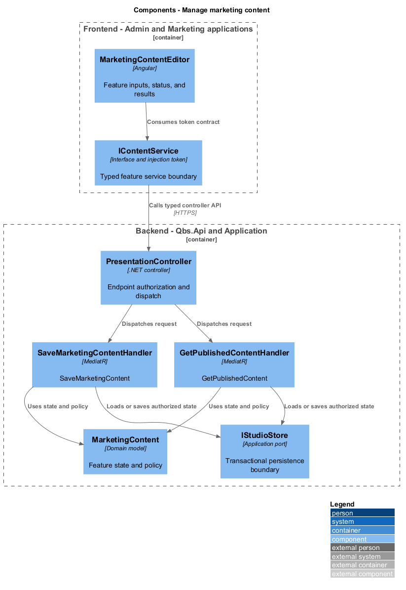
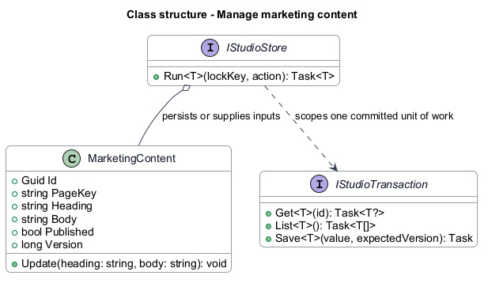
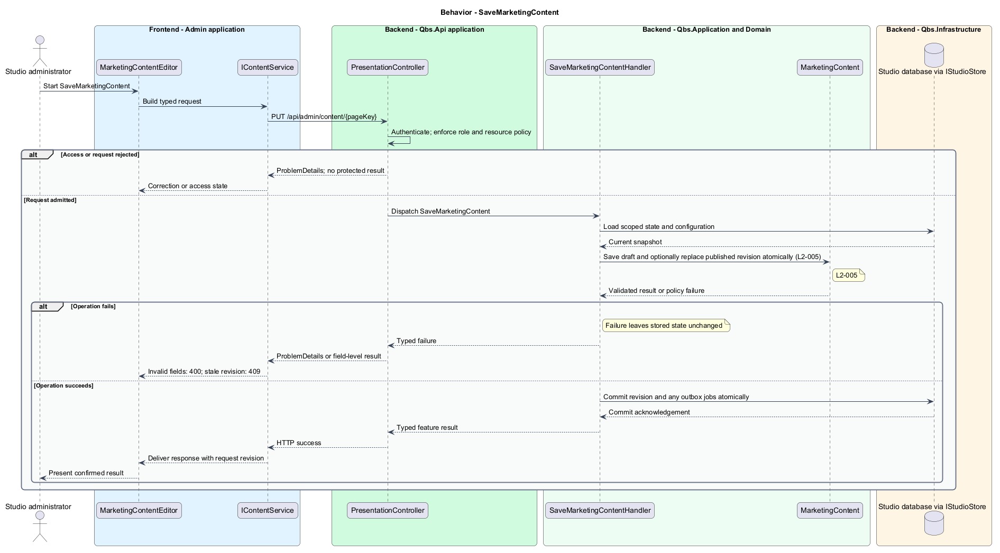
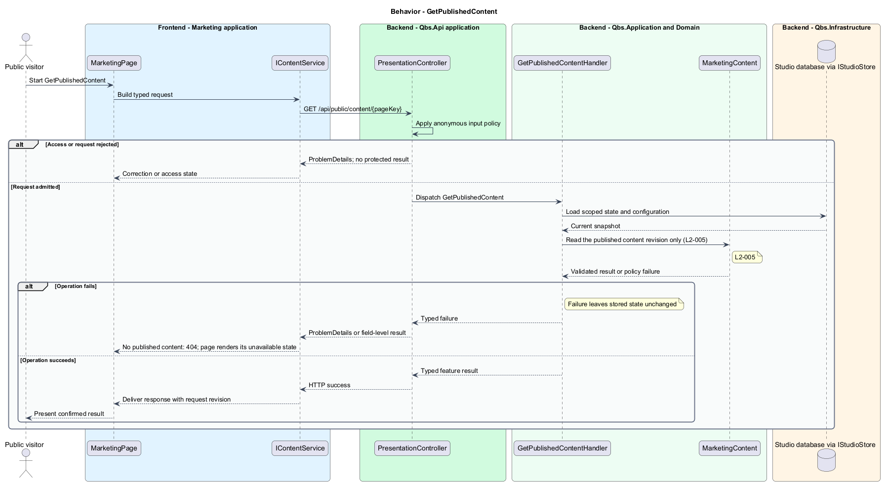

# Manage marketing content

## Overview

Quinntyne Brown Studio supports photography discovery, studio administration, and client deliverables. Marketing content is administrator-maintained text for a public page. This slice lets the studio update its presentation without editing application files. Published text follows the approved page layout.

## Description

Status: designed for production and implemented in this repository. Delivered handler and service names consolidate some participants shown below; the [implementation report](../../../implementation/README.md) and the [acceptance register](../../acceptance.md) record the delivered structure and the evidence that remains open.

`MarketingContentEditor` edits bounded plain-text fields for existing page keys. `MarketingPage` reads a public content projection. Rich HTML input is excluded; rendering escapes content to prevent stored markup execution. Page keys come from the approved task inventory rather than arbitrary route creation.

Draft edits remain separate from the published revision. Publishing atomically replaces the revision used on subsequent public reads. Empty required headings are rejected before the store changes. The public query returns only published text and excludes administrative revision details.

Acceptance covers save, draft isolation, subsequent public refresh, field errors, and concurrent publication conflict.

`IContentService` is the Angular service interface consumed through its injection token. Its HTTP implementation calls `PresentationController`. The controller dispatches its route operations to the corresponding named handlers. Shared-route delegation follows the [interface catalog](../../contracts.md#route-ownership); worker operations execute from durable jobs.

**Interfaces**

- `GET /api/admin/content → MarketingContent[]`
- `PUT /api/admin/content/{pageKey} ← heading, body, publish, expectedVersion → MarketingContent`
- `GET /api/public/content/{pageKey} → PublishedContent`

**Behavior ownership**

| Operation | Owner | Responsibility |
| --- | --- | --- |
| `SaveMarketingContent` | `SaveMarketingContentHandler` | Save draft and optionally replace published revision atomically. |
| `GetPublishedContent` | `GetPublishedContentHandler` | Read the published content revision only. |

The [shared architecture](../../architecture.md) defines authorization, wire conventions, persistence, environment boundaries, and delivery constraints. The [decision baseline](../../../specs/decisions.md) supplies exact policies and remaining evidence gates. Shared architecture requirements `L2-038` through `L2-045` and delivery requirements `L2-049` through `L2-054` apply to the implemented layers of this slice.

**Acceptance mapping**

The [acceptance register](../../acceptance.md) lists each applicable scenario with its implementing layer and current status. Feature tests exercise the success and failure behaviors described here. No production acceptance test exists merely because its scenario is designed.

## Requirements

Source: [L2 requirements](../../../specs/L2.md). Shared interface and delivery obligations have primary coverage in the engineering-delivery slice.

| L2 ID | Refines (L1) | Requirement |
| --- | --- | --- |
| `L2-001` | `L1-001` | The public and administrative applications shall support their specified tasks across the agreed desktop, tablet, and mobile viewport matrix. |
| `L2-002` | `L1-001` | The platform's interfaces shall use generous white space, clear task hierarchy, and controls limited to the specified workflows. |
| `L2-003` | `L1-001` | The platform shall restrict administrative content and operations to authorized studio administrators. This is a derived access requirement for the administrative application. |
| `L2-005` | `L1-002` | Administrators shall be able to update marketing content and configure public galleries through the administrative application without editing application code. |
| `L2-066` | `L1-001` | Platform interfaces shall follow the approved HTML prototype at 390, 768, and 1440 CSS-pixel widths across Chromium, Firefox, and WebKit, with keyboard-operable controls and readable validation and failure states. |

## Diagrams

The context identifies the people and systems involved in this capability. External services participate only where the description requires their data or effects.

The container view locates the participating applications and their deployed dependencies. It preserves the separation between browser interaction and persisted or background work.

The component view assigns the feature responsibilities to their architectural homes. `MarketingContent` provides the domain structure described in this slice.

The class view shows typed fields and relationships for `MarketingContent`. Application ports separate the model from provider implementations.

`SaveMarketingContent`: Save draft and optionally replace published revision atomically. Invalid fields: 400; stale revision: 409.

`GetPublishedContent`: Read the published content revision only. No published content: 404; page renders its unavailable state.

