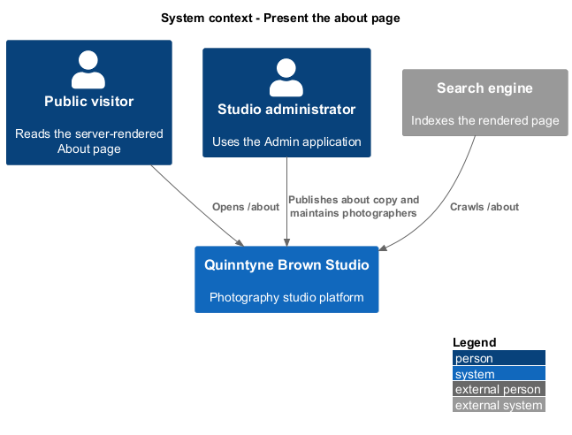
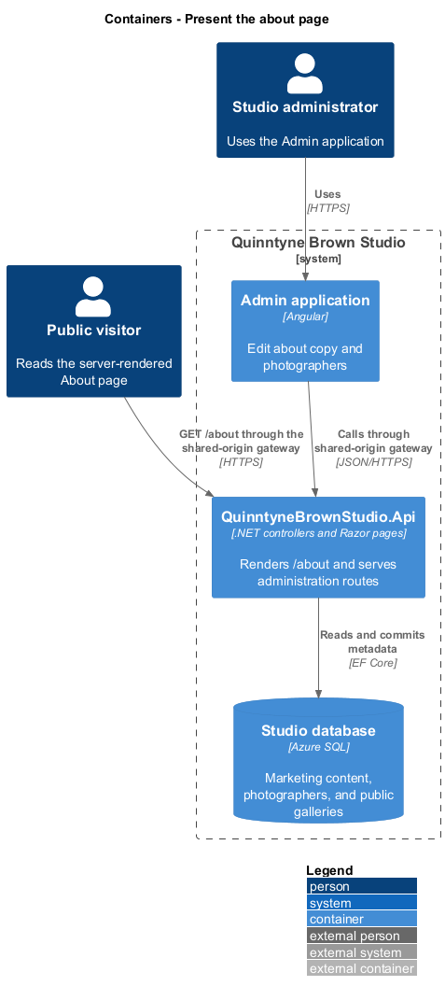
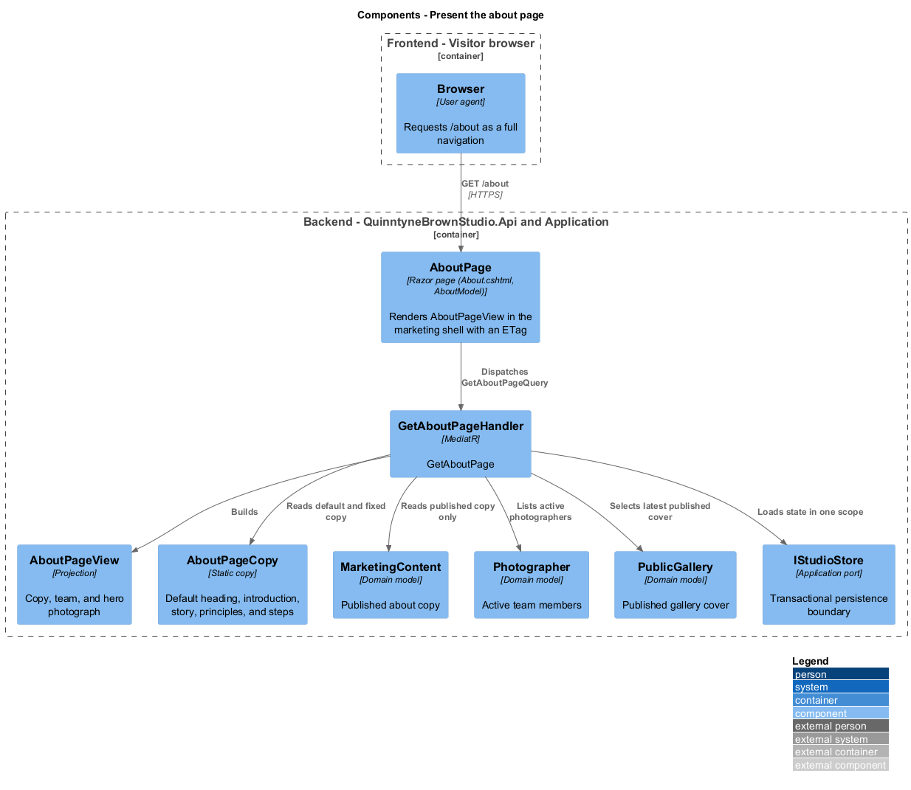
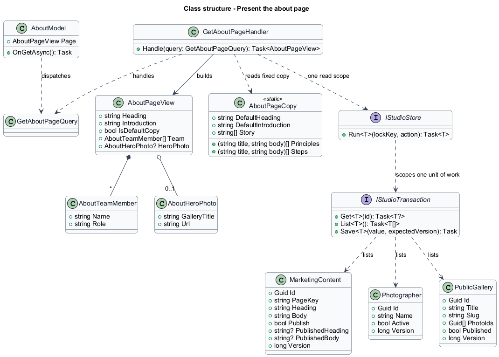
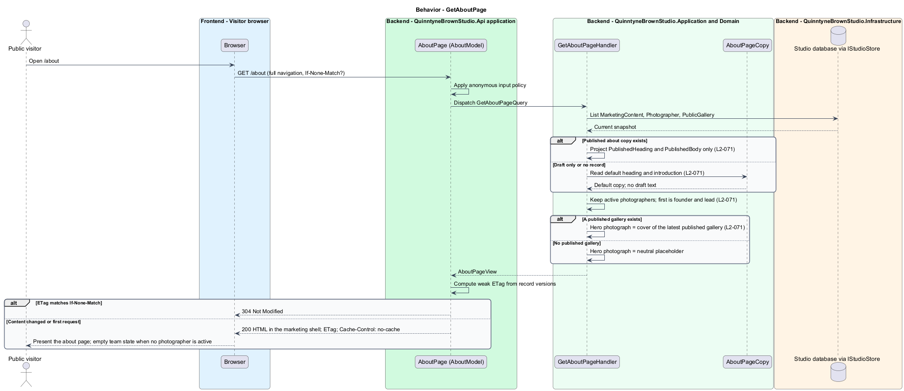

# Present the about page

## Overview

Quinntyne Brown Studio supports photography discovery, studio administration, and client deliverables. The About page introduces the studio to a prospective client before any quotation or contact. It presents an administrator-published heading and introduction, the studio story, three working principles, three session steps, and the studio's active photographers, following the approved prototype at `docs/mocks/marketing/about.html`.

The page is rendered by the API at `/about` under [OD-13](../../../specs/decisions.md#od-13--server-rendered-about-and-contact-pages), so the complete content reaches search engines and visitors in the first response. The rendering, metadata, canonical address, and sitemap obligations belong to the [serve-search-discoverable-pages](../serve-search-discoverable-pages/README.md) slice; this slice owns what the page says and where each statement comes from.

Local terms: **published copy** — the `PublishedHeading` and `PublishedBody` of the `MarketingContent` record whose page key is `about`; **default copy** — the prototype heading and introduction used when no published copy exists; **team** — the photographers whose `Active` flag is set; **hero photograph** — the cover of the most recently published public gallery.

## Description

Status: designed under OD-13; not yet implemented.

`AboutPage` is the Razor page at `Pages/About.cshtml` with the `AboutModel` page model, declared with `@page "/about"`. `OnGetAsync` dispatches `GetAboutPageQuery`, computes a weak `ETag` from the versions of the records the view depends on in the same way `Pages/IndexModel.cs` does for the blog listing, answers 304 to a matching `If-None-Match`, and otherwise renders `AboutPageView` inside the marketing shell selected by `_Layout.cshtml`.

`GetAboutPageHandler` is the MediatR handler in `QuinntyneBrownStudio.Application/Presentation`. Inside one `IStudioStore.Run` scope it reads the `MarketingContent` record with page key `about` through `IStudioTransaction.List<MarketingContent>()` and uses its published copy only; a draft with no published revision, or no record at all, yields the default copy and sets `IsDefaultCopy`. Draft `Heading` and `Body` values are never projected. It lists `Photographer` records whose `Active` flag is set, in stored order, and marks the first as founder and lead photographer. It selects the most recently published `PublicGallery` and projects its first `PhotoIds` entry through the public derivative route `/api/public/galleries/{slug}/photos/{id}`; when no gallery is published the hero carries a neutral placeholder. The `Presentation.Save` page-key allowlist in `Application/Presentation/Presentation.cs` gains `about` so the existing content editor at `/content` can publish the copy.

`AboutPageView` is the projection the view renders: `Heading`, `Introduction`, `IsDefaultCopy`, `Team` (`AboutTeamMember[]` with `Name` and `Role`), and `HeroPhoto` (`GalleryTitle` and `Url`, or null). `AboutPageCopy` is a static class holding the default heading, the default introduction, the story paragraphs, the three principles, and the three session steps taken from the approved prototype; this copy ships with the release and is not editable.

Two facts are open. `Photographer` carries `Name` and `Active` only, while the prototype shows working hours on each team card; the hours source is `<TO SUPPLY>`. `PublicGallery` carries `Published` without a publication timestamp; the ordering key that identifies the most recently published gallery is `<TO SUPPLY>`.

The public read is anonymous; the page discloses only published content, active photographers, and published gallery covers. Administrators change what the page shows through the existing content editor and photographer records, and every request reads the current state, so a change appears on the next request without a release.

**Interfaces**

- `GET /about → HTML; ETag and Cache-Control: no-cache; 304 on a matching If-None-Match`
- `PUT /api/admin/content/about ← heading, body, publish, expectedVersion → MarketingContent` (existing route, page key added)
- `PUT /api/admin/photographers/{id} ← name, active, expectedVersion → Photographer` (existing route)

**Behavior ownership**

| Operation | Owner | Responsibility |
| --- | --- | --- |
| `GetAboutPage` | `GetAboutPageHandler` | Read published or default copy, active photographers, and the latest published gallery cover; disclose no draft text. |

The [shared architecture](../../architecture.md) defines authorization, wire conventions, persistence, environment boundaries, and delivery constraints. The [decision baseline](../../../specs/decisions.md) supplies exact policies and remaining evidence gates. Shared architecture requirements `L2-038` through `L2-045` and delivery requirements `L2-049` through `L2-054` apply to the implemented layers of this slice.

**Acceptance mapping**

The [acceptance register](../../acceptance.md) lists each applicable scenario with its implementing layer and current status. Feature tests exercise the success and failure behaviors described here. No production acceptance test exists merely because its scenario is designed.

## Requirements

Source: [L2 requirements](../../../specs/L2.md). Shared interface and delivery obligations have primary coverage in the engineering-delivery slice.

| L2 ID | Refines (L1) | Requirement |
| --- | --- | --- |
| `L2-001` | `L1-001` | The public and administrative applications shall support their specified tasks across the agreed desktop, tablet, and mobile viewport matrix. |
| `L2-002` | `L1-001` | The platform's interfaces shall use generous white space, clear task hierarchy, and controls limited to the specified workflows. |
| `L2-066` | `L1-001` | Platform interfaces shall follow the approved HTML prototype at 390, 768, and 1440 CSS-pixel widths across Chromium, Firefox, and WebKit, with keyboard-operable controls and readable validation and failure states. |
| `L2-071` | `L1-018` | The public site shall serve `/about` presenting the administrator-published `about` heading and introduction, the studio story, three working principles, three session steps, and the studio's active photographers, following the approved prototype at `docs/mocks/marketing/about.html`. The story, principles, and steps are the prototype's copy. The hero photograph is the cover of the most recently published public gallery. When no `about` content has been published, the page shall use the prototype's default heading and introduction; draft content is never disclosed. |

## Diagrams

The context identifies the people and systems involved in this capability. A visitor reads the page; an administrator changes the copy and the team through the administration application.

The container view locates the participating applications and their deployed dependencies. The API renders the page itself; the Admin application edits the records the page reads.

The component view assigns the feature responsibilities to their architectural homes. `AboutPageCopy` supplies the fixed prototype copy beside the stored records.

The class view shows typed fields and relationships for `AboutPageView` and the records `GetAboutPageHandler` reads.

`GetAboutPage`: Read published or default copy, active photographers, and the latest published gallery cover. No published copy: default copy; no active photographer: empty team state; no published gallery: neutral placeholder; matching `If-None-Match`: 304.

