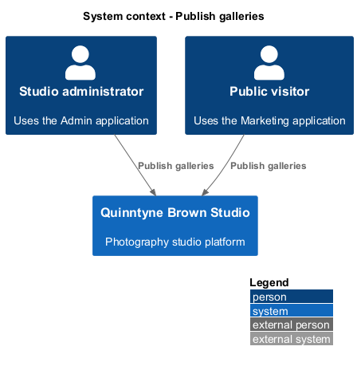
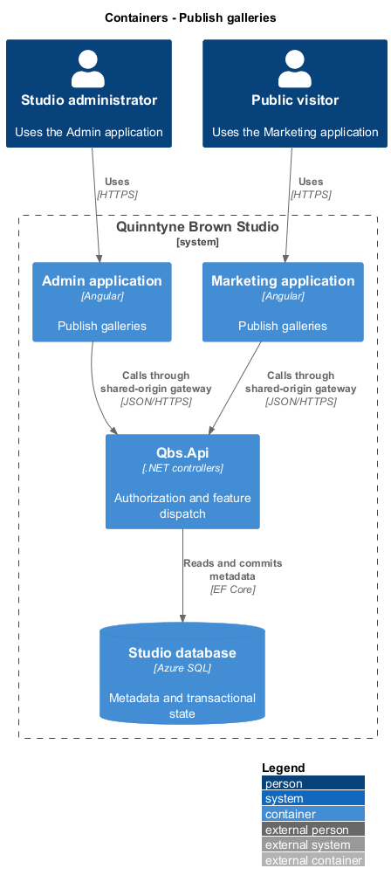
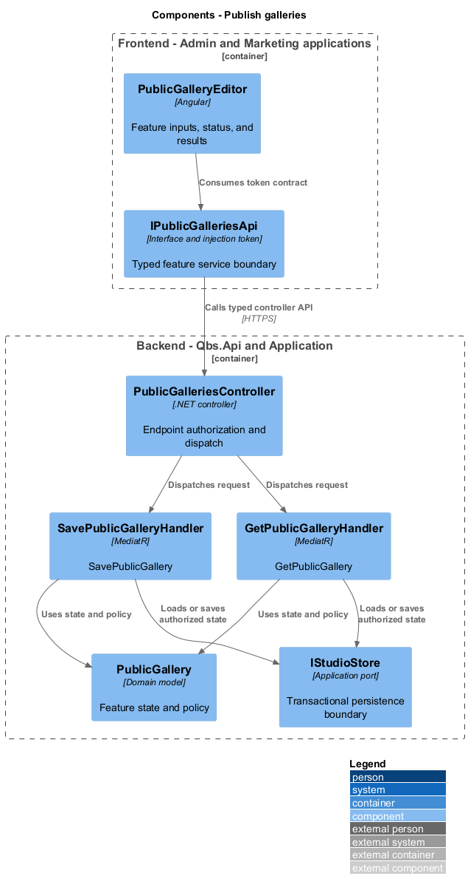
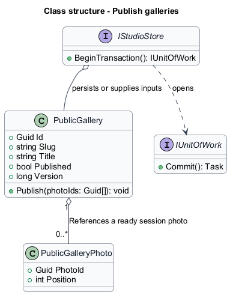
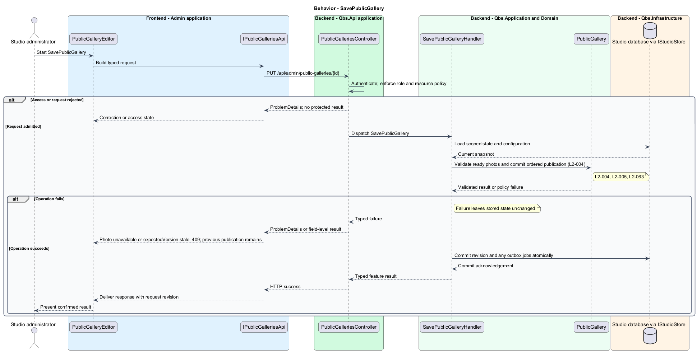
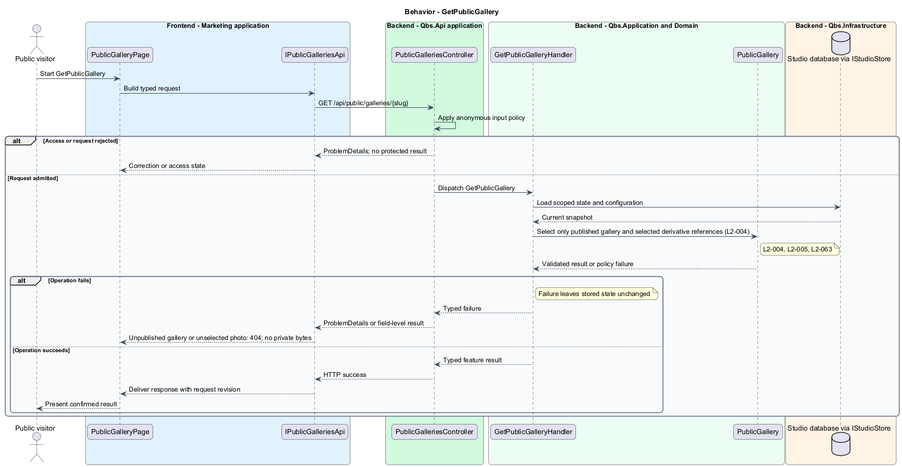

# Publish galleries

## Overview

Quinntyne Brown Studio supports photography discovery, studio administration, and client deliverables. A public gallery is a named collection of photographs deliberately selected for anonymous viewing. The administrator chooses its ordered photos independently of private client assignments. Visitors browse only the current published selection.

## Description

Status: proposed production slice. The repository contains standalone HTML mocks; the Angular and .NET names below identify the components introduced by this design.

`PublicGalleryEditor` saves the ordered selection and publication state. `PublicGalleryPage` in Marketing displays the resulting projection. `PublicGallery` references existing ready session photos; it owns no originals. The first selected photo supplies the cover. A stable unique slug identifies the public page.

The handler checks that every selected photo is ready and not pending deletion. Publication and selection changes commit together. Unpublishing makes subsequent gallery and public-image requests inaccessible. Public-image delivery rechecks the current gallery selection and streams metadata-stripped derivatives. Client assignments are managed by the separate access slice and never change as a consequence of publication.

Acceptance covers anonymous display, draft exclusion, direct access to deselected photos, conflicting edits, and deletion-reference races.

`IPublicGalleriesApi` is the Angular service interface consumed through its injection token. Its HTTP implementation calls `PublicGalleriesController`. The controller dispatches the operations below to the corresponding named handlers.

**Interfaces**

- `GET /api/admin/public-galleries → PublicGallery[]`
- `POST /api/admin/public-galleries; PUT /api/admin/public-galleries/{id} ← title, slug, photoIds[], published, expectedVersion → PublicGallery`
- `GET /api/public/galleries; GET /api/public/galleries/{slug} → PublicGalleryView`
- `GET /api/public/galleries/{slug}/photos/{photoId} → authorized JPEG stream`

**Behavior ownership**

| Operation | Owner | Responsibility |
| --- | --- | --- |
| `SavePublicGallery` | `SavePublicGalleryHandler` | Validate ready photos and commit ordered publication. |
| `GetPublicGallery` | `GetPublicGalleryHandler` | Select only published gallery and selected derivative references. |

The [shared architecture](../../architecture.md) defines authorization, wire conventions, persistence, environment boundaries, and delivery constraints. The [decision baseline](../../../specs/decisions.md) supplies exact policies and remaining evidence gates. Shared architecture requirements `L2-038` through `L2-045` and delivery requirements `L2-049` through `L2-054` apply to the implemented layers of this slice.

**Acceptance mapping**

The [acceptance register](../../acceptance.md) lists each applicable scenario with its implementing layer and current status. Feature tests exercise the success and failure behaviors described here. No production acceptance test exists merely because its scenario is designed.

## Requirements

Source: [L2 requirements](../../../specs/L2.md). Shared interface and delivery obligations have primary coverage in the engineering-delivery slice.

| L2 ID | Refines (L1) | Requirement |
| --- | --- | --- |
| `L2-001` | `L1-001` | The public and administrative applications shall support their specified tasks across the agreed desktop, tablet, and mobile viewport matrix. |
| `L2-002` | `L1-001` | The platform's interfaces shall use generous white space, clear task hierarchy, and controls limited to the specified workflows. |
| `L2-003` | `L1-001` | The platform shall restrict administrative content and operations to authorized studio administrators. This is a derived access requirement for the administrative application. |
| `L2-004` | `L1-002` | The public application shall display the photography galleries configured for public presentation by an administrator. |
| `L2-005` | `L1-002` | Administrators shall be able to update marketing content and configure public galleries through the administrative application without editing application code. |
| `L2-063` | `L1-010` | Administrators shall be able to assign and revoke client access to selected session galleries, with authorization enforced for gallery metadata and photo delivery. |
| `L2-066` | `L1-001` | Platform interfaces shall follow the approved HTML prototype at 390, 768, and 1440 CSS-pixel widths across Chromium, Firefox, and WebKit, with keyboard-operable controls and readable validation and failure states. |

## Diagrams

The context identifies the people and systems involved in this capability. External services participate only where the description requires their data or effects.

The container view locates the participating applications and their deployed dependencies. It preserves the separation between browser interaction and persisted or background work.

The component view assigns the feature responsibilities to their architectural homes. `PublicGallery` provides the domain structure described in this slice.

The class view shows typed fields and relationships for `PublicGallery`. A referenced photo retains its independent lifetime even when a gallery or album owns the reference entry.

`SavePublicGallery`: Validate ready photos and commit ordered publication. Photo unavailable or expectedVersion stale: 409; previous publication remains.

`GetPublicGallery`: Select only published gallery and selected derivative references. Unpublished gallery or unselected photo: 404; no private bytes.

