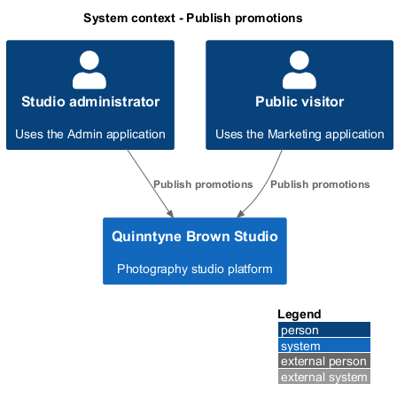
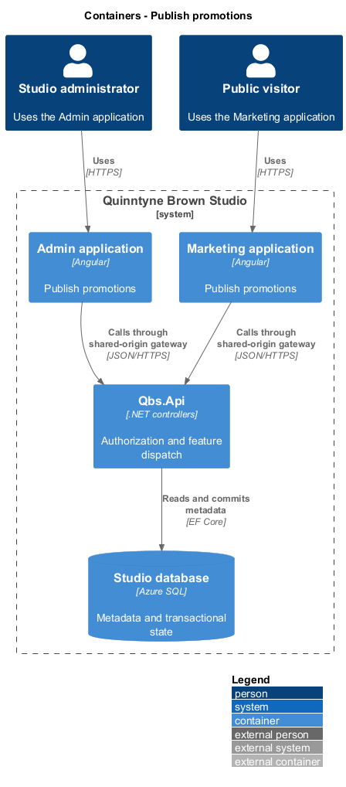
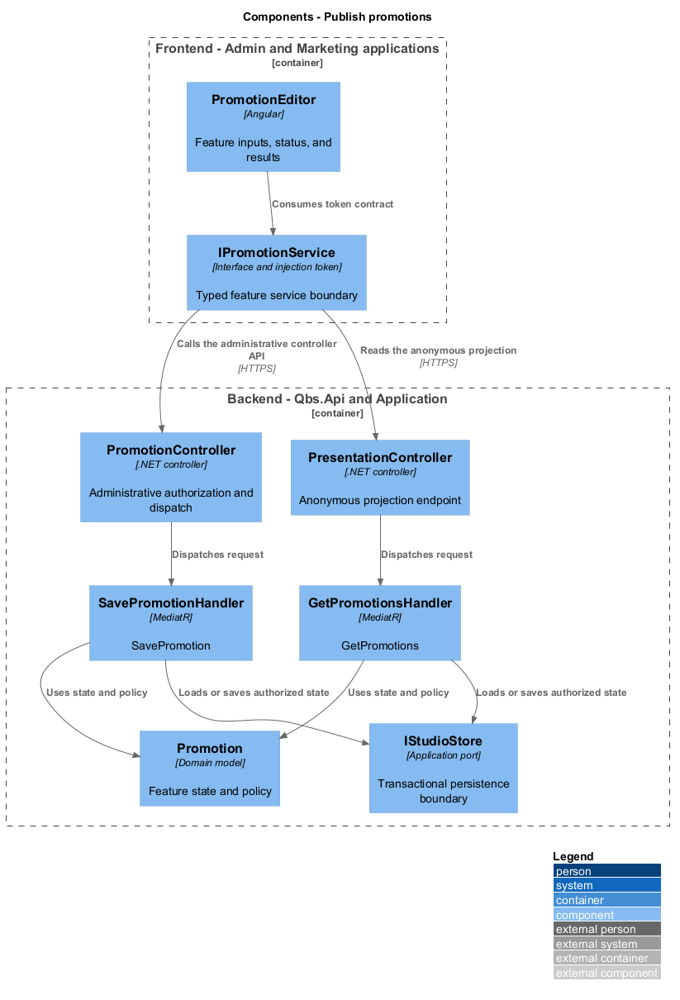
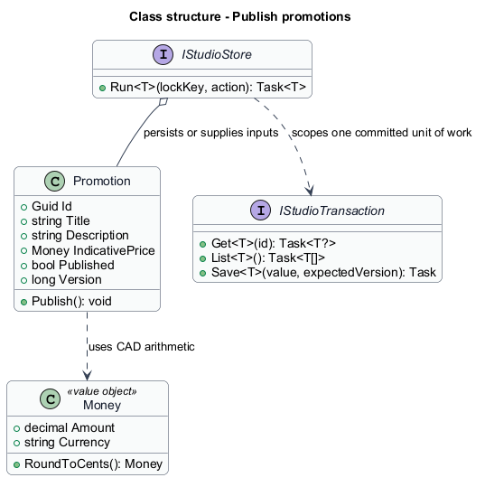
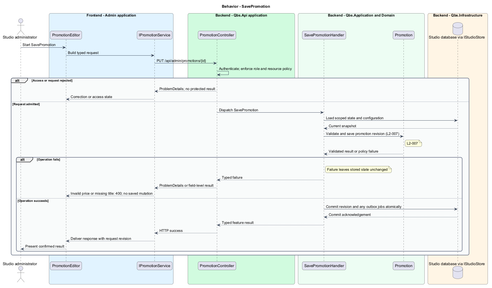
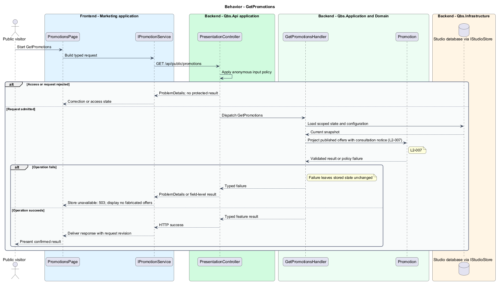

# Publish promotions

## Overview

Quinntyne Brown Studio supports photography discovery, studio administration, and client deliverables. A promotion is an administrator-configured package description with an indicative price. Visitors use promotions to understand possible services before consultation. A promotion does not establish a booking or a final contract.

## Description

Status: designed for production and implemented in this repository. Delivered handler and service names consolidate some participants shown below; the [implementation report](../../../implementation/README.md) and the [acceptance register](../../acceptance.md) record the delivered structure and the evidence that remains open.

`PromotionEditor` controls title, description, indicative price, and publication. `PromotionsPage` renders published entries with the fixed consultation qualification adjacent to every offer. The qualification is application-owned text and cannot be removed through content editing.

Prices follow the shared CAD representation. Public queries omit drafts. A promotion is presentation content; the calculator uses configured service rates and discount rules, not a hidden promotion override.

Acceptance covers create/edit, public refresh, invalid negative prices, draft exclusion, and qualification visibility at every viewport.

`IPromotionService` is the Angular service interface consumed through its injection token. Its HTTP implementation calls `PromotionController` for administration and `PresentationController` for the published projection. The controller dispatches its route operations to the corresponding named handlers. Shared-route delegation follows the [interface catalog](../../contracts.md#route-ownership); worker operations execute from durable jobs.

**Interfaces**

- `GET /api/admin/promotions → Promotion[]`
- `GET /api/admin/promotions/{id} → Promotion for its editor`
- `POST /api/admin/promotions; PUT /api/admin/promotions/{id} ← title, description, indicativePrice, published, expectedVersion → Promotion`
- `GET /api/public/promotions → PromotionView[] with consultationNotice`

**Behavior ownership**

| Operation | Owner | Responsibility |
| --- | --- | --- |
| `SavePromotion` | `SavePromotionHandler` | Validate and save promotion revision. |
| `GetPromotions` | `GetPromotionsHandler` | Project published offers with consultation notice. |

The [shared architecture](../../architecture.md) defines authorization, wire conventions, persistence, environment boundaries, and delivery constraints. The [decision baseline](../../../specs/decisions.md) supplies exact policies and remaining evidence gates. Shared architecture requirements `L2-038` through `L2-045` and delivery requirements `L2-049` through `L2-054` apply to the implemented layers of this slice.

**Acceptance mapping**

The [acceptance register](../../acceptance.md) lists each applicable scenario with its implementing layer and current status. Feature tests exercise the success and failure behaviors described here. No production acceptance test exists merely because its scenario is designed.

## Requirements

Source: [L2 requirements](../../../specs/L2.md). Shared interface and delivery obligations have primary coverage in the engineering-delivery slice.

| L2 ID | Refines (L1) | Requirement |
| --- | --- | --- |
| `L2-001` | `L1-001` | The public and administrative applications shall support their specified tasks across the agreed desktop, tablet, and mobile viewport matrix. |
| `L2-002` | `L1-001` | The platform's interfaces shall use generous white space, clear task hierarchy, and controls limited to the specified workflows. |
| `L2-003` | `L1-001` | The platform shall restrict administrative content and operations to authorized studio administrators. This is a derived access requirement for the administrative application. |
| `L2-007` | `L1-002` | Administrators shall be able to maintain public package promotions, and the public application shall state that the promoted offer is subject to change after detailed consultation. |
| `L2-066` | `L1-001` | Platform interfaces shall follow the approved HTML prototype at 390, 768, and 1440 CSS-pixel widths across Chromium, Firefox, and WebKit, with keyboard-operable controls and readable validation and failure states. |

## Diagrams

The context identifies the people and systems involved in this capability. External services participate only where the description requires their data or effects.

The container view locates the participating applications and their deployed dependencies. It preserves the separation between browser interaction and persisted or background work.

The component view assigns the feature responsibilities to their architectural homes. `Promotion` provides the domain structure described in this slice.

The class view shows typed fields and relationships for `Promotion`. Application ports separate the model from provider implementations.

`SavePromotion`: Validate and save promotion revision. Invalid price or missing title: 400; no saved mutation.

`GetPromotions`: Project published offers with consultation notice. Store unavailable: 503; display no fabricated offers.

