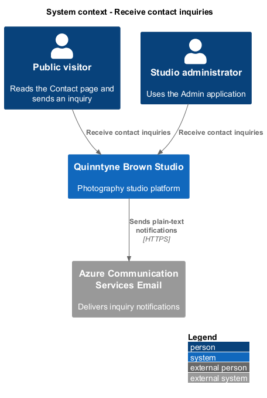
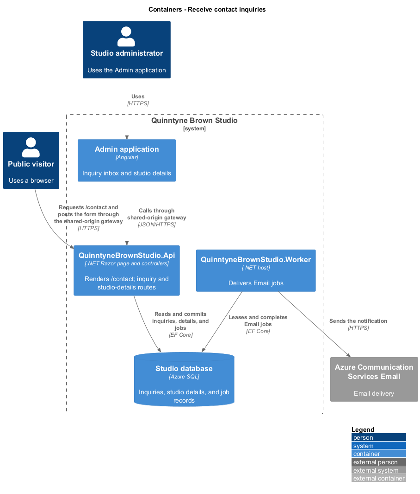
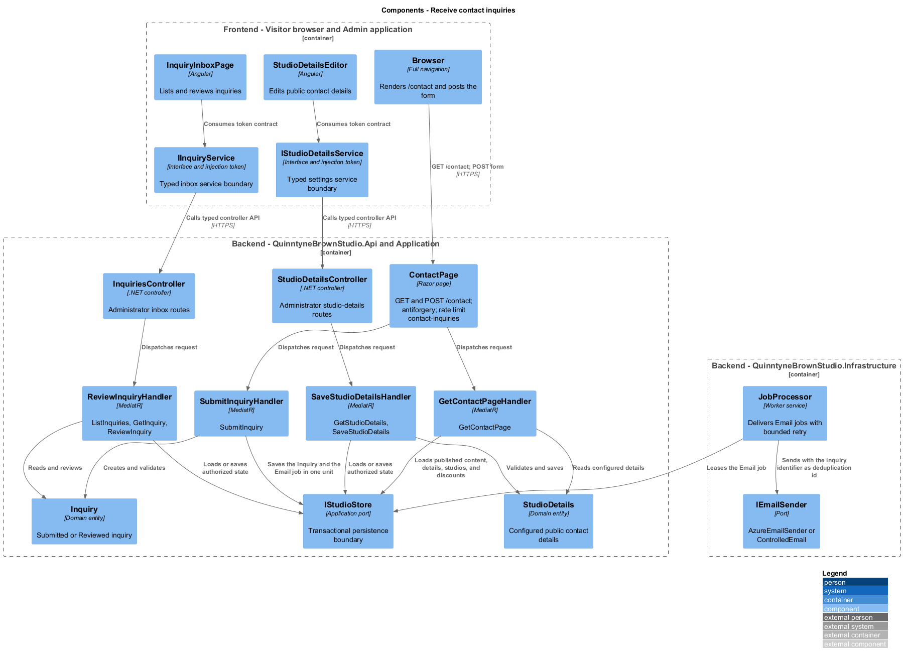
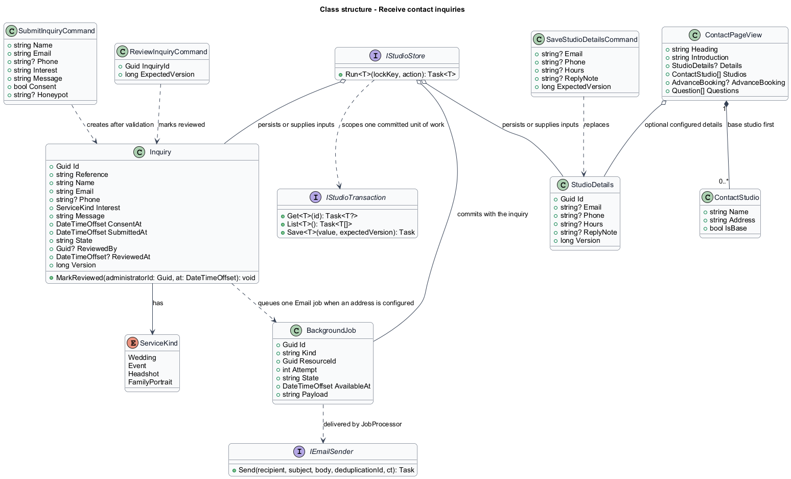
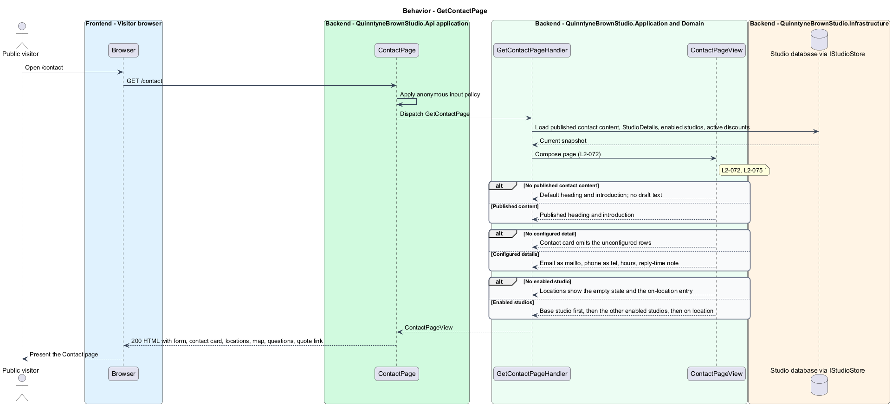
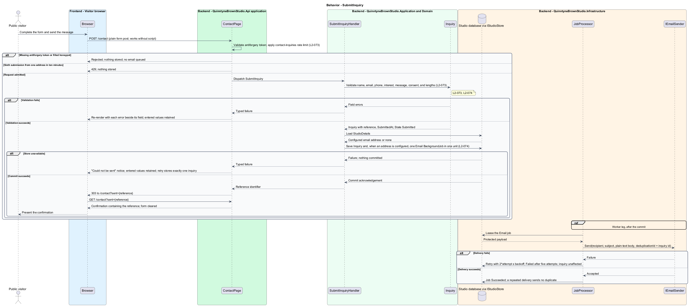
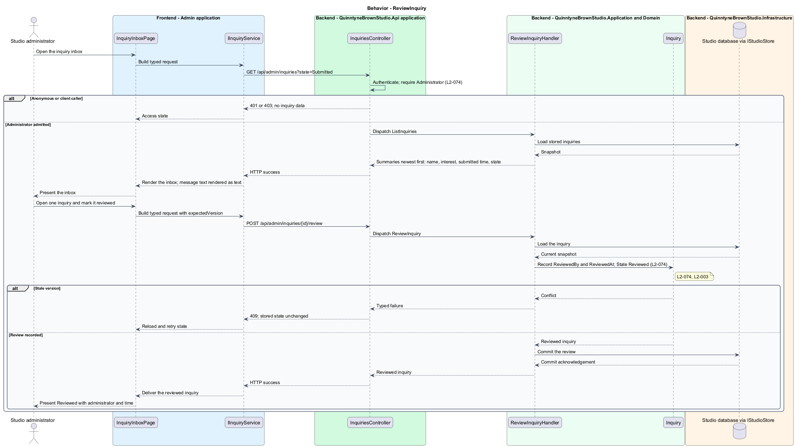
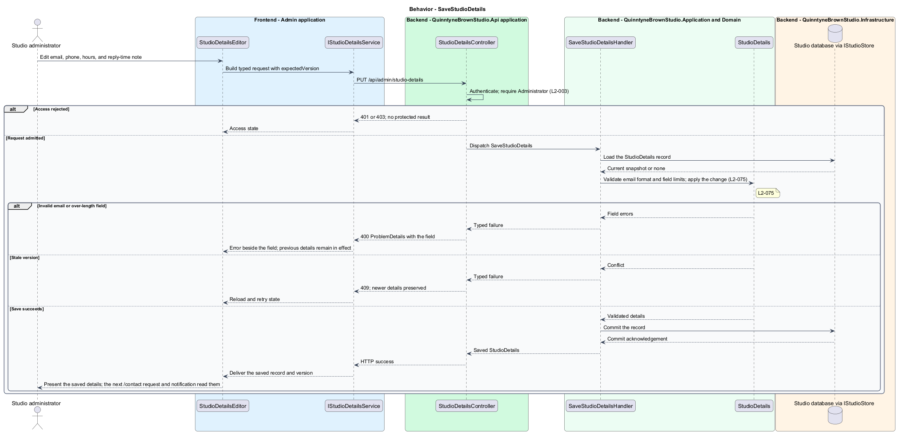

# Receive contact inquiries

## Overview

Quinntyne Brown Studio supports photography discovery, studio administration, and client deliverables. The Contact page is the public address `/contact` where a prospective client reads the studio's contact details, its locations, and common questions, and sends a message. An *inquiry* is that message once the studio has stored it: name, email address, optional phone number, photography interest, message text, consent, submission time, and a stable reference identifier. An inquiry establishes no booking, quotation, or reservation.

*Studio contact details* are the administrator-configured public email address, phone number, opening hours, and reply-time note. The Contact page reads them on each request and omits any row that is not configured. The same email address receives a plain-text notification for every stored inquiry through the existing email delivery job. Administrators read inquiries in an inbox with `Submitted` and `Reviewed` states, mirroring the print-request inbox.

The page is rendered by the API rather than the Angular marketing application, as decided in [OD-13](../../../specs/decisions.md#od-13--server-rendered-about-and-contact-pages). The [serve-search-discoverable-pages](../serve-search-discoverable-pages/README.md) slice owns the shared marketing shell, metadata, caching, gateway routing, and sitemap for `/contact`; this slice owns the page content, the form, the inquiry records, the inbox, and the studio details.

## Description

Status: implemented on 2026-09-13 under OD-13; evidence in the [acceptance register](../../acceptance.md).

`ContactPage` is the Razor page `Pages/Contact.cshtml` with the page model `ContactModel` (`@page "/contact"`). `OnGet` dispatches `GetContactPage` and renders the approved prototype layout from `docs/mocks/marketing/contact.html`: the published `contact` heading and introduction, the message form, the contact card, the studio locations, the illustrative map, three questions, and the quotation call to action. `OnPost` receives the plain form post, validates the antiforgery token that the Razor form tag helper emitted, and dispatches `SubmitInquiry`. A valid submission redirects to `/contact?sent=<reference>` so that a refresh cannot resubmit, and the page shows the confirmation with the reference. An invalid submission re-renders the form with each error beside its field and the entered values retained. A store failure re-renders with the "could not be sent" notice and the entered values retained. The form functions without client-side script.

`GetContactPageHandler` composes `ContactPageView` from the published fields of `MarketingContent` with page key `contact` (the existing `Presentation.Public` projection, never draft fields), the single `StudioDetails` record, the `Enabled` studios ordered with the `Studio.IsBase` studio first and projected as `Name` and `ResolvedAddress.Label`, the active advance-booking discount (`DiscountKind.Advance` days and percentage) that completes the first question, and the fixed prototype questions. `ContactPageView` carries `heading`, `introduction`, an optional `details` record, `studios`, an optional `advanceBooking` record, and `questions`. When no `contact` content has been published, the view uses the prototype's default heading and introduction. The map is inline SVG in the view and calls no external map service.

`Inquiry` is a domain entity stored through `IStudioStore` in the same document-store pattern as `PrintRequest`. It holds `Reference`, `Name`, `Email`, `Phone`, `Interest` (a `ServiceKind`), `Message`, `ConsentAt`, `SubmittedAt`, `State` (`Submitted` or `Reviewed`), `ReviewedBy`, and `ReviewedAt`, plus the inherited `Id` and `Version`. `StudioDetails` is a single entity with a fixed identifier holding `Email`, `Phone`, `Hours`, and `ReplyNote`; each field is optional so that an unconfigured detail is absent rather than fictional. Production data seeds no `StudioDetails` values.

`SubmitInquiry` carries the six form fields; `ContactModel` drops a post whose hidden honeypot field is filled before dispatching anything, answering the same redirect a visitor sees. `SubmitInquiryValidator` runs in the shared FluentValidation pipeline (name 200, email 254, phone 50, message 4,000 characters; interest limited to the four `ServiceKind` values; consent required) so every field error reaches the form at once. `SubmitInquiryHandler` assigns the reference and saves the `Inquiry` inside one `IStudioStore.Run` unit of work. When `StudioDetails.Email` is configured, the same unit queues, through the `IEmailQueue` port implemented by `ProtectedEmailQueue`, a `BackgroundJob` of kind `Email` whose `ResourceId` is the inquiry identifier and whose protected payload names the recipient, subject, and plain-text body, following the `IdentityAccounts` invitation pattern. The inquiry commits before any email exists, so a delivery failure never loses the message. The reference scheme is `QB-IN-<n>`: `n` is one more than the largest existing reference number, starting at 1041, and `Reference` is the record's unique key.

`JobProcessor` in `QuinntyneBrownStudio.Infrastructure` delivers `Email` jobs through `IEmailSender` (`AzureEmailSender` in production, `ControlledEmail` under tests), using the job identifier as the deduplication identifier; one job exists per inquiry, so a repeated delivery attempt sends one message. A failed attempt is retried with a `2^attempt` second backoff; after five attempts the job records `Failed` with an administrator-visible retry, and the stored inquiry is unaffected.

The rate-limit policy `contact-inquiries` partitions a fixed window by client address with a permit limit of 5 per 10 minutes, registered beside the existing `blog-writes` policy in `BlogRegistration`; the sixth submission in the window receives 429. `Program.cs` already trusts the gateway's forwarded headers, so the partition key is the visitor's address rather than the gateway's.

`InquiriesController` is an administrator-only controller under `/api/admin/inquiries`. It lists inquiries newest first, returns one inquiry, and records a review. `ListInquiriesHandler` and `GetInquiryHandler` project the stored values; the inbox renders message text as text so stored markup never executes. `ReviewInquiryHandler` sets `State` to `Reviewed` with `ReviewedBy` and `ReviewedAt`, and rejects a stale `expectedVersion` with 409. Anonymous and client callers receive 401 or 403 and no inquiry data.

`StudioDetailsController` exposes `GET` and `PUT /api/admin/studio-details` for administrators. `GetStudioDetailsHandler` returns the record or an empty record. `SaveStudioDetailsHandler` validates the email format and the field limits (email 254, phone 50, hours 200, reply-time note 200 characters), rejects a stale `expectedVersion` with 409, and saves the record. A subsequent `/contact` request and a subsequent notification read the saved values without a release.

`InquiryInboxPage` is the administrator screen for the inbox, delivered as an `InquiryInbox` component at `/inquiries` in the Admin application, mirroring `PrintInbox`. `StudioDetailsEditor` is the settings screen at `/studio-details`, delivered by `SettingsPage`. `IInquiryService` and `IStudioDetailsService` are the Angular service interfaces consumed through the injection tokens `INQUIRY_SERVICE` and `STUDIO_DETAILS_SERVICE`, following the `IContentService` token pattern; their HTTP implementations call the two controllers and acceptance composition binds controlled implementations.

Acceptance covers the fully configured page, the unconfigured and empty states, keyboard operation at the agreed widths, valid submission with confirmation, field errors with retained entries, store failure and retry, antiforgery, honeypot and rate-limit rejection, script-free operation, inbox listing and review, notification queuing and deduplication, missing-address and failed-delivery behavior, access denial, and studio-details save, validation, and conflict.

**Interfaces**

- `GET /contact → rendered Contact page (200 HTML); GET /contact?sent={reference} → the page with its confirmation`
- `POST /contact ← name, email, phone?, interest, message, consent, honeypot, antiforgery token → 303 to /contact?sent={reference}; field errors re-render with retained values; 429 beyond 5 submissions per client address in 10 minutes`
- `GET /api/admin/inquiries?state=Submitted|Reviewed → inquiry summaries newest first; GET /api/admin/inquiries/{id} → one inquiry`
- `POST /api/admin/inquiries/{id}/review ← expectedVersion → Reviewed inquiry; 409 on a stale version`
- `GET /api/admin/studio-details → StudioDetails or an empty record; PUT /api/admin/studio-details ← email?, phone?, hours?, replyNote?, expectedVersion → saved StudioDetails; 400 field errors; 409 on a stale version`
- `BackgroundJob{Kind: "Email", ResourceId: inquiryId} → IEmailSender.Send(recipient, subject, body, deduplicationId: inquiryId)`

**Behavior ownership**

| Operation | Owner | Responsibility |
| --- | --- | --- |
| `GetContactPage` | `GetContactPageHandler` | Compose published content, configured details, base-first studios, the active advance-booking rule, and the questions; omit unconfigured details. |
| `SubmitInquiry` | `SubmitInquiryHandler` | Validate fields and consent; reject a filled honeypot; store the inquiry with its reference and queue the notification job in one unit of work. |
| `ListInquiries` | `ListInquiriesHandler` | Project stored inquiries newest first for administrators. |
| `GetInquiry` | `GetInquiryHandler` | Project one stored inquiry with every submitted value as text. |
| `ReviewInquiry` | `ReviewInquiryHandler` | Record the reviewing administrator and time; reject a stale version. |
| `SaveStudioDetails` | `SaveStudioDetailsHandler` | Validate and save the studio contact details; reject a stale version; `GetStudioDetailsHandler` reads the record. |

The [shared architecture](../../architecture.md) defines authorization, wire conventions, persistence, environment boundaries, and delivery constraints. The [decision baseline](../../../specs/decisions.md) supplies exact policies and remaining evidence gates. Shared architecture requirements `L2-038` through `L2-045` and delivery requirements `L2-049` through `L2-054` apply to the implemented layers of this slice.

**Acceptance mapping**

The [acceptance register](../../acceptance.md) lists each applicable scenario with its implementing layer and current status. Feature tests exercise the success and failure behaviors described here. No production acceptance test exists merely because its scenario is designed.

## Requirements

Source: [L2 requirements](../../../specs/L2.md). Shared interface and delivery obligations have primary coverage in the engineering-delivery slice.

| L2 ID | Refines (L1) | Requirement |
| --- | --- | --- |
| `L2-001` | `L1-001` | The public and administrative applications shall support their specified tasks across the agreed desktop, tablet, and mobile viewport matrix. |
| `L2-002` | `L1-001` | The platform's interfaces shall use generous white space, clear task hierarchy, and controls limited to the specified workflows. |
| `L2-003` | `L1-001` | The platform shall restrict administrative content and operations to authorized studio administrators. This is a derived access requirement for the administrative application. |
| `L2-066` | `L1-001` | Platform interfaces shall follow the approved HTML prototype at 390, 768, and 1440 CSS-pixel widths across Chromium, Firefox, and WebKit, with keyboard-operable controls and readable validation and failure states. |
| `L2-072` | `L1-019` | The public site shall serve `/contact` presenting the administrator-published `contact` heading and introduction, the message form, the configured studio contact details, the enabled studios with the base studio first plus an on-location entry, an illustrative map, common questions, and a quotation call to action, following the approved prototype at `docs/mocks/marketing/contact.html`. Contact details that are not configured are omitted rather than replaced by placeholder values, and the map is an illustration that calls no external map service. |
| `L2-073` | `L1-019` | The Contact page form shall accept a visitor's name, email address, optional phone number, photography interest (Wedding, Event, Headshots, or Family portraits), message, and consent, validate them on the server, store a valid inquiry with a stable reference identifier, and confirm the submission. Invalid or failed submissions shall keep the visitor's entries. The form shall work without client-side script, carry an antiforgery token, and reject automated and excessive submissions. |
| `L2-074` | `L1-019` | The platform shall keep submitted inquiries in an administrator inbox with `Submitted` and `Reviewed` states and shall queue a plain-text notification email to the configured studio email address through the existing email delivery job. Inquiries are stored before any email is queued, remain available when email delivery fails, and are readable only by administrators. |
| `L2-075` | `L1-019` | Administrators shall be able to configure the studio's public contact details, namely email address, phone number, opening hours, and reply-time note, through the administrative application. The public Contact page and inquiry notifications read the current details on each request, and no fictional contact details are seeded into production data. |

## Diagrams

The context identifies the people and systems involved in this capability. The email provider participates because a stored inquiry produces a notification.

The container view locates the participating applications and their deployed dependencies. The visitor's browser reaches the API-rendered page through the gateway, the administrator uses the Admin application, and the worker delivers notifications from the database's job records.

The component view assigns the feature responsibilities to their architectural homes. `Inquiry` and `StudioDetails` provide the domain structure described in this slice.

The class view shows typed fields and relationships for `Inquiry` and `StudioDetails`, the commands that change them, the view the page renders, and the job that carries the notification.

`GetContactPage`: Compose published content, configured details, base-first studios, the active advance-booking rule, and the questions. No published content: default copy; no details: rows omitted; no studios: empty state with the on-location entry.

`SubmitInquiry`: Validate, store the inquiry, and queue the notification in one unit of work; the worker delivers the email afterwards. Invalid fields: re-render with retained entries; filled honeypot or missing antiforgery token: rejected without storage; sixth submission in ten minutes: 429; store failure: notice with retained entries.

`ReviewInquiry`: List the inbox, open one inquiry, and record the review. Client or anonymous caller: 403 or 401; stale version: 409.

`SaveStudioDetails`: Validate and save the studio contact details. Invalid email or over-length field: 400 beside the field; stale version: 409; the next `/contact` request reads the saved values.

