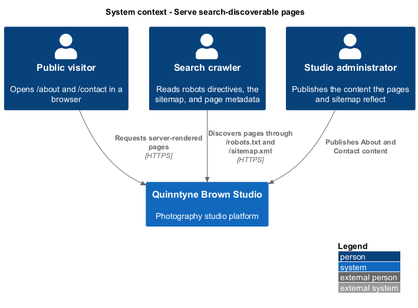
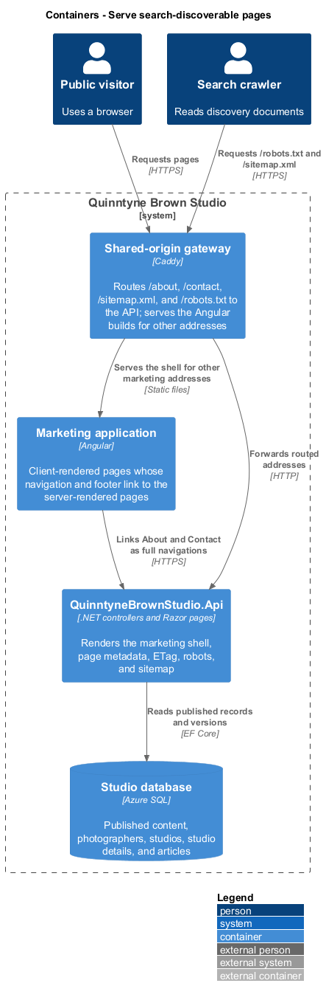
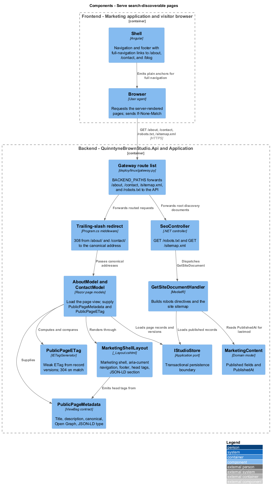
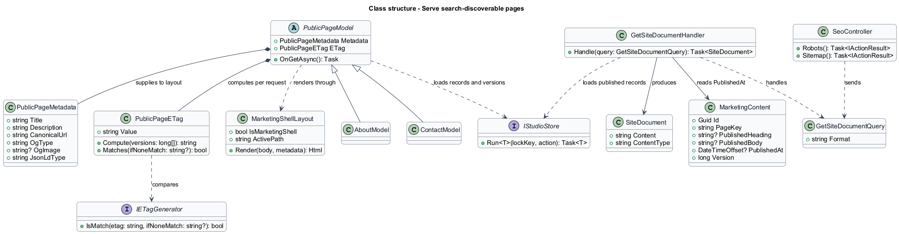
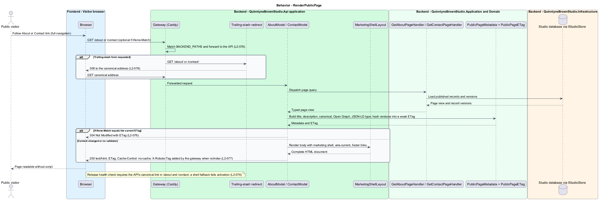
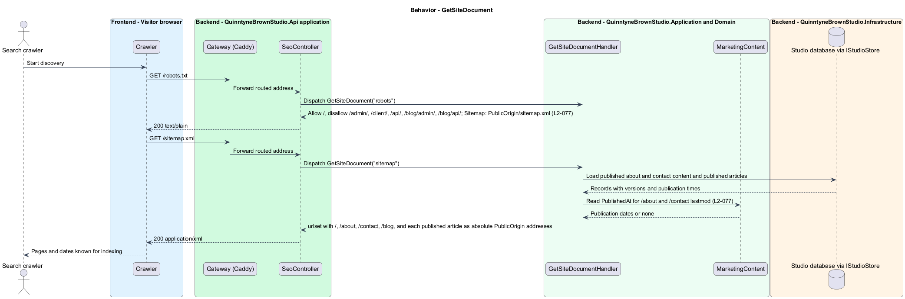

# Serve search-discoverable pages

## Overview

Quinntyne Brown Studio supports photography discovery, studio administration, and client deliverables. The marketing site is an Angular application whose pages render in the browser after the shell loads. A search crawler that reads the shell sees no page content, so pages meant to be found by search need a different delivery. This slice covers that delivery for two pages: the About page at `/about` and the Contact page at `/contact`.

A **server-rendered page** — HTML document whose content and metadata are complete in the API's response, before any browser script runs. The blog listing at `/blog` already renders this way through a Razor page in `QuinntyneBrownStudio.Api`, under the exception recorded in `L2-070`. This slice extends that exception to About and Contact and adds the discovery plumbing both pages share: a canonical address, page metadata, conditional caching, gateway routing, a release health check, and a site sitemap advertised by `/robots.txt`.

The slice owns rendering and discovery only. The About page content is designed in [present-about-page](../present-about-page/README.md); the Contact page, its form, and the inquiry inbox are designed in [receive-contact-inquiries](../receive-contact-inquiries/README.md). Those slices supply the page bodies; this slice supplies the shell around them and the way a browser or crawler reaches them.

## Description

Status: implemented on 2026-09-13 under OD-13, extended the same day with the relaunch gate under OD-14; evidence in the [acceptance register](../../acceptance.md).

`MarketingShellLayout` is the marketing shell inside `Pages/Shared/_Layout.cshtml`. Today the layout selects that shell only when `IsBlogListing` is true; the design generalizes the flag to `IsMarketingShell` so About, Contact, and the blog listing share one header, navigation, and footer. The navigation lists Portfolio, Services, About, Blog, Prints, Packages, the quote call to action, and client login, and marks the current page with `aria-current="page"`. The footer links `About the studio`, `Get in touch`, `Our work`, `Blog`, and `Client access`. The mobile menu keeps the existing keyboard-operable button, backdrop, and Escape handling.

`PublicPageMetadata` is the set of `ViewBag` values each page model supplies to the layout: `Title`, `Description`, `CanonicalUrl` (`PublicOrigin` plus the page path, as `Pages/Index.cshtml` builds for `/blog`), `OgType`, and an optional `OgImage`. The layout already emits `<title>`, `<meta name="description">`, `<link rel="canonical">`, Open Graph, and Twitter Card tags from those values. Each page adds JSON-LD in the `Head` section: `AboutPage` for `/about` and `ContactPage` for `/contact`, following the `Blog` block in `Pages/Index.cshtml`.

`PublicPageETag` is the conditional-request behavior copied from `Pages/IndexModel.cs`. A page model hashes the versions of the records that shaped the page (`MarketingContent.Version` plus the photographer, studio, or studio-details versions the page read), forms a weak `ETag`, and answers `304 Not Modified` when `If-None-Match` matches through `IETagGenerator`. Responses carry `Cache-Control: no-cache` so a browser or the gateway revalidates on every request.

The trailing-slash redirect in `Program.cs` currently handles `/blog/` inside a `UseWhen` branch. The design extends that branch to `/about/` and `/contact/`, each redirecting permanently (308) to its canonical address with the query string preserved. The same branch applies `SecurityHeadersMiddleware`, so About and Contact receive the nonce-based content security policy the blog already uses.

`GetSiteDocumentHandler` supplies two root documents through `SeoController`. `GET /robots.txt` keeps the existing directives (allow `/`, disallow `/admin/`, `/client/`, `/api/`, `/blog/admin/`, `/blog/api/`) and advertises one sitemap at `PublicOrigin/sitemap.xml`. `GET /sitemap.xml` is a single `urlset`: `/`, `/about`, and `/contact` with `lastmod` from `MarketingContent.PublishedAt`, then `/blog` and every published article through the existing `GetPublishedArticlesQuery`. `MarketingContent` gains a `PublishedAt` timestamp set when `Presentation.Save` copies draft fields into the published fields. `/blog/sitemap.xml` and `/blog/robots.txt` remain as delivered so existing references keep resolving; the root documents are the advertised ones. `SiteDocument` is the `(Content, ContentType)` result the controller writes, the same shape as `BlogDocument`.

The gateway definition in `deploy/linux/gateway.py` lists the addresses the API answers; everything else falls back to the marketing shell. `BACKEND_PATHS` gains `/about`, `/about/`, `/contact`, `/contact/`, and `/sitemap.xml`. The release health check in `deploy/linux/release.py` (`healthy()`) reads `/about` and `/contact` and requires the API's canonical link in each body, the same test it applies to `/blog`; a release whose gateway serves the shell for either address does not activate. When a gateway configuration sets `noIndex`, Caddy adds `X-Robots-Tag: noindex, nofollow` to every response, including both pages.

On the Angular side, `Shell` (`shell.ts`, `shell.html`) already links `/blog` with a plain `<a href>` so the browser performs a full navigation to the API-rendered page. `publicLinks` gains About and Contact rendered the same way, and the footer gains the `About the studio`, `Get in touch`, `Our work`, `Blog`, and `Client access` links. `routes.ts` drops the `contact` route and `PublicPage` loses its contact branch, so no client-rendered page competes with the server-rendered one. Every other marketing page stays in the Angular application.

`LaunchGate` is the relaunch behavior recorded in [OD-14](../../../specs/decisions.md#od-14--coming-soon-relaunch-gate). `LaunchOptions` binds the `Launch:ComingSoon` setting; `GetLaunchStateHandler` answers `LaunchState` for the requester, true only while the setting is on and the request carries no signed-in account, and `LaunchController` publishes it at `GET /api/public/launch`. The marketing shell in `_Layout.cshtml` reads the same query: while the gate applies it lists About, Blog, Contact, the quote call to action, and client login, drops `Our work` from the footer, and points the brand at `/blog`; `IndexModel`, `AboutModel`, and `ContactModel` fold the state into their ETags, so a copy cached on one side of the gate never answers for the other, and the About page omits its portfolio link. On the Angular side `LaunchService` (`api`) reads the endpoint through `LAUNCH_SERVICE`, `LaunchGateService` (`application`) holds the state as a signal behind `LAUNCH_GATE_SERVICE`, the `launchGate` guard in `routes.ts` sends a gated visitor to `/blog` by a full navigation before any client-rendered page renders, and `Shell` filters its navigation and footer to the server-rendered links. The quote route carries no guard. A launch state the API cannot supply gates nobody, because the blog the gate leads to comes from the same API. `PublishLaunchArticleCommand` runs at API startup while the setting is on and publishes `LaunchArticle`, the coming-soon post, into a blog that holds no article at all; a blog with any article, published or draft, is left as it is. The Bicep `comingSoon` parameter writes `Launch__ComingSoon` into the host environment, so an unconfigured host, and every local development launch, gates nobody.

Acceptance covers complete HTML without script, canonical and metadata presence, trailing-slash redirects, navigation and footer links in both shells, `304` on an unchanged `ETag` and a new `ETag` after publication, the release health check, sitemap membership with `lastmod`, robots directives, and the no-index header.

**Interfaces**

- `GET /about`, `GET /contact → 200 text/html; ETag; Cache-Control: no-cache; canonical, description, Open Graph, JSON-LD in the head`
- `GET /about/`, `GET /contact/ → 308 to the canonical address`
- `GET /about` with `If-None-Match` equal to the current ETag `→ 304`
- `GET /robots.txt → text/plain directives and Sitemap: PublicOrigin/sitemap.xml`
- `GET /sitemap.xml → application/xml urlset with /, /about, /contact, /blog, and published articles`
- `GET /api/public/launch → 200 { comingSoon }: true only while Launch:ComingSoon is on and the request is anonymous`

**Behavior ownership**

| Operation | Owner | Responsibility |
| --- | --- | --- |
| `RenderPublicPage` | `AboutModel`, `ContactModel` with `MarketingShellLayout` | Compose page content, metadata, and ETag into one HTML document; answer 304 or 308 when applicable. |
| `GetSiteDocument` | `GetSiteDocumentHandler` | Build the root robots directives and the site sitemap from published content and articles. |
| `GetLaunchState` | `GetLaunchStateHandler` | Report whether the relaunch gate applies to the requester; the shells, the guard, and the About ETag read it. |
| `PublishLaunchArticle` | `PublishLaunchArticleCommandHandler` | Publish the coming-soon article into an empty blog at startup while the gate is configured. |

The [shared architecture](../../architecture.md) defines authorization, wire conventions, persistence, environment boundaries, and delivery constraints. The [decision baseline](../../../specs/decisions.md) supplies exact policies and remaining evidence gates. Shared architecture requirements `L2-038` through `L2-045` and delivery requirements `L2-049` through `L2-054` apply to the implemented layers of this slice.

**Acceptance mapping**

The [acceptance register](../../acceptance.md) lists each applicable scenario with its implementing layer and current status. Feature tests exercise the success and failure behaviors described here. No production acceptance test exists merely because its scenario is designed.

## Requirements

Source: [L2 requirements](../../../specs/L2.md). Shared interface and delivery obligations have primary coverage in the engineering-delivery slice.

| L2 ID | Refines (L1) | Requirement |
| --- | --- | --- |
| `L2-001` | `L1-001` | The public and administrative applications shall support their specified tasks across the agreed desktop, tablet, and mobile viewport matrix. |
| `L2-066` | `L1-001` | Platform interfaces shall follow the approved HTML prototype at 390, 768, and 1440 CSS-pixel widths across Chromium, Firefox, and WebKit, with keyboard-operable controls and readable validation and failure states. |
| `L2-076` | `L1-020` | The API shall render `/about` and `/contact` as complete HTML documents that include the page content, a page-specific title and meta description, a canonical link built from `PublicOrigin`, Open Graph metadata, and JSON-LD structured data, using the marketing shell that serves the blog listing. The gateway shall route both addresses to the API, the trailing-slash forms shall redirect permanently to the canonical addresses, and the marketing application's navigation and footer shall link to both pages as full navigations. |
| `L2-077` | `L1-020` | The site's `/robots.txt` shall advertise a sitemap that lists the marketing home, `/about`, `/contact`, and the blog addresses with last-modified dates for administrator-published content, and shall not disallow `/about` or `/contact`. Environments configured as no-index shall keep their `X-Robots-Tag` header on both pages. |
| `L2-078` | `L1-002` | While the studio is configured as coming soon, the client-rendered marketing pages (home, portfolio, services, prints, promotions, and public galleries) shall send a visitor who is not signed in to `/blog`, while the quote calculator, `/about`, `/contact`, the blog, and the account sign-in pages stay open; both marketing shells shall offer only the open pages to such a visitor; a signed-in administrator or client shall see every page; an unconfigured studio, including local development, shall gate nobody; and a gated studio whose blog is empty shall publish one coming-soon article at startup. |

## Diagrams

The context identifies the people and systems involved in this capability. A search crawler joins the visitor as a consumer because discovery is the point of the slice.

The container view locates the participating applications and their deployed dependencies. The shared-origin gateway appears here, unlike in other feature designs, because routing the two addresses to the API is part of this slice's behavior.

The component view assigns the feature responsibilities to their architectural homes. `MarketingShellLayout`, `PublicPageMetadata`, and `PublicPageETag` shape the response; `GetSiteDocumentHandler` supplies the discovery documents.

The class view shows typed fields and relationships for `PublicPageMetadata`, `SiteDocument`, and the `PublishedAt` addition to `MarketingContent`.

`RenderPublicPage`: Compose page content, metadata, and ETag into one HTML document. Trailing slash: 308; matching `If-None-Match`: 304; shell fallback at the gateway: release health check fails.

`GetSiteDocument`: Build the root robots directives and the site sitemap from published content and articles. No published About or Contact content: the page still appears without `lastmod`.

