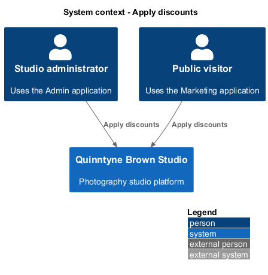
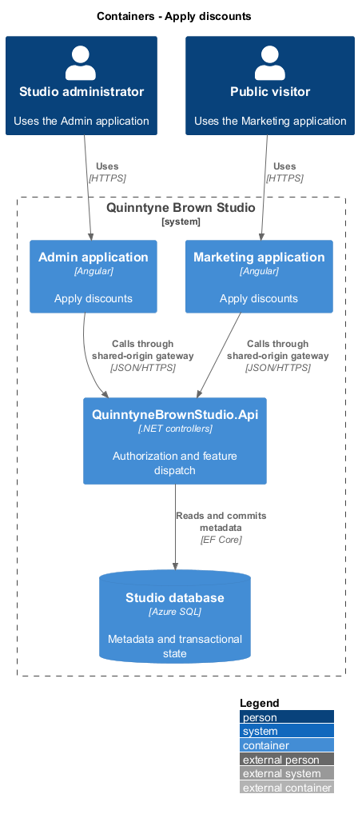
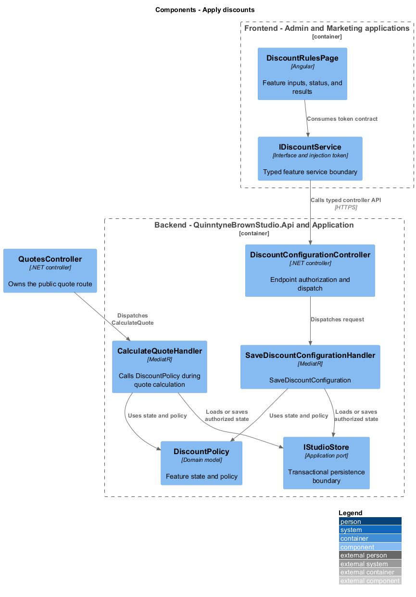
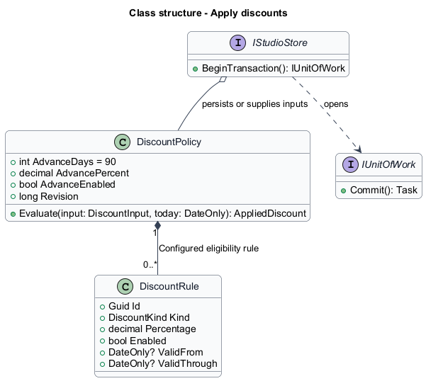
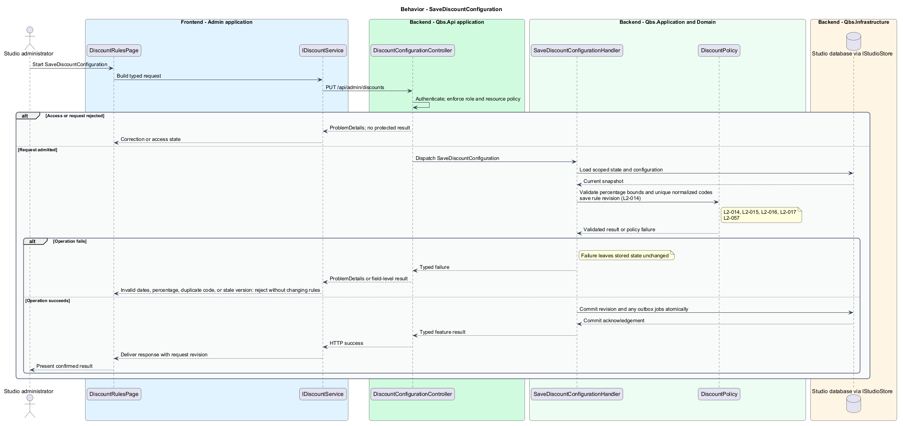
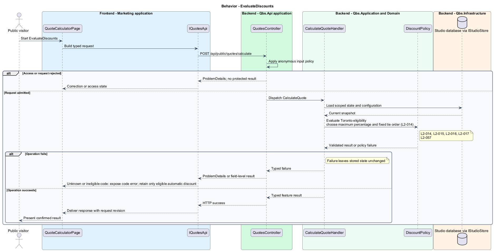

# Apply discounts

## Overview

Quinntyne Brown Studio supports photography discovery, studio administration, and client deliverables. A discount rule reduces a quote when a code or session date qualifies. Administrators configure the rules. The calculator selects one eligible percentage so a visitor receives a repeatable result.

## Description

Status: proposed production slice. The repository contains standalone HTML mocks; the Angular and .NET names below identify the components introduced by this design.

`DiscountRulesPage` manages code rules, advance threshold, and weekday eligibility. `DiscountPolicy` is a domain service shared by quote calculation and rule preview. `DiscountInput` contains subtotal, normalized code, and Toronto session date. `IClock` supplies the current Toronto calculation date through an explicit conversion.

Rules start disabled with zero percentages. Valid percentages lie between 0 and 100 inclusive. Code dates are optional inclusive calculation-date bounds; normalized codes are unique. Lead time uses calendar-date subtraction. The largest eligible percentage applies to the entire rounded subtotal. Ties prefer code, advance, then weekday. `AppliedDiscount` contains rule identity, percentage, and rounded amount.

Acceptance covers N-1/N/N+1 days, Toronto midnight, disabled and expired codes, case normalization, equal-percentage ties, and eligibility removal after date changes.

`IDiscountsApi` is the Angular service interface consumed through its injection token. Its HTTP implementation calls `DiscountsController`. The controller dispatches its route operations to the corresponding named handlers. Shared-route delegation follows the [interface catalog](../../contracts.md#route-ownership); worker operations execute from durable jobs.

**Interfaces**

- `GET /api/admin/discounts → DiscountConfiguration`
- `PUT /api/admin/discounts ← advanceRule, weekdayRule, codeRules[], expectedVersion → DiscountConfiguration`
- `POST /api/public/quotes/calculate → includes AppliedDiscount; no separate public mutation`

**Behavior ownership**

| Operation | Owner | Responsibility |
| --- | --- | --- |
| `SaveDiscountConfiguration` | `SaveDiscountConfigurationHandler` | Validate percentage bounds and unique normalized codes; save rule revision. |
| `EvaluateDiscounts` | `DiscountPolicy.Evaluate via CalculateQuoteHandler` | Evaluate Toronto eligibility; choose maximum percentage and fixed tie order. |

The [shared architecture](../../architecture.md) defines authorization, wire conventions, persistence, environment boundaries, and delivery constraints. The [decision baseline](../../../specs/decisions.md) supplies exact policies and remaining evidence gates. Shared architecture requirements `L2-038` through `L2-045` and delivery requirements `L2-049` through `L2-054` apply to the implemented layers of this slice.

**Acceptance mapping**

The [acceptance register](../../acceptance.md) lists each applicable scenario with its implementing layer and current status. Feature tests exercise the success and failure behaviors described here. No production acceptance test exists merely because its scenario is designed.

## Requirements

Source: [L2 requirements](../../../specs/L2.md). Shared interface and delivery obligations have primary coverage in the engineering-delivery slice.

| L2 ID | Refines (L1) | Requirement |
| --- | --- | --- |
| `L2-001` | `L1-001` | The public and administrative applications shall support their specified tasks across the agreed desktop, tablet, and mobile viewport matrix. |
| `L2-002` | `L1-001` | The platform's interfaces shall use generous white space, clear task hierarchy, and controls limited to the specified workflows. |
| `L2-003` | `L1-001` | The platform shall restrict administrative content and operations to authorized studio administrators. This is a derived access requirement for the administrative application. |
| `L2-014` | `L1-004` | The calculator shall accept discount codes and apply the corresponding discount only when the code satisfies the configured eligibility rules. Managing these rules is a derived configuration need. |
| `L2-015` | `L1-004` | Administrators shall be able to configure the advance-booking discount and its lead-time threshold, with an initial threshold of 90 days. The calculator shall evaluate eligibility using the requested session date and the agreed date rules. |
| `L2-016` | `L1-004` | The platform shall support configuration of slow-day discount eligibility and value, and the calculator shall evaluate the requested session date against that configuration. |
| `L2-017` | `L1-004` | The calculator shall apply the agreed discount-combination rules consistently when multiple discounts qualify and shall remove eligibility when changed inputs no longer qualify. |
| `L2-057` | `L1-004` | The calculator shall apply the largest eligible configured percentage discount using the code, lead-time, weekday, timezone, and tie rules in OD-02. |
| `L2-066` | `L1-001` | Platform interfaces shall follow the approved HTML prototype at 390, 768, and 1440 CSS-pixel widths across Chromium, Firefox, and WebKit, with keyboard-operable controls and readable validation and failure states. |

## Diagrams

The context identifies the people and systems involved in this capability. External services participate only where the description requires their data or effects.

The container view locates the participating applications and their deployed dependencies. It preserves the separation between browser interaction and persisted or background work.

The component view assigns the feature responsibilities to their architectural homes. `DiscountPolicy` provides the domain structure described in this slice.

The class view shows typed fields and relationships for `DiscountPolicy`. `DiscountRule` describes the related structure used by the feature.

`SaveDiscountConfiguration`: Validate percentage bounds and unique normalized codes; save rule revision. Invalid dates, percentage, duplicate code, or stale version: reject without changing rules.

`EvaluateDiscounts`: Evaluate Toronto eligibility; choose maximum percentage and fixed tie order. Unknown or ineligible code: expose code error; retain only eligible automatic discount.

