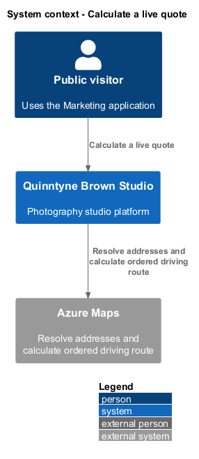
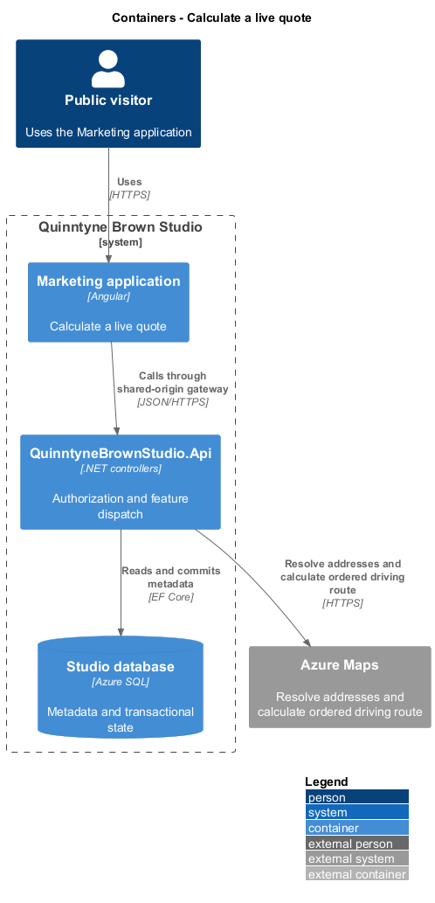
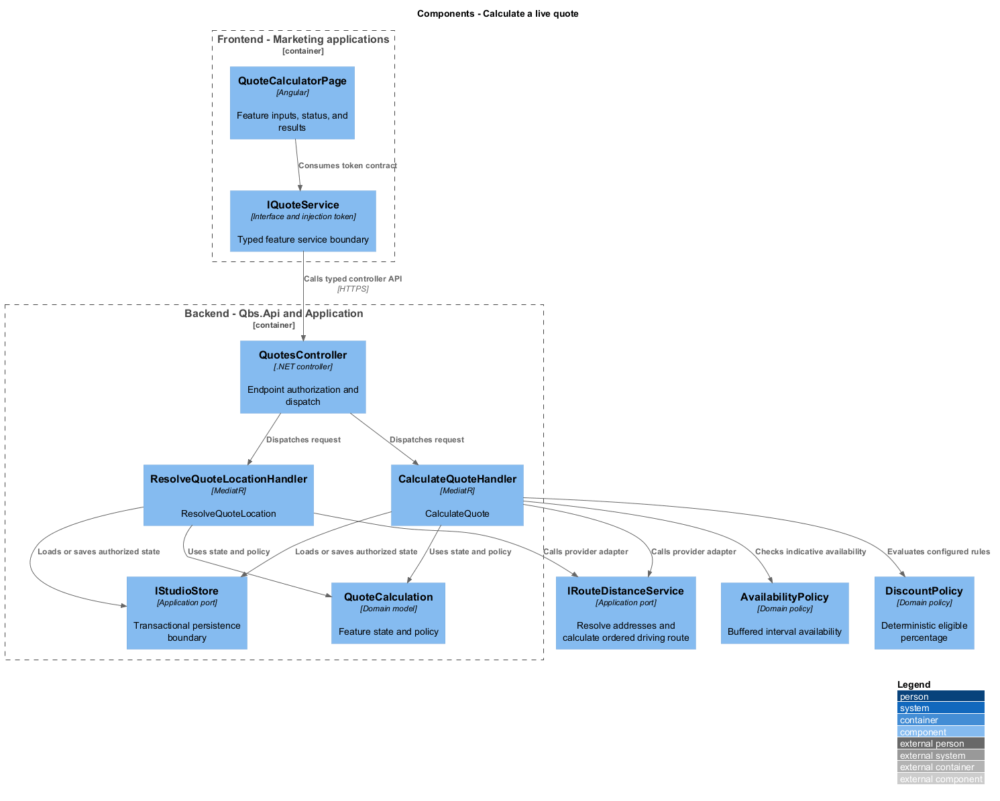
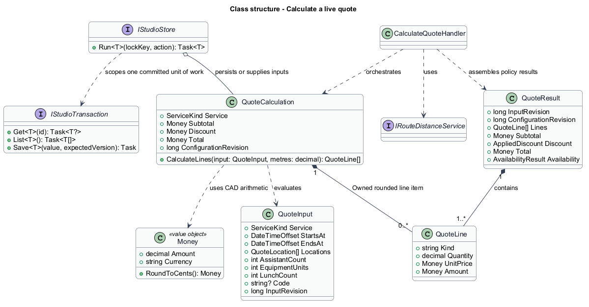
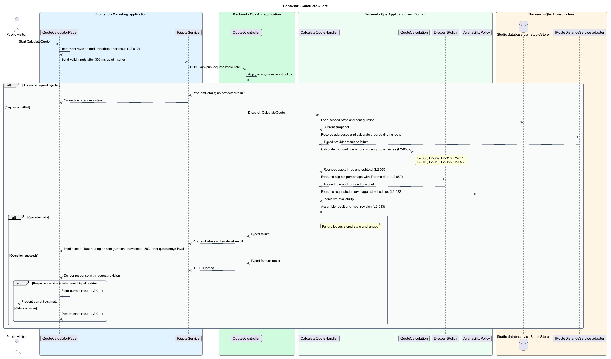
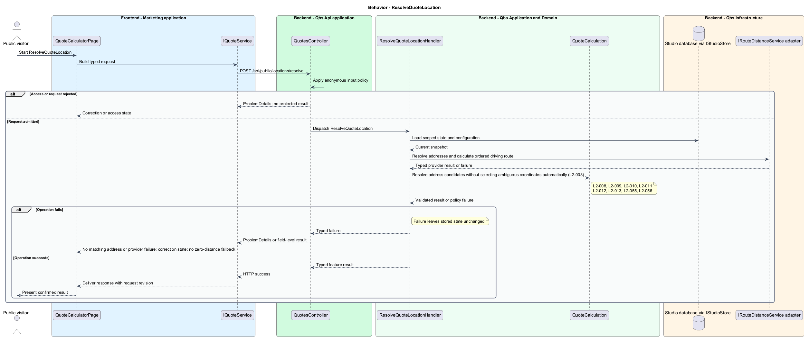

# Calculate a live quote

## Overview

Quinntyne Brown Studio supports photography discovery, studio administration, and client deliverables. A quote is a current estimate for a wedding, event, headshot session, or family portrait session. The visitor supplies timing, locations, and applicable costs. The calculator presents an itemized amount without creating a reservation.

## Description

Status: designed for production and implemented in this repository. Delivered handler and service names consolidate some participants shown below; the [implementation report](../../../implementation/README.md) and the [acceptance register](../../acceptance.md) record the delivered structure and the evidence that remains open.

`QuoteCalculatorPage` owns input and result signals. `QuoteInput` carries service, start/end instants, ordered resolved locations, assistant count, equipment units, lunch count, parking amounts, studio selections, and an optional code. `QuoteInputRevision` increases on every change. A 300 ms quiet interval limits requests; a changed revision immediately invalidates the displayed result.

`CalculateQuoteHandler` loads one pricing configuration snapshot and calls `IRouteDistanceService` with base, ordered stops, and return-to-base coordinates. `QuoteCalculation` applies OD-01 line rounding and the shared `DiscountPolicy`. `AvailabilityPolicy` evaluates the same requested interval; unavailable timing is visibly separate from price and never implies a booking.

`QuoteResult` contains echoed input revision, configuration revision, itemized money lines, discount identity/percentage/amount, total, currency, and availability. A result updates the UI only when its revision equals the latest input revision. Incomplete fields, missing rates, and routing failure remove current-valid status. An invalid code shows its error while otherwise-valid automatic discounts remain available.

Acceptance uses independently calculated amounts, out-of-order responses, optional-cost removal, four service types, multi-stop route legs, missing configuration, and provider failure.

`IQuoteService` is the Angular service interface consumed through its injection token. Its HTTP implementation calls `QuotesController`. The controller dispatches its route operations to the corresponding named handlers. Shared-route delegation follows the [interface catalog](../../contracts.md#route-ownership); worker operations execute from durable jobs.

**Interfaces**

- `POST /api/public/quotes/calculate ← QuoteInput, inputRevision → QuoteResult`
- `POST /api/public/locations/resolve ← address → ResolvedLocation[]; ambiguous choices require selection`

**Behavior ownership**

| Operation | Owner | Responsibility |
| --- | --- | --- |
| `CalculateQuote` | `CalculateQuoteHandler` | Read rate snapshot; route studio round trip; calculate lines, discount, and availability. |
| `ResolveQuoteLocation` | `ResolveQuoteLocationHandler` | Resolve address candidates without selecting ambiguous coordinates automatically. |

The [shared architecture](../../architecture.md) defines authorization, wire conventions, persistence, environment boundaries, and delivery constraints. The [decision baseline](../../../specs/decisions.md) supplies exact policies and remaining evidence gates. Shared architecture requirements `L2-038` through `L2-045` and delivery requirements `L2-049` through `L2-054` apply to the implemented layers of this slice.

**Acceptance mapping**

The [acceptance register](../../acceptance.md) lists each applicable scenario with its implementing layer and current status. Feature tests exercise the success and failure behaviors described here. No production acceptance test exists merely because its scenario is designed.

## Requirements

Source: [L2 requirements](../../../specs/L2.md). Shared interface and delivery obligations have primary coverage in the engineering-delivery slice.

| L2 ID | Refines (L1) | Requirement |
| --- | --- | --- |
| `L2-001` | `L1-001` | The public and administrative applications shall support their specified tasks across the agreed desktop, tablet, and mobile viewport matrix. |
| `L2-002` | `L1-001` | The platform's interfaces shall use generous white space, clear task hierarchy, and controls limited to the specified workflows. |
| `L2-008` | `L1-003` | The quote calculator shall support weddings, events, headshots, and family portraits using the configured rates for the selected service. |
| `L2-009` | `L1-003` | The calculator shall support multiple session locations and account for distance, potential parking costs, and applicable local studio fees using configured pricing rules. |
| `L2-010` | `L1-003` | The calculator shall account for applicable equipment rental, lunch, and assistant costs. |
| `L2-011` | `L1-003` | The calculator shall update the displayed quote as valid pricing inputs change, without requiring a full page reload or a separate quote-submission workflow. |
| `L2-012` | `L1-003` | The calculator shall distinguish a valid current quote from incomplete inputs, invalid inputs, missing rate configuration, or a failed calculation. |
| `L2-013` | `L1-003` | The calculator shall present the calculated estimate with the pricing currency and any applied discount identified. |
| `L2-055` | `L1-003` | The calculator shall use the OD-01 CAD, billing-unit, tax-presentation, validation, and decimal-rounding rules for every quotation. |
| `L2-056` | `L1-003` | The calculator shall calculate driving distance from the configured studio base through session locations in entered order and back to base using Azure Maps. |
| `L2-066` | `L1-001` | Platform interfaces shall follow the approved HTML prototype at 390, 768, and 1440 CSS-pixel widths across Chromium, Firefox, and WebKit, with keyboard-operable controls and readable validation and failure states. |

## Diagrams

The context identifies the people and systems involved in this capability. External services participate only where the description requires their data or effects.

The container view locates the participating applications and their deployed dependencies. It preserves the separation between browser interaction and persisted or background work.

The component view assigns the feature responsibilities to their architectural homes. `QuoteCalculation` provides the domain structure described in this slice.

The class view shows typed fields and relationships for `QuoteCalculation`. `QuoteLine` describes the related structure used by the feature.

`CalculateQuote`: Read rate snapshot; route studio round trip; calculate lines, discount, and availability. Invalid input: 400; routing or configuration unavailable: 503; prior quote stays invalid.

`ResolveQuoteLocation`: Resolve address candidates without selecting ambiguous coordinates automatically. No matching address or provider failure: correction state; no zero-distance fallback.

