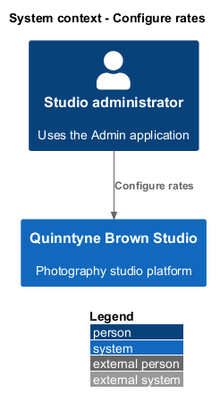
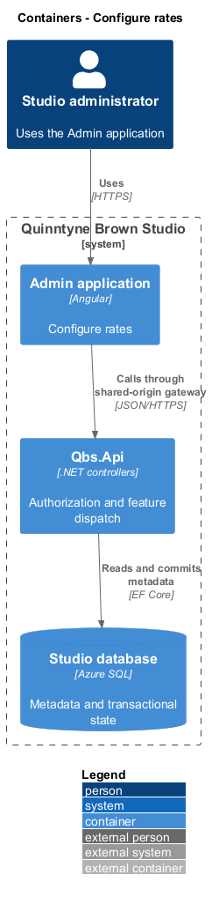
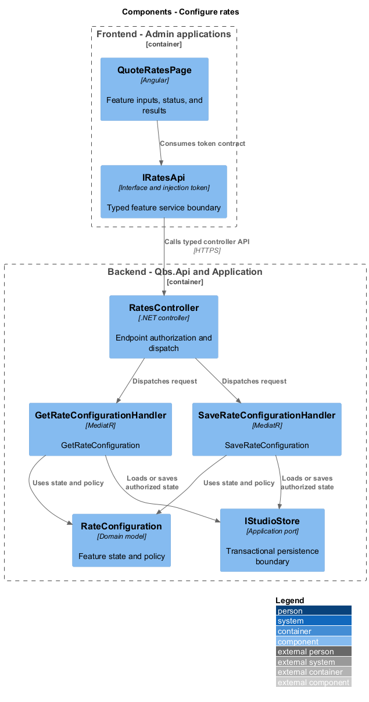
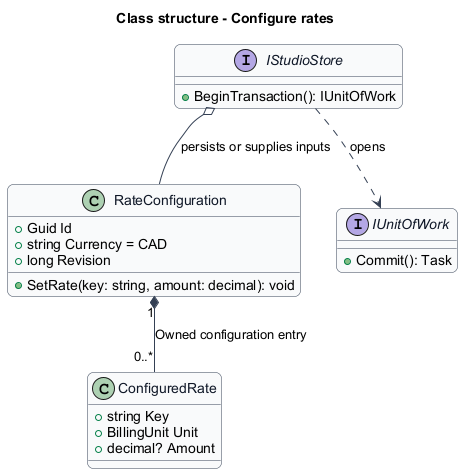
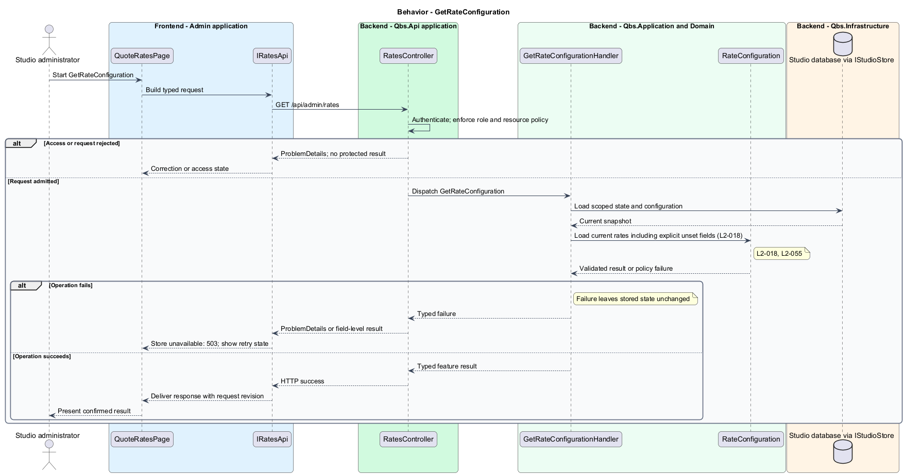
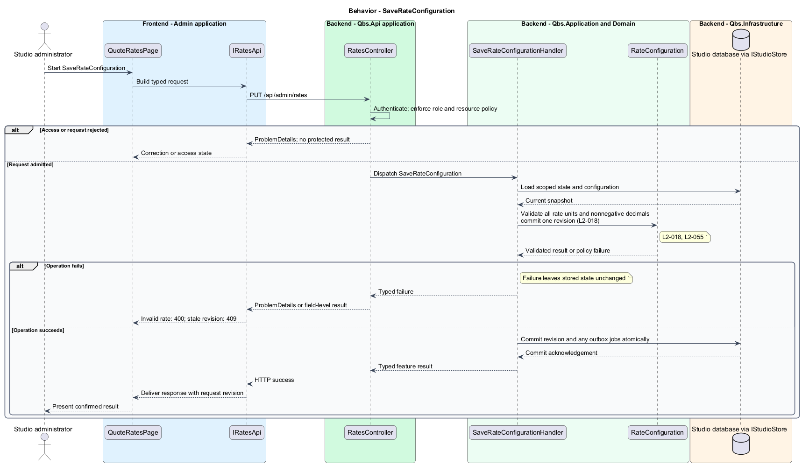

# Configure rates

## Overview

Quinntyne Brown Studio supports photography discovery, studio administration, and client deliverables. A rate configuration is the administrator-owned set of values used to calculate estimates. It separates studio prices from application code. Subsequent calculations use a saved configuration revision.

## Description

Status: proposed production slice. The repository contains standalone HTML mocks; the Angular and .NET names below identify the components introduced by this design.

`QuoteRatesPage` presents photography hourly rates for all four service kinds and travel, equipment-unit, lunch, and assistant rates. `RateConfiguration` stores decimal CAD values with explicit billing units. A field distinguishes unset from a configured zero; required unset rates prevent quoting.

`SaveRateConfigurationHandler` validates every submitted rate and saves the complete version atomically. A stale version returns a conflict and leaves current rates intact. Rate edits do not alter existing print-request snapshots. The quote calculator retrieves one revision for each calculation.

Acceptance covers every service/cost rate, zero values, negative and overflow rejection, unchanged last-valid configuration after failure, and subsequent quote refresh.

`IRatesApi` is the Angular service interface consumed through its injection token. Its HTTP implementation calls `RatesController`. The controller dispatches the operations below to the corresponding named handlers.

**Interfaces**

- `GET /api/admin/rates → RateConfiguration`
- `PUT /api/admin/rates ← serviceRates[], costRates[], expectedVersion → RateConfiguration`

**Behavior ownership**

| Operation | Owner | Responsibility |
| --- | --- | --- |
| `GetRateConfiguration` | `GetRateConfigurationHandler` | Load current rates including explicit unset fields. |
| `SaveRateConfiguration` | `SaveRateConfigurationHandler` | Validate all rate units and nonnegative decimals; commit one revision. |

The [shared architecture](../../architecture.md) defines authorization, wire conventions, persistence, environment boundaries, and delivery constraints. The [decision baseline](../../../specs/decisions.md) supplies exact policies and remaining evidence gates. Shared architecture requirements `L2-038` through `L2-045` and delivery requirements `L2-049` through `L2-054` apply to the implemented layers of this slice.

**Acceptance mapping**

The [acceptance register](../../acceptance.md) lists each applicable scenario with its implementing layer and current status. Feature tests exercise the success and failure behaviors described here. No production acceptance test exists merely because its scenario is designed.

## Requirements

Source: [L2 requirements](../../../specs/L2.md). Shared interface and delivery obligations have primary coverage in the engineering-delivery slice.

| L2 ID | Refines (L1) | Requirement |
| --- | --- | --- |
| `L2-001` | `L1-001` | The public and administrative applications shall support their specified tasks across the agreed desktop, tablet, and mobile viewport matrix. |
| `L2-002` | `L1-001` | The platform's interfaces shall use generous white space, clear task hierarchy, and controls limited to the specified workflows. |
| `L2-003` | `L1-001` | The platform shall restrict administrative content and operations to authorized studio administrators. This is a derived access requirement for the administrative application. |
| `L2-018` | `L1-005` | Administrators shall be able to maintain rates for supported photography services and the quotation cost factors specified in L1-003. |
| `L2-055` | `L1-003` | The calculator shall use the OD-01 CAD, billing-unit, tax-presentation, validation, and decimal-rounding rules for every quotation. |
| `L2-066` | `L1-001` | Platform interfaces shall follow the approved HTML prototype at 390, 768, and 1440 CSS-pixel widths across Chromium, Firefox, and WebKit, with keyboard-operable controls and readable validation and failure states. |

## Diagrams

The context identifies the people and systems involved in this capability. External services participate only where the description requires their data or effects.

The container view locates the participating applications and their deployed dependencies. It preserves the separation between browser interaction and persisted or background work.

The component view assigns the feature responsibilities to their architectural homes. `RateConfiguration` provides the domain structure described in this slice.

The class view shows typed fields and relationships for `RateConfiguration`. A referenced photo retains its independent lifetime even when a gallery or album owns the reference entry.

`GetRateConfiguration`: Load current rates including explicit unset fields. Store unavailable: 503; show retry state.

`SaveRateConfiguration`: Validate all rate units and nonnegative decimals; commit one revision. Invalid rate: 400; stale revision: 409.

