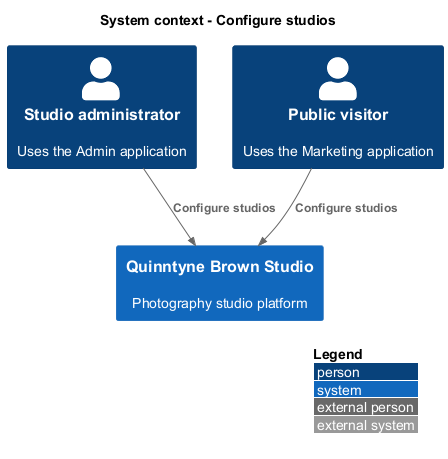
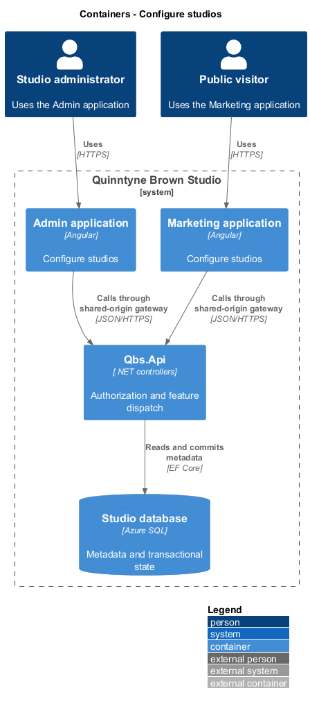
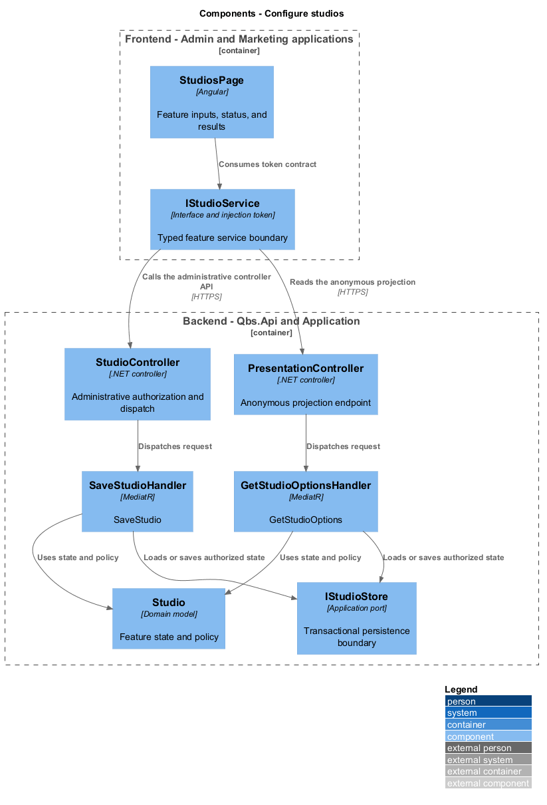
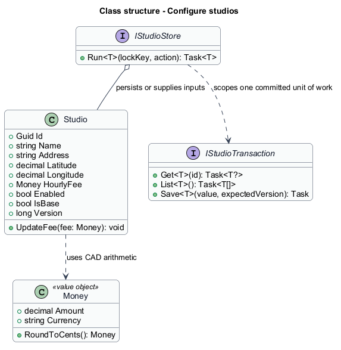
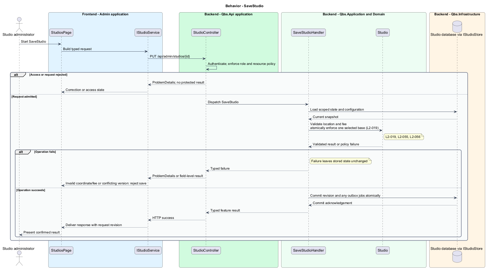
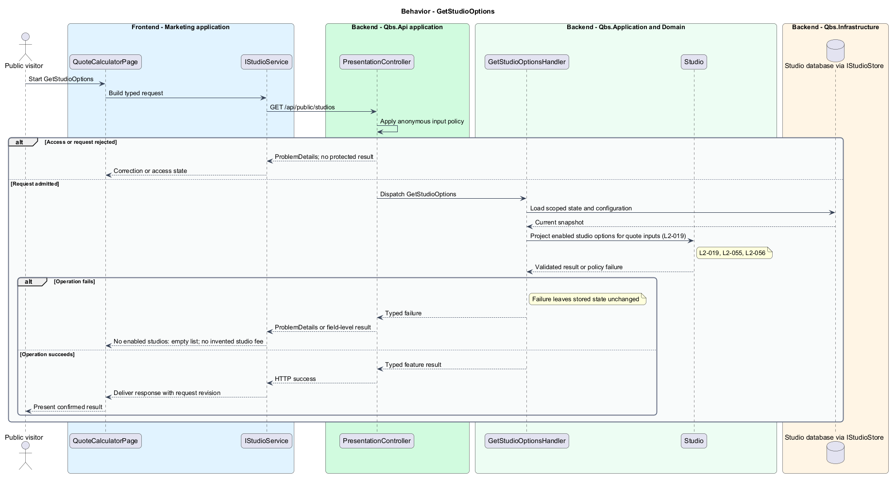

# Configure studios

## Overview

Quinntyne Brown Studio supports photography discovery, studio administration, and client deliverables. A studio is a named photography location with an hourly fee and a resolved address. One configured base supplies the start and end of quotation travel. Enabled studios can be selected as session locations.

## Description

Status: designed for production and implemented in this repository. Delivered handler and service names consolidate some participants shown below; the [implementation report](../../../implementation/README.md) and the [acceptance register](../../acceptance.md) record the delivered structure and the evidence that remains open.

`StudiosPage` creates and updates studio records. Address selection records resolved coordinates; the routing adapter supplies candidates. `SaveStudioHandler` validates fee and coordinates. Selecting a new base clears the former base in the same transaction. The application permits initial incomplete setup but refuses routed quotes until a base exists.

`StudioOptionsQuery` returns enabled studio names, coordinates, and fees for the calculator. Each selected location carries its own studio hours. Repeated selection is charged only for the explicit location occurrences; no hidden global studio charge is added.

Acceptance covers adding a selectable studio, fee changes in subsequent quotes, disabling a studio, base changes, and unresolved-address rejection.

`IStudioService` is the Angular service interface consumed through its injection token. Its HTTP implementation calls `StudioController` for configuration and `PresentationController` for the enabled public projection. The controller dispatches its route operations to the corresponding named handlers. Shared-route delegation follows the [interface catalog](../../contracts.md#route-ownership); worker operations execute from durable jobs.

**Interfaces**

- `GET /api/admin/studios → Studio[]`
- `GET /api/admin/studios/{id} → Studio for its editor`
- `POST /api/admin/studios; PUT /api/admin/studios/{id} ← name, resolvedAddress, hourlyFee, enabled, isBase, expectedVersion → Studio`
- `GET /api/public/studios → StudioOption[]`

**Behavior ownership**

| Operation | Owner | Responsibility |
| --- | --- | --- |
| `SaveStudio` | `SaveStudioHandler` | Validate location and fee; atomically enforce one selected base. |
| `GetStudioOptions` | `GetStudioOptionsHandler` | Project enabled studio options for quote inputs. |

The [shared architecture](../../architecture.md) defines authorization, wire conventions, persistence, environment boundaries, and delivery constraints. The [decision baseline](../../../specs/decisions.md) supplies exact policies and remaining evidence gates. Shared architecture requirements `L2-038` through `L2-045` and delivery requirements `L2-049` through `L2-054` apply to the implemented layers of this slice.

**Acceptance mapping**

The [acceptance register](../../acceptance.md) lists each applicable scenario with its implementing layer and current status. Feature tests exercise the success and failure behaviors described here. No production acceptance test exists merely because its scenario is designed.

## Requirements

Source: [L2 requirements](../../../specs/L2.md). Shared interface and delivery obligations have primary coverage in the engineering-delivery slice.

| L2 ID | Refines (L1) | Requirement |
| --- | --- | --- |
| `L2-001` | `L1-001` | The public and administrative applications shall support their specified tasks across the agreed desktop, tablet, and mobile viewport matrix. |
| `L2-002` | `L1-001` | The platform's interfaces shall use generous white space, clear task hierarchy, and controls limited to the specified workflows. |
| `L2-003` | `L1-001` | The platform shall restrict administrative content and operations to authorized studio administrators. This is a derived access requirement for the administrative application. |
| `L2-019` | `L1-005` | Administrators shall be able to add and maintain studios with the location and fee information needed for quotation calculations. |
| `L2-055` | `L1-003` | The calculator shall use the OD-01 CAD, billing-unit, tax-presentation, validation, and decimal-rounding rules for every quotation. |
| `L2-056` | `L1-003` | The calculator shall calculate driving distance from the configured studio base through session locations in entered order and back to base using Azure Maps. |
| `L2-066` | `L1-001` | Platform interfaces shall follow the approved HTML prototype at 390, 768, and 1440 CSS-pixel widths across Chromium, Firefox, and WebKit, with keyboard-operable controls and readable validation and failure states. |

## Diagrams

The context identifies the people and systems involved in this capability. External services participate only where the description requires their data or effects.

The container view locates the participating applications and their deployed dependencies. It preserves the separation between browser interaction and persisted or background work.

The component view assigns the feature responsibilities to their architectural homes. `Studio` provides the domain structure described in this slice.

The class view shows typed fields and relationships for `Studio`. Application ports separate the model from provider implementations.

`SaveStudio`: Validate location and fee; atomically enforce one selected base. Invalid coordinate/fee or conflicting version: reject save.

`GetStudioOptions`: Project enabled studio options for quote inputs. No enabled studios: empty list; no invented studio fee.

