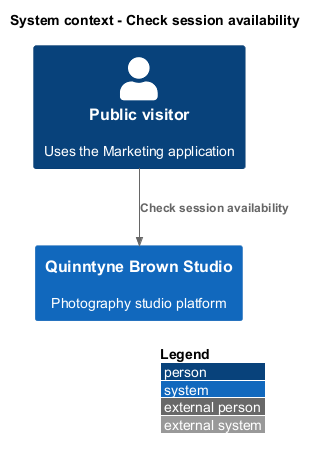
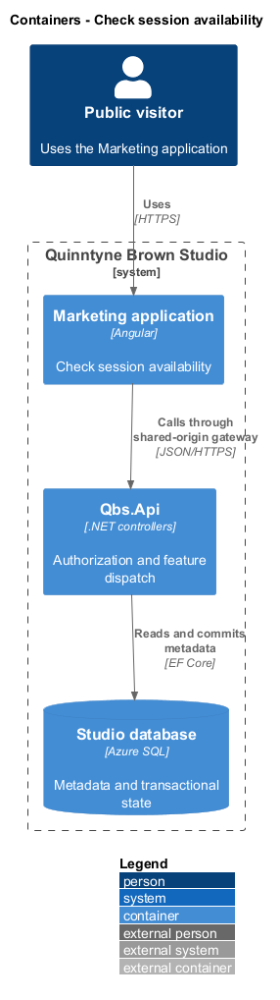
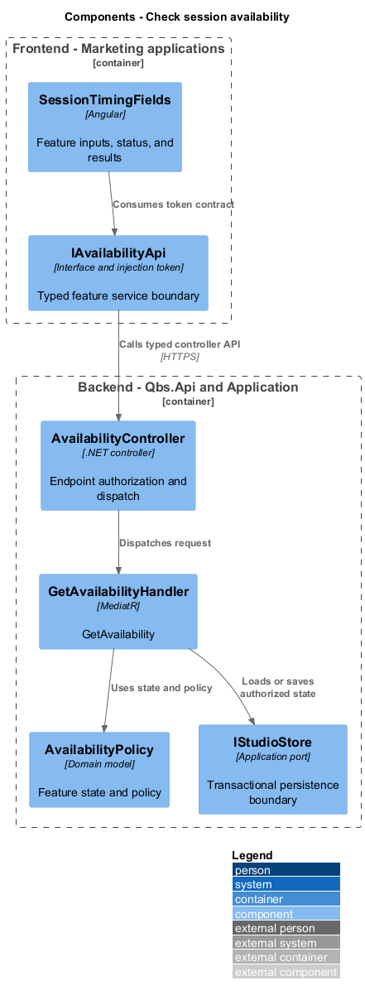
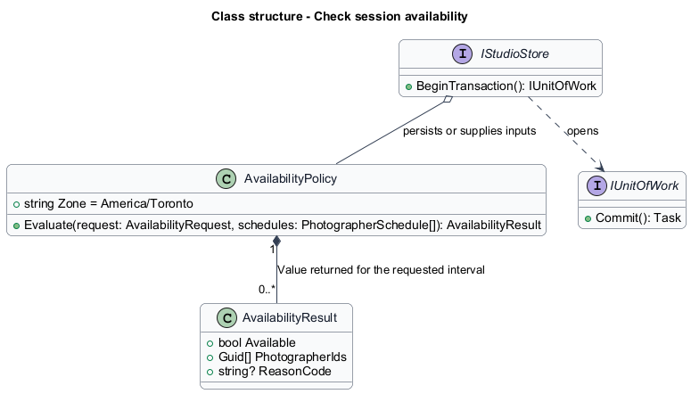
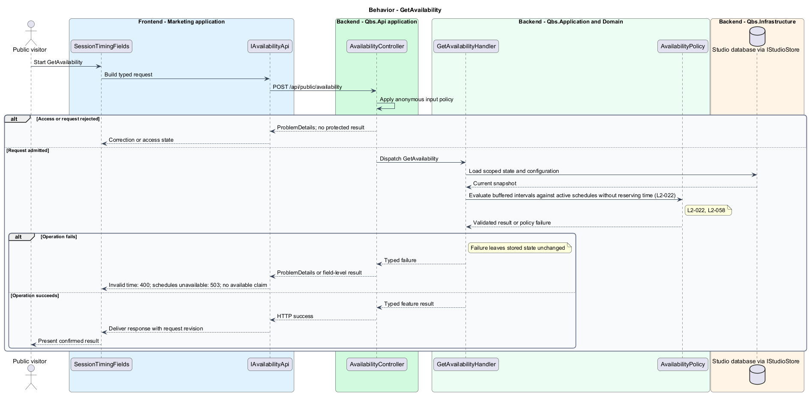

# Check session availability

## Overview

Quinntyne Brown Studio supports photography discovery, studio administration, and client deliverables. Availability is an assessment of whether a photographer can accommodate requested session timing. It uses saved working windows, blocks, and commitments. The result communicates possibility without holding time.

## Description

Status: proposed production slice. The repository contains standalone HTML mocks; the Angular and .NET names below identify the components introduced by this design.

`SessionTimingFields` accepts start/end instants and an optional photographer choice. `GetAvailabilityHandler` loads active schedules and invokes `AvailabilityPolicy`. The requested occupied interval includes the configured before/after buffers and lies within a working window. It overlaps neither unavailable intervals nor occupied commitments.

`AvailabilityResult` carries the requested interval, available flag, eligible photographer identifiers, and a reason code when unavailable. Public output excludes commitment names and other client details. A positive result can become stale after a schedule change, so the UI labels it indicative. The live quote handler uses this same policy rather than a second scheduling algorithm.

Acceptance covers one eligible photographer among several, a specific unavailable selection, no active photographers, adjacency, DST, and zero mutations after repeated availability checks.

`IAvailabilityApi` is the Angular service interface consumed through its injection token. Its HTTP implementation calls `AvailabilityController`. The controller dispatches the operations below to the corresponding named handlers.

**Interfaces**

- `POST /api/public/availability ← startsAt, endsAt, photographerId? → AvailabilityResult`

**Behavior ownership**

| Operation | Owner | Responsibility |
| --- | --- | --- |
| `GetAvailability` | `GetAvailabilityHandler` | Evaluate buffered intervals against active schedules without reserving time. |

The [shared architecture](../../architecture.md) defines authorization, wire conventions, persistence, environment boundaries, and delivery constraints. The [decision baseline](../../../specs/decisions.md) supplies exact policies and remaining evidence gates. Shared architecture requirements `L2-038` through `L2-045` and delivery requirements `L2-049` through `L2-054` apply to the implemented layers of this slice.

**Acceptance mapping**

The [acceptance register](../../acceptance.md) lists each applicable scenario with its implementing layer and current status. Feature tests exercise the success and failure behaviors described here. No production acceptance test exists merely because its scenario is designed.

## Requirements

Source: [L2 requirements](../../../specs/L2.md). Shared interface and delivery obligations have primary coverage in the engineering-delivery slice.

| L2 ID | Refines (L1) | Requirement |
| --- | --- | --- |
| `L2-001` | `L1-001` | The public and administrative applications shall support their specified tasks across the agreed desktop, tablet, and mobile viewport matrix. |
| `L2-002` | `L1-001` | The platform's interfaces shall use generous white space, clear task hierarchy, and controls limited to the specified workflows. |
| `L2-022` | `L1-006` | The quoting experience shall evaluate requested session timing against photographer schedules and distinguish available from unavailable requests without implying a confirmed reservation. |
| `L2-058` | `L1-006` | The platform shall evaluate photographer availability using explicit session intervals, Toronto time, 15-minute input increments, and configurable travel buffers initially set to 30 minutes before and after sessions. |
| `L2-066` | `L1-001` | Platform interfaces shall follow the approved HTML prototype at 390, 768, and 1440 CSS-pixel widths across Chromium, Firefox, and WebKit, with keyboard-operable controls and readable validation and failure states. |

## Diagrams

The context identifies the people and systems involved in this capability. External services participate only where the description requires their data or effects.

The container view locates the participating applications and their deployed dependencies. It preserves the separation between browser interaction and persisted or background work.

The component view assigns the feature responsibilities to their architectural homes. `AvailabilityPolicy` provides the domain structure described in this slice.

The class view shows typed fields and relationships for `AvailabilityPolicy`. A referenced photo retains its independent lifetime even when a gallery or album owns the reference entry.

`GetAvailability`: Evaluate buffered intervals against active schedules without reserving time. Invalid time: 400; schedules unavailable: 503; no available claim.

