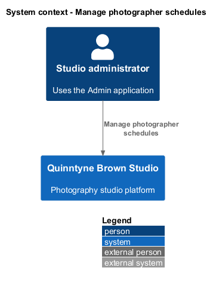
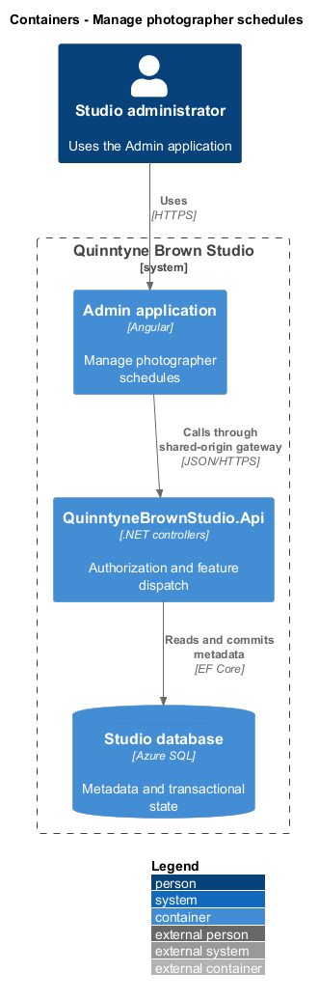
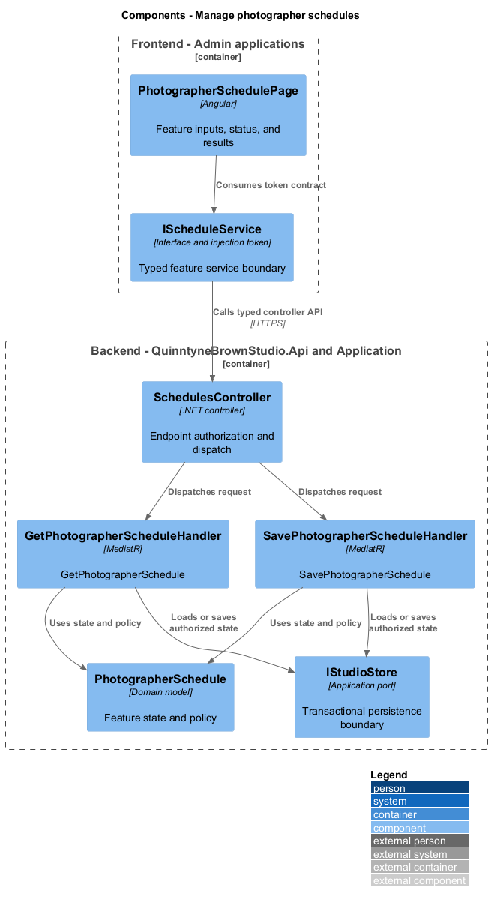
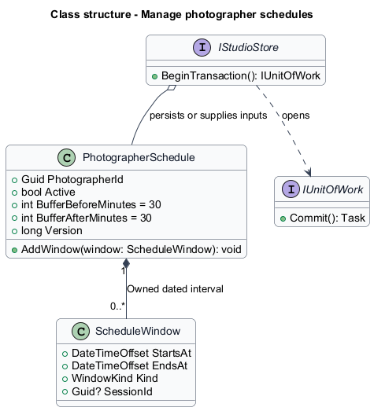
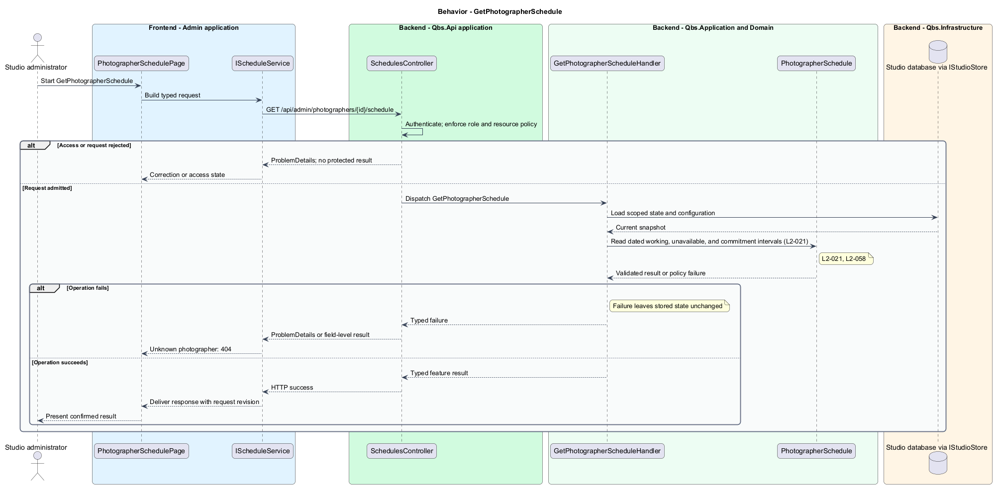
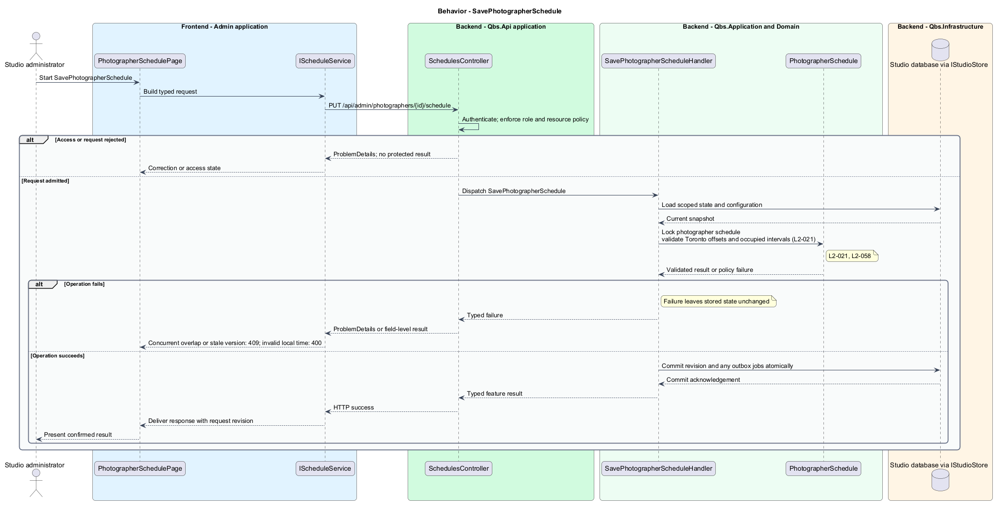

# Manage photographer schedules

## Overview

Quinntyne Brown Studio supports photography discovery, studio administration, and client deliverables. A photographer schedule describes working time, unavailability, and assigned session commitments. Administrators maintain it so the quote calculator can assess requested intervals. A commitment reserves time administratively; quote viewing does not create one.

## Description

Status: proposed production slice. The repository contains standalone HTML mocks; the Angular and .NET names below identify the components introduced by this design.

`PhotographerSchedulePage` maintains minimal photographer identity and active state alongside explicit dated working and unavailable windows. Recurring-rule expansion is outside the initial design. `ScheduleWindow` stores UTC boundaries and the Toronto zone. Local input carries its selected offset when time is ambiguous.

`SavePhotographerScheduleHandler` validates quarter-hour input, positive intervals, and buffered commitments. It serializes overlap checks per photographer inside a transaction. `Session` timing or assignment changes invoke the same policy and update the commitment in that transaction. Independent photographer schedules do not lock each other.

Acceptance covers saved-window retrieval, inactive photographers, adjacent buffered commitments, rejected overlaps, concurrent saves, and both daylight-saving transitions.

`ISchedulesApi` is the Angular service interface consumed through its injection token. Its HTTP implementation calls `SchedulesController`. The controller dispatches its route operations to the corresponding named handlers. Shared-route delegation follows the [interface catalog](../../contracts.md#route-ownership); worker operations execute from durable jobs.

**Interfaces**

- `GET /api/admin/photographers; POST /api/admin/photographers ← name, active → Photographer`
- `GET /api/admin/photographers/{id}/schedule → PhotographerSchedule`
- `PUT /api/admin/photographers/{id}/schedule ← workingWindows[], unavailableWindows[], buffers, expectedVersion → PhotographerSchedule`

**Behavior ownership**

| Operation | Owner | Responsibility |
| --- | --- | --- |
| `GetPhotographerSchedule` | `GetPhotographerScheduleHandler` | Read dated working, unavailable, and commitment intervals. |
| `SavePhotographerSchedule` | `SavePhotographerScheduleHandler` | Lock photographer schedule; validate Toronto offsets and occupied intervals. |

The [shared architecture](../../architecture.md) defines authorization, wire conventions, persistence, environment boundaries, and delivery constraints. The [decision baseline](../../../specs/decisions.md) supplies exact policies and remaining evidence gates. Shared architecture requirements `L2-038` through `L2-045` and delivery requirements `L2-049` through `L2-054` apply to the implemented layers of this slice.

**Acceptance mapping**

The [acceptance register](../../acceptance.md) lists each applicable scenario with its implementing layer and current status. Feature tests exercise the success and failure behaviors described here. No production acceptance test exists merely because its scenario is designed.

## Requirements

Source: [L2 requirements](../../../specs/L2.md). Shared interface and delivery obligations have primary coverage in the engineering-delivery slice.

| L2 ID | Refines (L1) | Requirement |
| --- | --- | --- |
| `L2-001` | `L1-001` | The public and administrative applications shall support their specified tasks across the agreed desktop, tablet, and mobile viewport matrix. |
| `L2-002` | `L1-001` | The platform's interfaces shall use generous white space, clear task hierarchy, and controls limited to the specified workflows. |
| `L2-003` | `L1-001` | The platform shall restrict administrative content and operations to authorized studio administrators. This is a derived access requirement for the administrative application. |
| `L2-021` | `L1-006` | Administrators shall be able to add and update photographer schedules with the information required to determine quotation availability. |
| `L2-058` | `L1-006` | The platform shall evaluate photographer availability using explicit session intervals, Toronto time, 15-minute input increments, and configurable travel buffers initially set to 30 minutes before and after sessions. |
| `L2-066` | `L1-001` | Platform interfaces shall follow the approved HTML prototype at 390, 768, and 1440 CSS-pixel widths across Chromium, Firefox, and WebKit, with keyboard-operable controls and readable validation and failure states. |

## Diagrams

The context identifies the people and systems involved in this capability. External services participate only where the description requires their data or effects.

The container view locates the participating applications and their deployed dependencies. It preserves the separation between browser interaction and persisted or background work.

The component view assigns the feature responsibilities to their architectural homes. `PhotographerSchedule` provides the domain structure described in this slice.

The class view shows typed fields and relationships for `PhotographerSchedule`. `ScheduleWindow` describes the related structure used by the feature.

`GetPhotographerSchedule`: Read dated working, unavailable, and commitment intervals. Unknown photographer: 404.

`SavePhotographerSchedule`: Lock photographer schedule; validate Toronto offsets and occupied intervals. Concurrent overlap or stale version: 409; invalid local time: 400.

