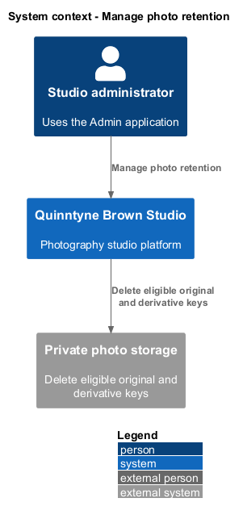
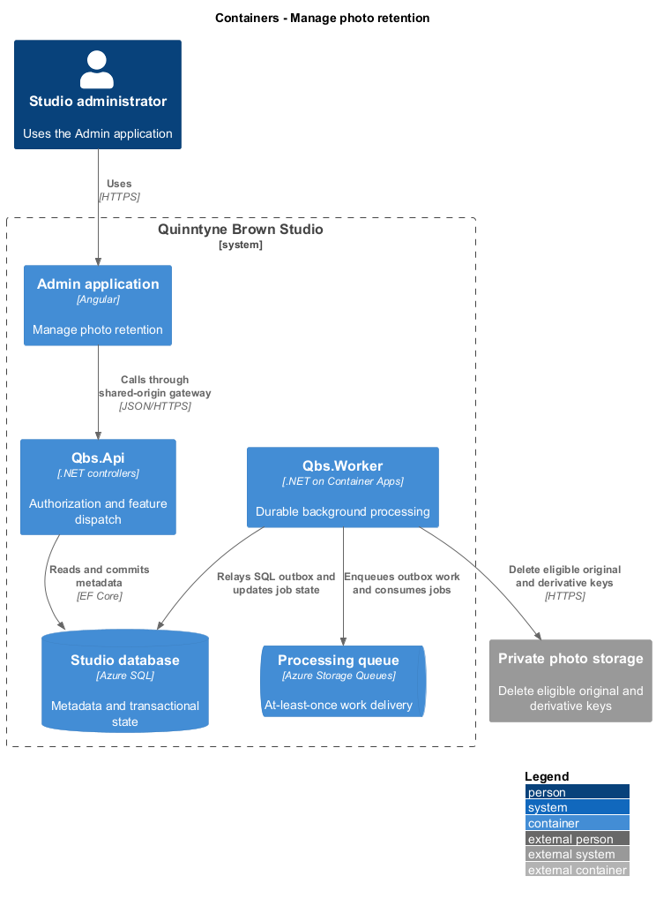
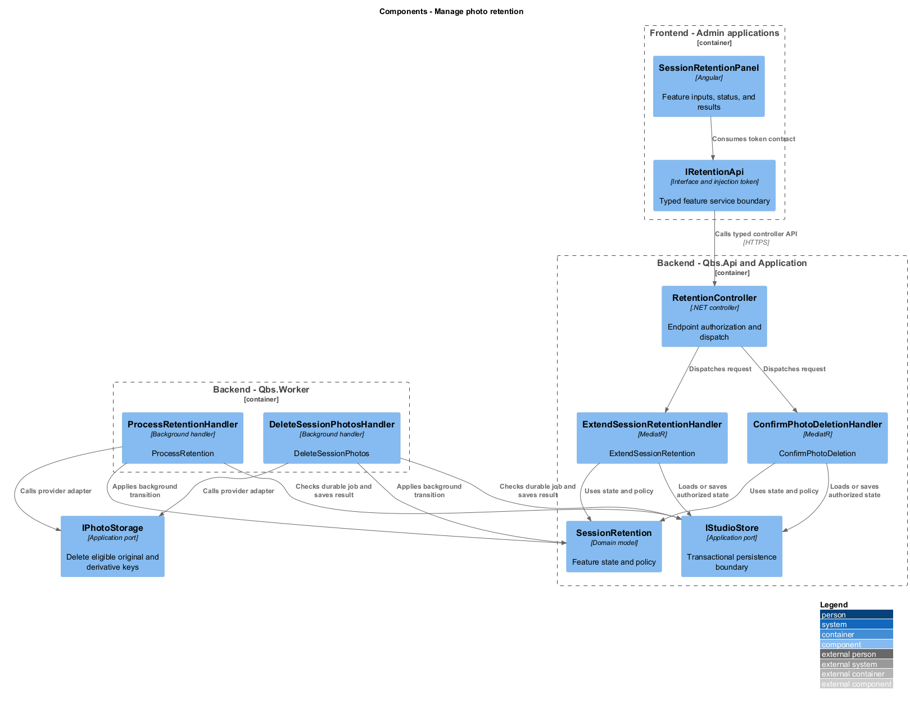
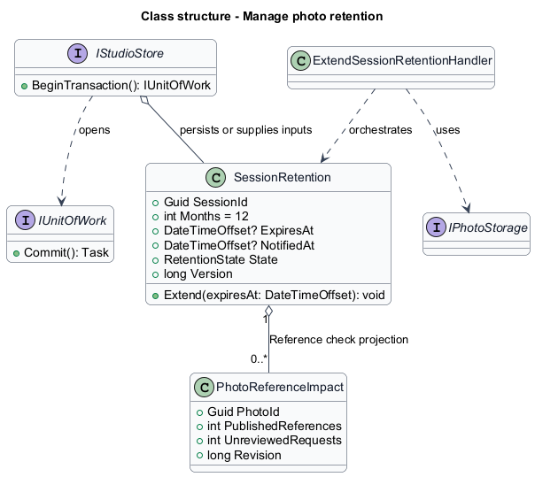
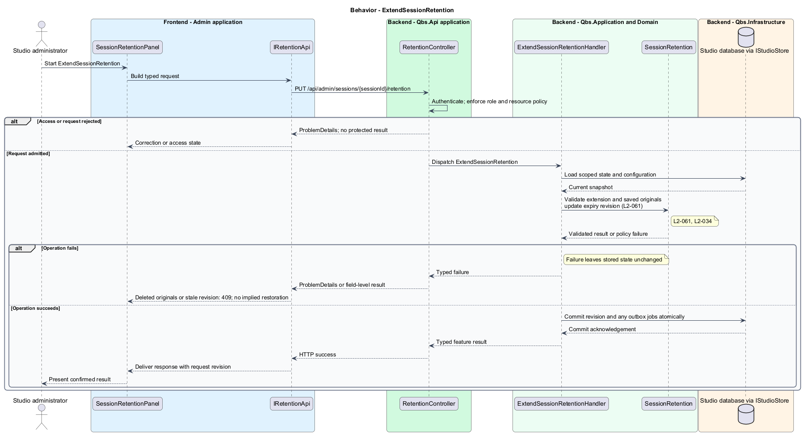
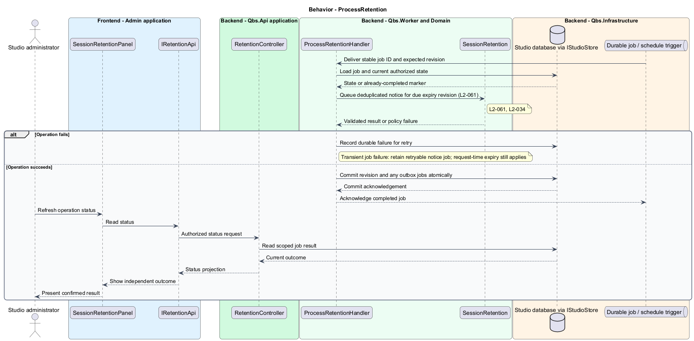
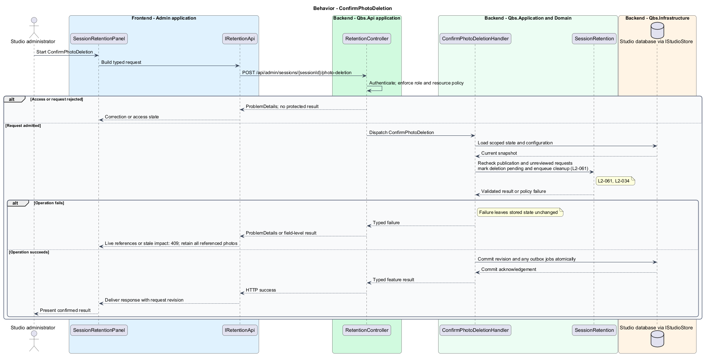
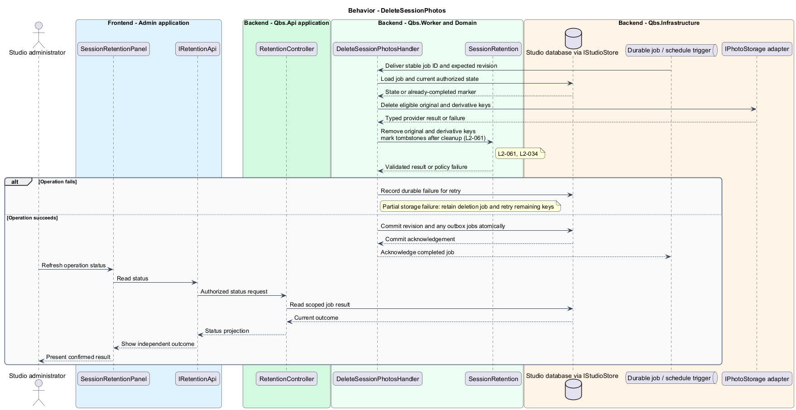

# Manage photo retention

## Overview

Quinntyne Brown Studio supports photography discovery, studio administration, and client deliverables. Retention defines how long session photos remain available to assigned clients. Expiry removes client access while preserving stored originals until an administrator confirms deletion. Reference checks protect published photos and unreviewed print requests.

## Description

Status: proposed production slice. The repository contains standalone HTML mocks; the Angular and .NET names below identify the components introduced by this design.

`SessionRetentionPanel` shows the session expiry, extension action, and a deletion-impact report. `SessionRetention` uses the latest photo expiry derived from upload dates and the configurable duration. A session with no photos has no photo expiry. `ProcessRetentionHandler` performs daily notice checks and records one notice per expiry revision.

Client authorization checks the current expiry on every request; access does not depend on the scheduler running at the boundary. An extension invalidates the old notice revision and restores assigned-client access only for stored photos. Album views retain unavailable placeholders after expiry. Submitted print snapshots remain readable without photo bytes.

`ConfirmPhotoDeletionHandler` compares the impact report revision and checks references in the same transaction as marking deletion pending. Published references and unreviewed requests block confirmation. `DeleteSessionPhotosHandler` removes original and derived blobs idempotently and leaves metadata tombstones after successful cleanup. Retried jobs continue partial cleanup. A concurrently published or newly requested photo cannot bypass the deletion-pending state.

Acceptance covers month-end expiry, notice deduplication, scheduler outage at expiry, extension, stale impact confirmation, blocked references, partial deletion, and inaccessible album images.

`IRetentionApi` is the Angular service interface consumed through its injection token. Its HTTP implementation calls `RetentionController`. The controller dispatches the operations below to the corresponding named handlers.

**Interfaces**

- `GET /api/admin/sessions/{sessionId}/retention → retention and current impact`
- `PUT /api/admin/sessions/{sessionId}/retention ← months, expiresAt?, expectedVersion → SessionRetention`
- `POST /api/admin/sessions/{sessionId}/photo-deletion ← impactRevision, confirm=true → DeletionJobId (202)`

**Behavior ownership**

| Operation | Owner | Responsibility |
| --- | --- | --- |
| `ExtendSessionRetention` | `ExtendSessionRetentionHandler` | Validate extension and saved originals; update expiry revision. |
| `ProcessRetention` | `ProcessRetentionHandler` | Queue deduplicated notice for due expiry revision. |
| `ConfirmPhotoDeletion` | `ConfirmPhotoDeletionHandler` | Recheck publication and unreviewed requests; mark deletion pending and enqueue cleanup. |
| `DeleteSessionPhotos` | `DeleteSessionPhotosHandler` | Remove original and derivative keys; mark tombstones after cleanup. |

The [shared architecture](../../architecture.md) defines authorization, wire conventions, persistence, environment boundaries, and delivery constraints. The [decision baseline](../../../specs/decisions.md) supplies exact policies and remaining evidence gates. Shared architecture requirements `L2-038` through `L2-045` and delivery requirements `L2-049` through `L2-054` apply to the implemented layers of this slice.

**Acceptance mapping**

The [acceptance register](../../acceptance.md) lists each applicable scenario with its implementing layer and current status. Feature tests exercise the success and failure behaviors described here. No production acceptance test exists merely because its scenario is designed.

## Requirements

Source: [L2 requirements](../../../specs/L2.md). Shared interface and delivery obligations have primary coverage in the engineering-delivery slice.

| L2 ID | Refines (L1) | Requirement |
| --- | --- | --- |
| `L2-001` | `L1-001` | The public and administrative applications shall support their specified tasks across the agreed desktop, tablet, and mobile viewport matrix. |
| `L2-002` | `L1-001` | The platform's interfaces shall use generous white space, clear task hierarchy, and controls limited to the specified workflows. |
| `L2-003` | `L1-001` | The platform shall restrict administrative content and operations to authorized studio administrators. This is a derived access requirement for the administrative application. |
| `L2-034` | `L1-010` | Client authorization shall be enforced for protected galleries, photos, albums, and print-request operations, including direct requests that bypass the interface. |
| `L2-061` | `L1-008` | The platform shall support configurable session retention initially 12 calendar months after upload, administrator notice 30 days before expiry, client-access expiry, extensions, and administrator-confirmed deletion. |
| `L2-066` | `L1-001` | Platform interfaces shall follow the approved HTML prototype at 390, 768, and 1440 CSS-pixel widths across Chromium, Firefox, and WebKit, with keyboard-operable controls and readable validation and failure states. |

## Diagrams

The context identifies the people and systems involved in this capability. External services participate only where the description requires their data or effects.

The container view locates the participating applications and their deployed dependencies. It preserves the separation between browser interaction and persisted or background work.

The component view assigns the feature responsibilities to their architectural homes. `SessionRetention` provides the domain structure described in this slice.

The class view shows typed fields and relationships for `SessionRetention`. A referenced photo retains its independent lifetime even when a gallery or album owns the reference entry.

`ExtendSessionRetention`: Validate extension and saved originals; update expiry revision. Deleted originals or stale revision: 409; no implied restoration.

`ProcessRetention`: Queue deduplicated notice for due expiry revision. Transient job failure: retain retryable notice job; request-time expiry still applies.

`ConfirmPhotoDeletion`: Recheck publication and unreviewed requests; mark deletion pending and enqueue cleanup. Live references or stale impact: 409; retain all referenced photos.

`DeleteSessionPhotos`: Remove original and derivative keys; mark tombstones after cleanup. Partial storage failure: retain deletion job and retry remaining keys.

