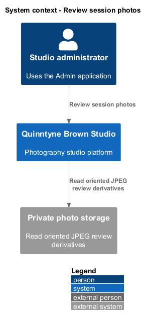
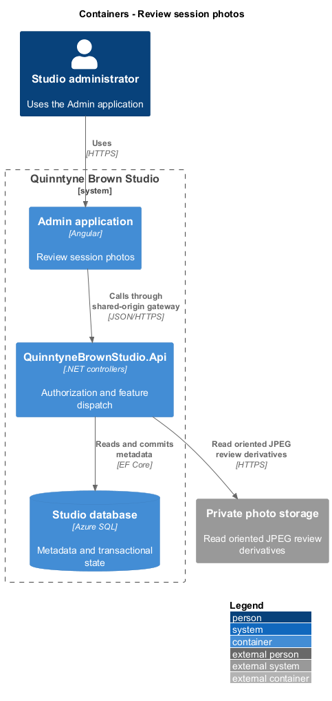
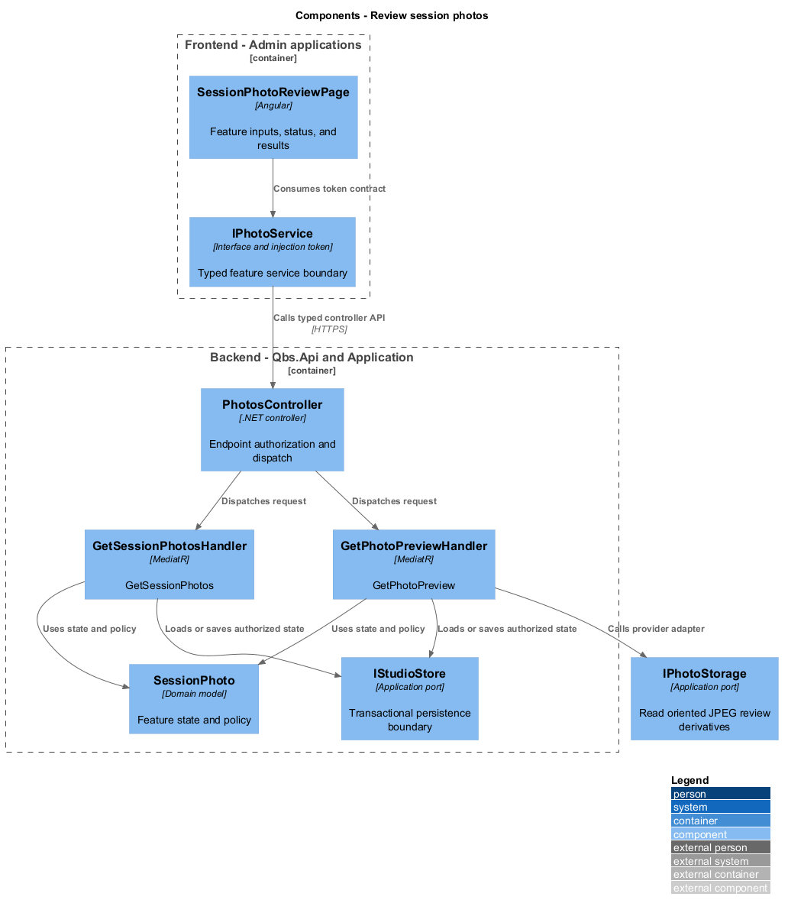
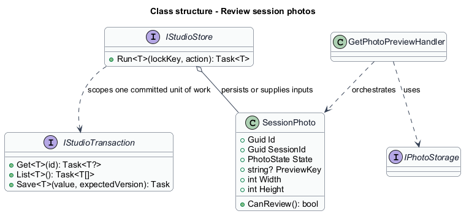
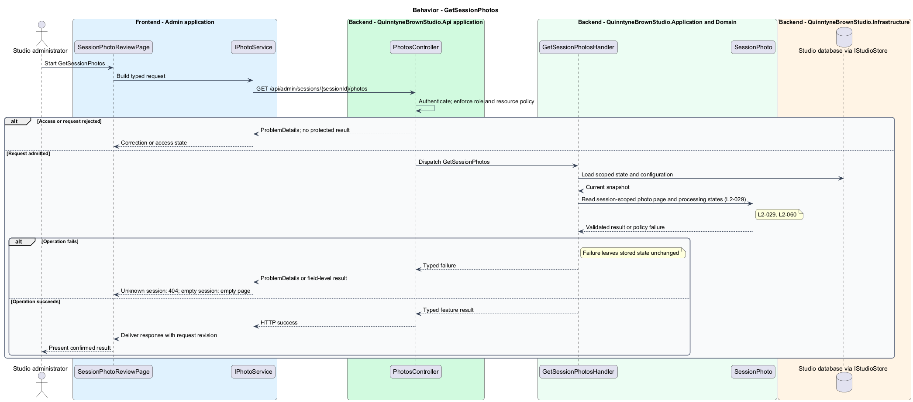
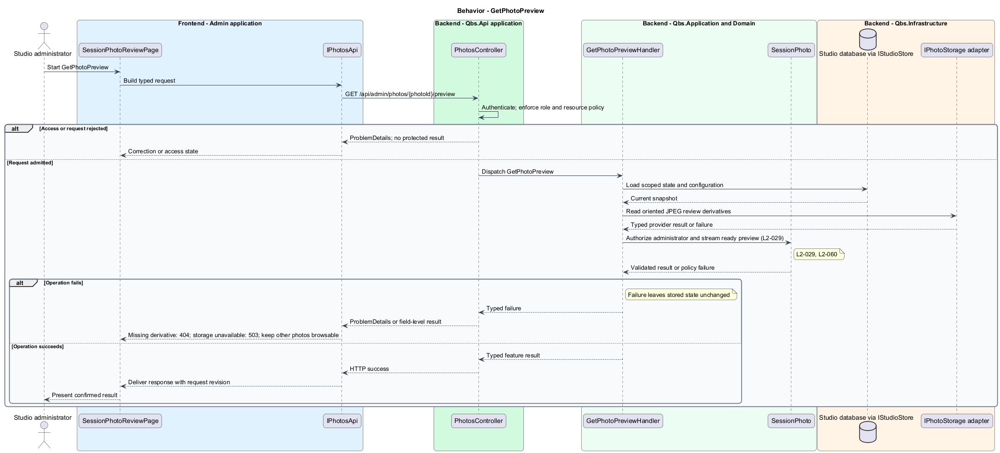

# Review session photos

## Overview

Quinntyne Brown Studio supports photography discovery, studio administration, and client deliverables. Session review is the administrator view of uploaded photographs for one session. A preview is a browser-viewable derivative of an original. The administrator browses thumbnails and opens an individual photo for inspection.

## Description

Status: proposed production slice. The repository contains standalone HTML mocks; the Angular and .NET names below identify the components introduced by this design.

`SessionPhotoReviewPage` queries a cursor-paged session photo list with 50 items per page. It keeps selected-photo state in signals and loads full previews on demand. `GetSessionPhotosHandler` scopes every result to the selected session. Processing and failure records remain visible with their status instead of broken-image success placeholders.

`PhotosController` authorizes the administrator before streaming a derivative from private storage. Original storage keys never become browser URLs. Corrupt or missing derivatives return a visible per-photo failure; other ready images remain available. AI annotations are optional overlays supplied by the AI slice and never gate inspection.

Acceptance covers two sessions with disjoint photos, keyboard selection, empty and processing states, one missing derivative among ready photos, and inspection during an AI outage.

`IPhotosApi` is the Angular service interface consumed through its injection token. Its HTTP implementation calls `PhotosController`. The controller dispatches its route operations to the corresponding named handlers. Shared-route delegation follows the [interface catalog](../../contracts.md#route-ownership); worker operations execute from durable jobs.

**Interfaces**

- `GET /api/admin/sessions/{sessionId}/photos?cursor=... → PhotoPage with nextCursor`
- `GET /api/admin/photos/{photoId}/preview → authorized JPEG stream`

**Behavior ownership**

| Operation | Owner | Responsibility |
| --- | --- | --- |
| `GetSessionPhotos` | `GetSessionPhotosHandler` | Read session-scoped photo page and processing states. |
| `GetPhotoPreview` | `GetPhotoPreviewHandler` | Authorize administrator and stream ready preview. |

The [shared architecture](../../architecture.md) defines authorization, wire conventions, persistence, environment boundaries, and delivery constraints. The [decision baseline](../../../specs/decisions.md) supplies exact policies and remaining evidence gates. Shared architecture requirements `L2-038` through `L2-045` and delivery requirements `L2-049` through `L2-054` apply to the implemented layers of this slice.

**Acceptance mapping**

The [acceptance register](../../acceptance.md) lists each applicable scenario with its implementing layer and current status. Feature tests exercise the success and failure behaviors described here. No production acceptance test exists merely because its scenario is designed.

## Requirements

Source: [L2 requirements](../../../specs/L2.md). Shared interface and delivery obligations have primary coverage in the engineering-delivery slice.

| L2 ID | Refines (L1) | Requirement |
| --- | --- | --- |
| `L2-001` | `L1-001` | The public and administrative applications shall support their specified tasks across the agreed desktop, tablet, and mobile viewport matrix. |
| `L2-002` | `L1-001` | The platform's interfaces shall use generous white space, clear task hierarchy, and controls limited to the specified workflows. |
| `L2-003` | `L1-001` | The platform shall restrict administrative content and operations to authorized studio administrators. This is a derived access requirement for the administrative application. |
| `L2-029` | `L1-009` | Administrators shall be able to browse and visually inspect photos belonging to a selected session. |
| `L2-060` | `L1-008` | The platform shall preserve accepted JPEG, CR2, CR3, NEF, ARW, and DNG originals and produce browser-viewable previews for supported camera models. |
| `L2-066` | `L1-001` | Platform interfaces shall follow the approved HTML prototype at 390, 768, and 1440 CSS-pixel widths across Chromium, Firefox, and WebKit, with keyboard-operable controls and readable validation and failure states. |

## Diagrams

The context identifies the people and systems involved in this capability. External services participate only where the description requires their data or effects.

The container view locates the participating applications and their deployed dependencies. It preserves the separation between browser interaction and persisted or background work.

The component view assigns the feature responsibilities to their architectural homes. `SessionPhoto` provides the domain structure described in this slice.

The class view shows typed fields and relationships for `SessionPhoto`. Application ports separate the model from provider implementations.

`GetSessionPhotos`: Read session-scoped photo page and processing states. Unknown session: 404; empty session: empty page.

`GetPhotoPreview`: Authorize administrator and stream ready preview. Missing derivative: 404; storage unavailable: 503; keep other photos browsable.

