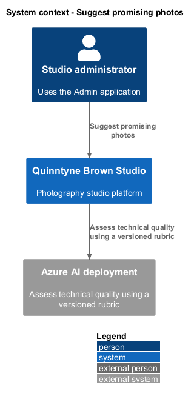
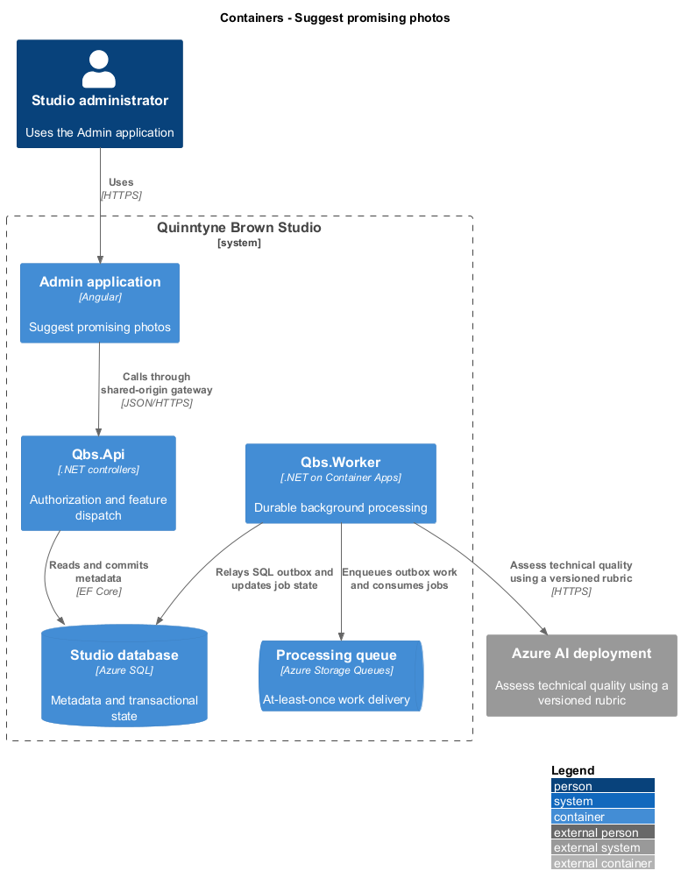
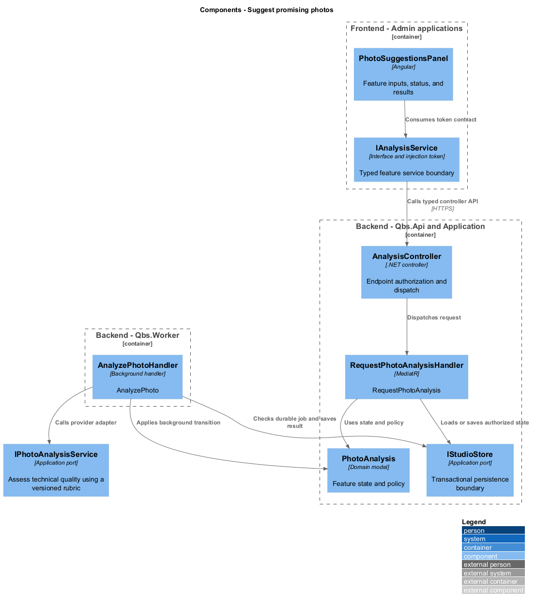
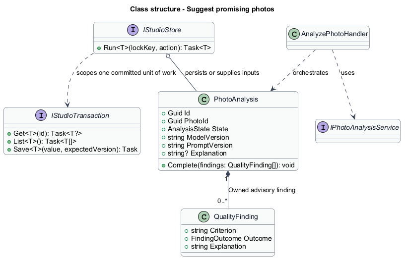
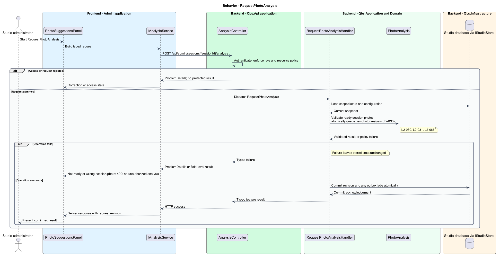
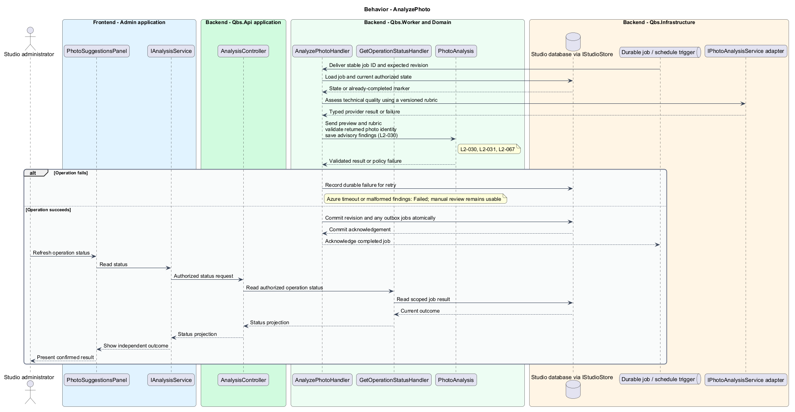

# Suggest promising photos

## Overview

Quinntyne Brown Studio supports photography discovery, studio administration, and client deliverables. An AI suggestion is advisory guidance about visible photographic quality. It is attached to one session photo and distinguished from the administrator judgment. The studio uses explanations to support manual review.

## Description

Status: designed for production and implemented in this repository. Delivered handler and service names consolidate some participants shown below; the [implementation report](../../../implementation/README.md) and the [acceptance register](../../acceptance.md) record the delivered structure and the evidence that remains open.

`PhotoSuggestionsPanel` requests analysis of ready photos and polls a batch status resource while review remains interactive. `RequestPhotoAnalysisHandler` authorizes the session, validates photo membership, and records durable per-photo jobs. `AnalyzePhotoHandler` sends a derived JPEG preview and the versioned technical-quality rubric through `IPhotoAnalysisService`.

The adapter targets an Azure-hosted vision-enabled model qualified under G-AI. `QualityFinding` records a criterion, advisory outcome, and explanation, allowing uncertainty. The response parser rejects unknown photo identifiers, malformed findings, and missing provenance. Each result records photo, model, and prompt versions. A retry creates a new attempt while preserving failure evidence.

Analysis state is `Queued`, `Running`, `Succeeded`, or `Failed`. No handler in this slice changes publication, client assignment, or retention. Provider failure leaves the manual review path intact and exposes an honest failure state.

Acceptance includes mixed analysis results, incorrect-photo responses, timeouts, malformed output, retry, and the studio's approved evaluation corpus. Model accuracy is not inferred from successful API calls.

`IAnalysisService` is the Angular service interface consumed through its injection token. Its HTTP implementation calls `AnalysisController`. The controller dispatches its route operations to the corresponding named handlers. Shared-route delegation follows the [interface catalog](../../contracts.md#route-ownership); worker operations execute from durable jobs.

**Interfaces**

- `POST /api/admin/sessions/{sessionId}/analysis ← photoIds[] → AnalysisBatchId (202)`
- `GET /api/admin/analysis/{batchId} → per-photo status, findings, provenance`
- `POST /api/admin/analysis/{batchId}/retry ← failedPhotoIds[] → AnalysisBatchId (202)`

**Behavior ownership**

| Operation | Owner | Responsibility |
| --- | --- | --- |
| `RequestPhotoAnalysis` | `RequestPhotoAnalysisHandler` | Validate ready session photos; atomically queue per-photo analysis. |
| `AnalyzePhoto` | `AnalyzePhotoHandler` | Send preview and rubric; validate returned photo identity; save advisory findings. |

The [shared architecture](../../architecture.md) defines authorization, wire conventions, persistence, environment boundaries, and delivery constraints. The [decision baseline](../../../specs/decisions.md) supplies exact policies and remaining evidence gates. Shared architecture requirements `L2-038` through `L2-045` and delivery requirements `L2-049` through `L2-054` apply to the implemented layers of this slice.

**Acceptance mapping**

The [acceptance register](../../acceptance.md) lists each applicable scenario with its implementing layer and current status. Feature tests exercise the success and failure behaviors described here. No production acceptance test exists merely because its scenario is designed.

## Requirements

Source: [L2 requirements](../../../specs/L2.md). Shared interface and delivery obligations have primary coverage in the engineering-delivery slice.

| L2 ID | Refines (L1) | Requirement |
| --- | --- | --- |
| `L2-001` | `L1-001` | The public and administrative applications shall support their specified tasks across the agreed desktop, tablet, and mobile viewport matrix. |
| `L2-002` | `L1-001` | The platform's interfaces shall use generous white space, clear task hierarchy, and controls limited to the specified workflows. |
| `L2-003` | `L1-001` | The platform shall restrict administrative content and operations to authorized studio administrators. This is a derived access requirement for the administrative application. |
| `L2-030` | `L1-009` | The session review experience shall use an Azure AI service to suggest promising photos and shall identify suggestions as AI-generated guidance rather than an administrator's final decision. |
| `L2-031` | `L1-009` | An AI analysis failure shall be visible to the administrator and shall not prevent manual review of successfully uploaded photos. |
| `L2-066` | `L1-001` | Platform interfaces shall follow the approved HTML prototype at 390, 768, and 1440 CSS-pixel widths across Chromium, Firefox, and WebKit, with keyboard-operable controls and readable validation and failure states. |
| `L2-067` | `L1-009` | Azure AI suggestions shall assess visible sharpness, exposure, and issues such as closed eyes using preview images, and shall include explanations tied to the analyzed photo and model version. |

## Diagrams

The context identifies the people and systems involved in this capability. External services participate only where the description requires their data or effects.

The container view locates the participating applications and their deployed dependencies. It preserves the separation between browser interaction and persisted or background work.

The component view assigns the feature responsibilities to their architectural homes. `PhotoAnalysis` provides the domain structure described in this slice.

The class view shows typed fields and relationships for `PhotoAnalysis`. `QualityFinding` describes the related structure used by the feature.

`RequestPhotoAnalysis`: Validate ready session photos; atomically queue per-photo analysis. Not-ready or wrong-session photo: 400; no unauthorized analysis.

`AnalyzePhoto`: Send preview and rubric; validate returned photo identity; save advisory findings. Azure timeout or malformed findings: Failed; manual review remains usable.

