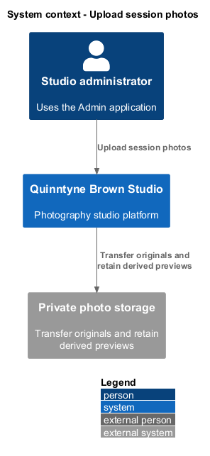
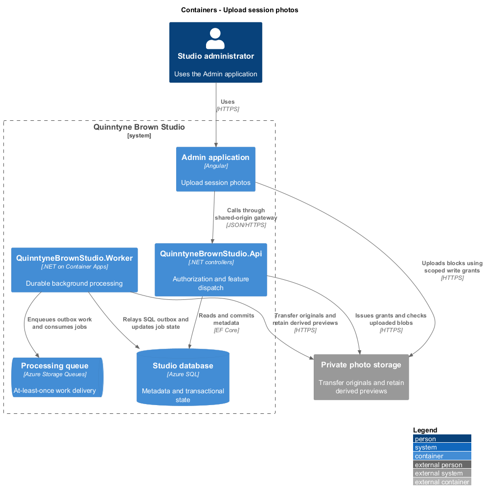
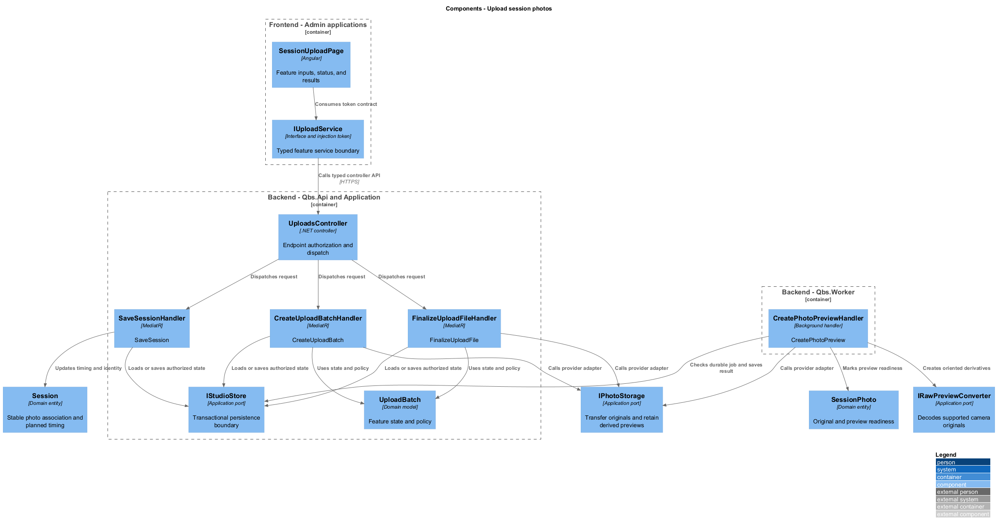
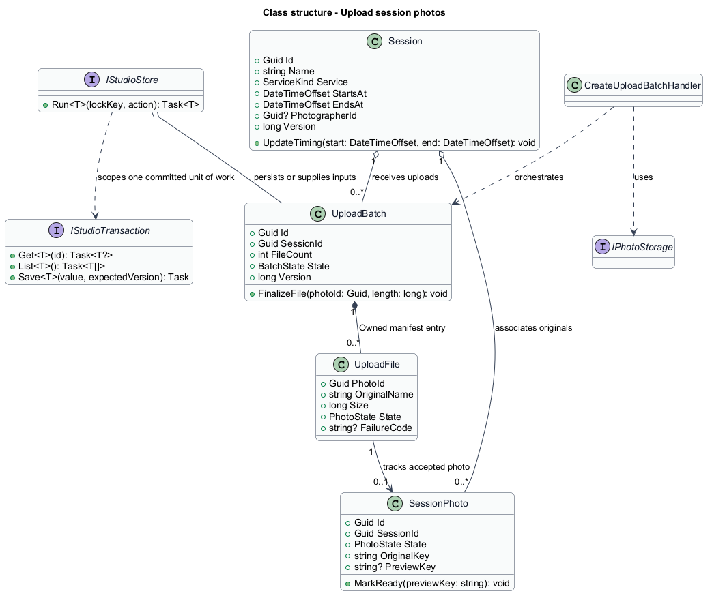
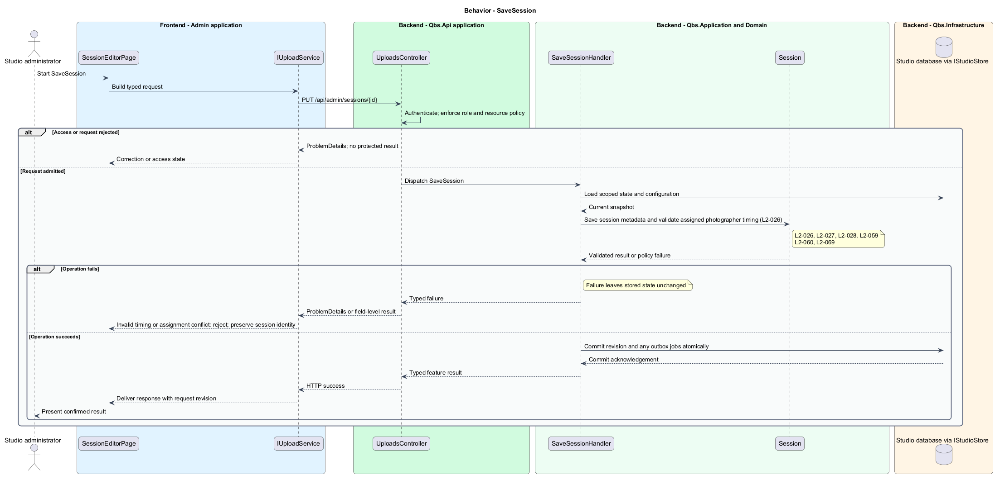
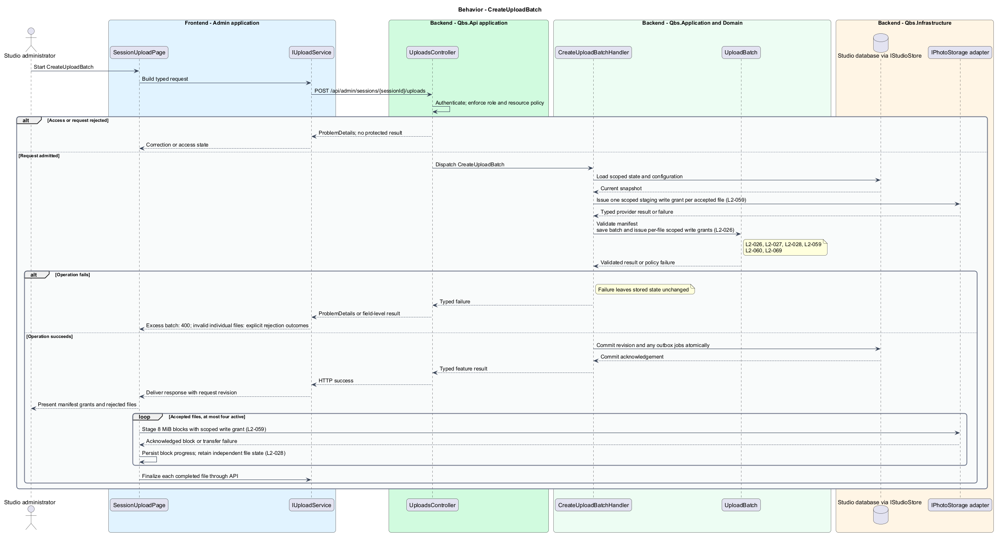
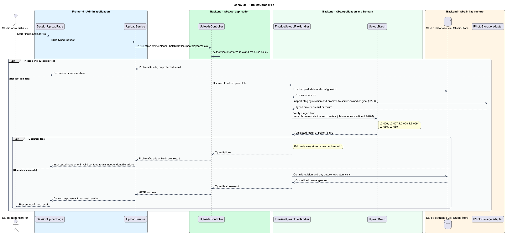
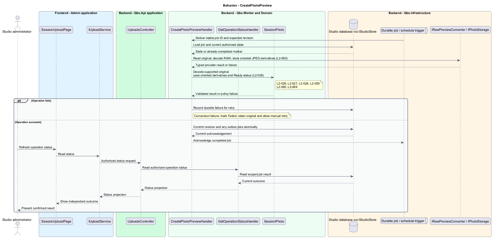
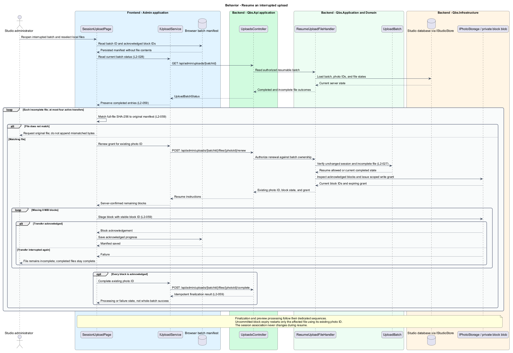

# Upload session photos

## Overview

Quinntyne Brown Studio supports photography discovery, studio administration, and client deliverables. A session is the association point for photographs from one photography assignment. An upload batch groups files selected for that session. Administrators transfer originals together and track each file through transfer and preview processing.

## Description

Status: designed for production and implemented in this repository. Delivered handler and service names consolidate some participants shown below; the [implementation report](../../../implementation/README.md) and the [acceptance register](../../acceptance.md) record the delivered structure and the evidence that remains open.

`SessionEditorPage` creates and edits session name, service, planned timing, and optional photographer assignment. `SaveSessionHandler` applies the scheduling conflict policy when a photographer is assigned. `SessionUploadPage` selects one existing session before constructing a file manifest.

`CreateUploadBatchHandler` enforces 1,000 files and records one generated photo identifier per accepted file. `IPhotoStorage` issues write grants for those exact blob keys. The UI transfers 8 MiB blocks with four active files and reports byte progress independently from `Ready` preview status. Unsupported or oversized files retain explicit rejection reasons while valid entries proceed.

`FinalizeUploadFileHandler` checks batch ownership, blob size, content identity, and session association. It commits a processing job to the SQL outbox, returning `202`. Retries use the same photo identifier and do not add another photo. Reload recovery uses persisted batch/block identifiers and requires matching local-file reselection. Network failure preserves completed files.

`CreatePhotoPreviewHandler` runs in the worker and uses `IRawPreviewConverter` for RAW originals. `SessionPhoto` advances from `Uploading` to `Processing` to `Ready`, or to `Rejected`/`Failed`. A failure is retryable only if its reason permits retry. The worker emits oriented JPEG derivatives and retains original bytes. G-RAW and G-UPLOAD remain evidence gates.

Acceptance covers session identity, mixed batches, interrupted blocks, repeat finalization, content validation, conversion failure, and the OD-04 capacity profile.

`IUploadService` is the Angular service interface consumed through its injection token. Its HTTP implementation calls `UploadsController`. The controller dispatches its route operations to the corresponding named handlers. Shared-route delegation follows the [interface catalog](../../contracts.md#route-ownership); worker operations execute from durable jobs.

**Interfaces**

- `GET /api/admin/sessions; GET /api/admin/sessions/{id}; POST /api/admin/sessions; PUT /api/admin/sessions/{id} ← name, service, startsAt, endsAt, photographerId?, expectedVersion → Session`
- `POST /api/admin/sessions/{sessionId}/uploads ← files[{clientFileId,name,size,sha256}] → UploadBatch with per-file grants/rejections`
- `GET /api/admin/uploads/{batchId} → UploadBatchStatus`
- `POST /api/admin/uploads/{batchId}/files/{photoId}/renew → write grant; POST .../complete → processing status`
- `POST /api/admin/photos/{photoId}/retry-preview → processing status`

**Behavior ownership**

| Operation | Owner | Responsibility |
| --- | --- | --- |
| `SaveSession` | `SaveSessionHandler` | Save session metadata and validate assigned photographer timing. |
| `CreateUploadBatch` | `CreateUploadBatchHandler` | Validate manifest; save batch and issue per-file scoped write grants. |
| `FinalizeUploadFile` | `FinalizeUploadFileHandler` | Verify staged blob; save photo association and preview job in one transaction. |
| `CreatePhotoPreview` | `CreatePhotoPreviewHandler` | Decode supported original; save oriented derivatives and Ready status. |

The [shared architecture](../../architecture.md) defines authorization, wire conventions, persistence, environment boundaries, and delivery constraints. The [decision baseline](../../../specs/decisions.md) supplies exact policies and remaining evidence gates. Shared architecture requirements `L2-038` through `L2-045` and delivery requirements `L2-049` through `L2-054` apply to the implemented layers of this slice.

**Acceptance mapping**

`ResumeUploadFileHandler` reads server-confirmed block state and renews the write grant for an existing incomplete photo. Before transfer, the browser computes each original's SHA-256 incrementally in a worker and records it in the file manifest. Reselection verifies the full digest without loading the complete file into memory. An expired uncommitted block restarts the affected file under the same photo identifier. A completed or finalized original receives no further write grant.

Finalization promotes the validated staging object to a server-owned original key using the inspected storage revision. The processing worker verifies the original digest before marking its preview ready. Existing browser write grants can affect staging only; they cannot overwrite an accepted original. A mismatched digest rejects the file and prevents review success.

The [acceptance register](../../acceptance.md) lists each applicable scenario with its implementing layer and current status. Feature tests exercise the success and failure behaviors described here. No production acceptance test exists merely because its scenario is designed.

## Requirements

Source: [L2 requirements](../../../specs/L2.md). Shared interface and delivery obligations have primary coverage in the engineering-delivery slice.

| L2 ID | Refines (L1) | Requirement |
| --- | --- | --- |
| `L2-001` | `L1-001` | The public and administrative applications shall support their specified tasks across the agreed desktop, tablet, and mobile viewport matrix. |
| `L2-002` | `L1-001` | The platform's interfaces shall use generous white space, clear task hierarchy, and controls limited to the specified workflows. |
| `L2-003` | `L1-001` | The platform shall restrict administrative content and operations to authorized studio administrators. This is a derived access requirement for the administrative application. |
| `L2-026` | `L1-008` | Administrators shall be able to upload a batch of large photo files originating from a camera without submitting each file individually. |
| `L2-027` | `L1-008` | Uploaded photos shall be associated with the intended photography session and remain distinguishable from photos in other sessions. |
| `L2-028` | `L1-008` | The upload experience shall report progress and distinguish successful files from rejected or failed files without presenting an incomplete batch as wholly successful. |
| `L2-059` | `L1-008` | The upload workflow shall support up to 1,000 files per batch and 250,000,000 bytes per file with resumable transfers and independent file outcomes. |
| `L2-060` | `L1-008` | The platform shall preserve accepted JPEG, CR2, CR3, NEF, ARW, and DNG originals and produce browser-viewable previews for supported camera models. |
| `L2-066` | `L1-001` | Platform interfaces shall follow the approved HTML prototype at 390, 768, and 1440 CSS-pixel widths across Chromium, Firefox, and WebKit, with keyboard-operable controls and readable validation and failure states. |
| `L2-069` | `L1-008` | Administrators shall be able to create, view, and update session records with a name, service, and planned timing as the association point for photo uploads. |

## Diagrams

The context identifies the people and systems involved in this capability. External services participate only where the description requires their data or effects.

The container view locates the participating applications and their deployed dependencies. It preserves the separation between browser interaction and persisted or background work.

The component view assigns the feature responsibilities to their architectural homes. `UploadBatch` provides the domain structure described in this slice.

The class view shows typed fields and relationships for `UploadBatch`. `UploadFile` describes the related structure used by the feature.

`SaveSession`: Save session metadata and validate assigned photographer timing. Invalid timing or assignment conflict: reject; preserve session identity.

`CreateUploadBatch`: Validate manifest; save batch and issue per-file scoped write grants. Excess batch: 400; invalid individual files: explicit rejection outcomes.

`FinalizeUploadFile`: Verify staged blob; save photo association and preview job in one transaction. Interrupted transfer or invalid content: retain independent file failure.

`CreatePhotoPreview`: Decode supported original; save oriented derivatives and Ready status. Conversion failure: mark Failed; retain original and allow manual retry.

An interrupted batch resumes from server-confirmed block acknowledgements after local-file reselection. Completed files remain complete, and repeat finalization retains the same photo identifier.

