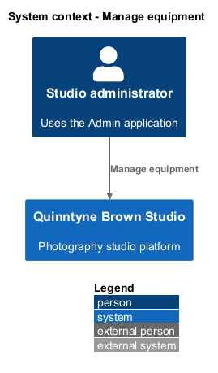
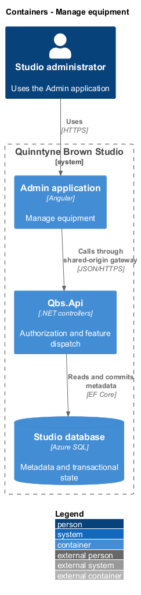
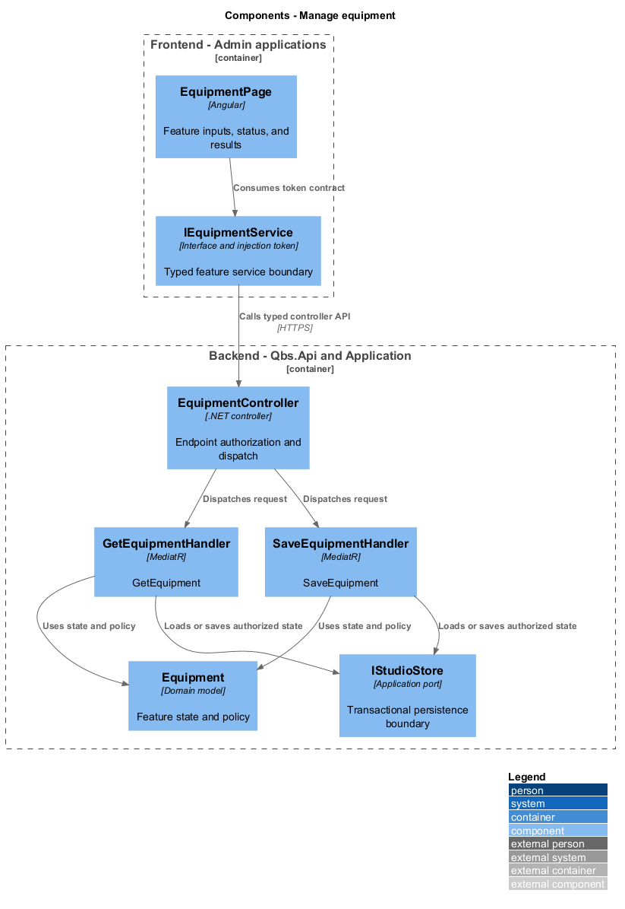
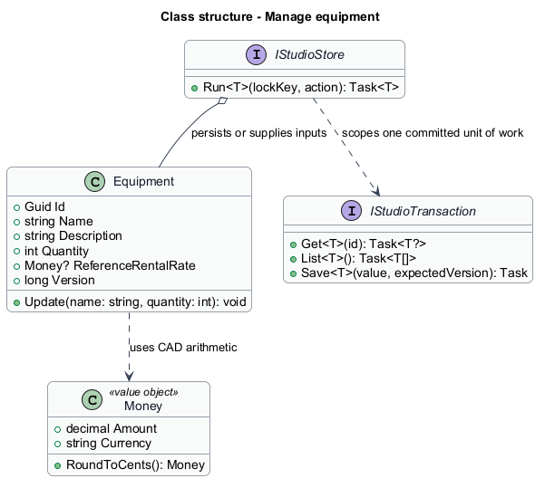
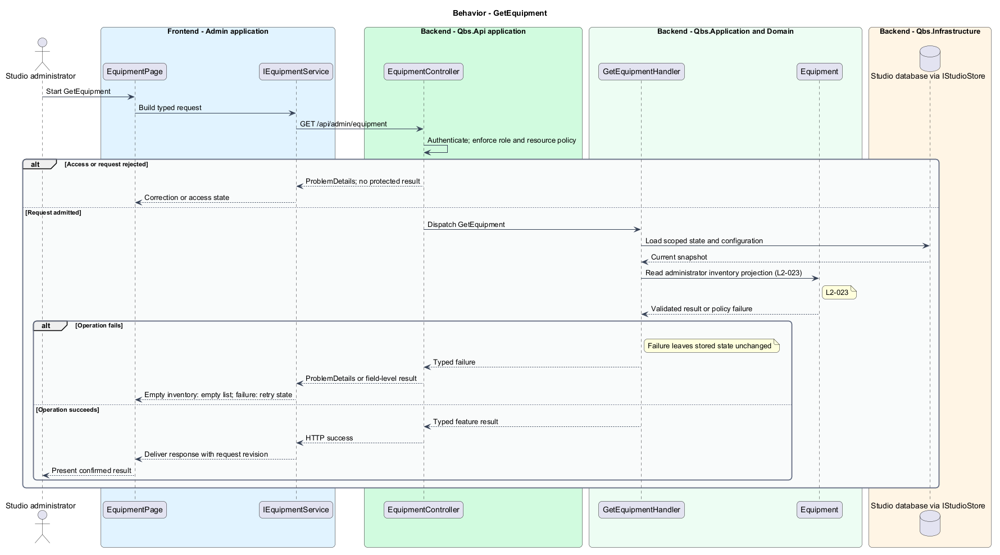
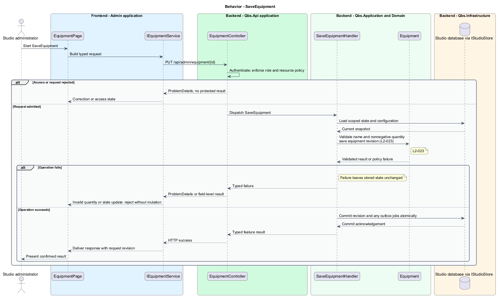

# Manage equipment

## Overview

Quinntyne Brown Studio supports photography discovery, studio administration, and client deliverables. An equipment record describes studio equipment and its recorded quantity. Administrators use this inventory to maintain studio information. The quote calculator uses the separate standard equipment-unit rate.

## Description

Status: designed for production and implemented in this repository. Delivered handler and service names consolidate some participants shown below; the [implementation report](../../../implementation/README.md) and the [acceptance register](../../acceptance.md) record the delivered structure and the evidence that remains open.

`EquipmentPage` provides list, create, and edit states. `Equipment` stores a required name, optional description, nonnegative integer quantity, and optional reference rental rate. The record identifies a maintained inventory entry, not a procurement or availability reservation.

`SaveEquipmentHandler` validates fields and expected version before persistence. Subsequent queries return saved values. Reference-rate changes do not silently override quote-rate configuration. Failed saves retain the user's draft and preserve stored values.

Acceptance covers create, reload, edit, negative quantity rejection, stale updates, access denial, and independence from configured quotation rates.

`IEquipmentService` is the Angular service interface consumed through its injection token. Its HTTP implementation calls `EquipmentController`. The controller dispatches its route operations to the corresponding named handlers. Shared-route delegation follows the [interface catalog](../../contracts.md#route-ownership); worker operations execute from durable jobs.

**Interfaces**

- `GET /api/admin/equipment → Equipment[]`
- `GET /api/admin/equipment/{id} → Equipment for its editor`
- `POST /api/admin/equipment; PUT /api/admin/equipment/{id} ← name, description, quantity, referenceRentalRate?, expectedVersion → Equipment`

**Behavior ownership**

| Operation | Owner | Responsibility |
| --- | --- | --- |
| `GetEquipment` | `GetEquipmentHandler` | Read administrator inventory projection. |
| `SaveEquipment` | `SaveEquipmentHandler` | Validate name and nonnegative quantity; save equipment revision. |

The [shared architecture](../../architecture.md) defines authorization, wire conventions, persistence, environment boundaries, and delivery constraints. The [decision baseline](../../../specs/decisions.md) supplies exact policies and remaining evidence gates. Shared architecture requirements `L2-038` through `L2-045` and delivery requirements `L2-049` through `L2-054` apply to the implemented layers of this slice.

**Acceptance mapping**

The [acceptance register](../../acceptance.md) lists each applicable scenario with its implementing layer and current status. Feature tests exercise the success and failure behaviors described here. No production acceptance test exists merely because its scenario is designed.

## Requirements

Source: [L2 requirements](../../../specs/L2.md). Shared interface and delivery obligations have primary coverage in the engineering-delivery slice.

| L2 ID | Refines (L1) | Requirement |
| --- | --- | --- |
| `L2-001` | `L1-001` | The public and administrative applications shall support their specified tasks across the agreed desktop, tablet, and mobile viewport matrix. |
| `L2-002` | `L1-001` | The platform's interfaces shall use generous white space, clear task hierarchy, and controls limited to the specified workflows. |
| `L2-003` | `L1-001` | The platform shall restrict administrative content and operations to authorized studio administrators. This is a derived access requirement for the administrative application. |
| `L2-023` | `L1-007` | Administrators shall be able to add, view, and update equipment records so the studio can maintain its equipment information. |
| `L2-066` | `L1-001` | Platform interfaces shall follow the approved HTML prototype at 390, 768, and 1440 CSS-pixel widths across Chromium, Firefox, and WebKit, with keyboard-operable controls and readable validation and failure states. |

## Diagrams

The context identifies the people and systems involved in this capability. External services participate only where the description requires their data or effects.

The container view locates the participating applications and their deployed dependencies. It preserves the separation between browser interaction and persisted or background work.

The component view assigns the feature responsibilities to their architectural homes. `Equipment` provides the domain structure described in this slice.

The class view shows typed fields and relationships for `Equipment`. Application ports separate the model from provider implementations.

`GetEquipment`: Read administrator inventory projection. Empty inventory: empty list; failure: retry state.

`SaveEquipment`: Validate name and nonnegative quantity; save equipment revision. Invalid quantity or stale update: reject without mutation.

