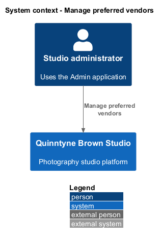
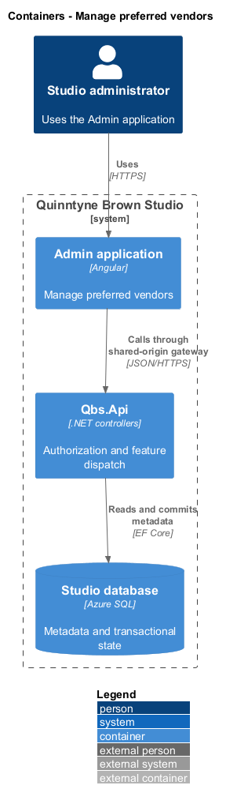
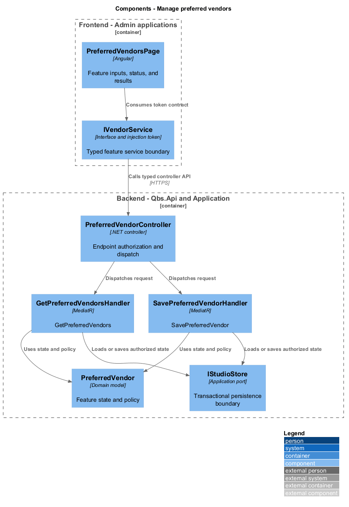
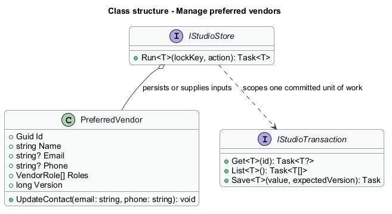
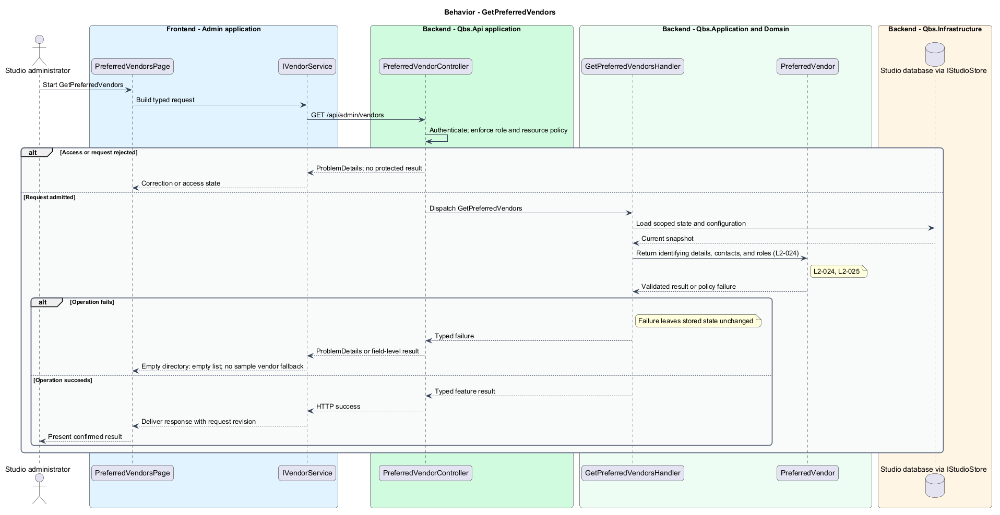
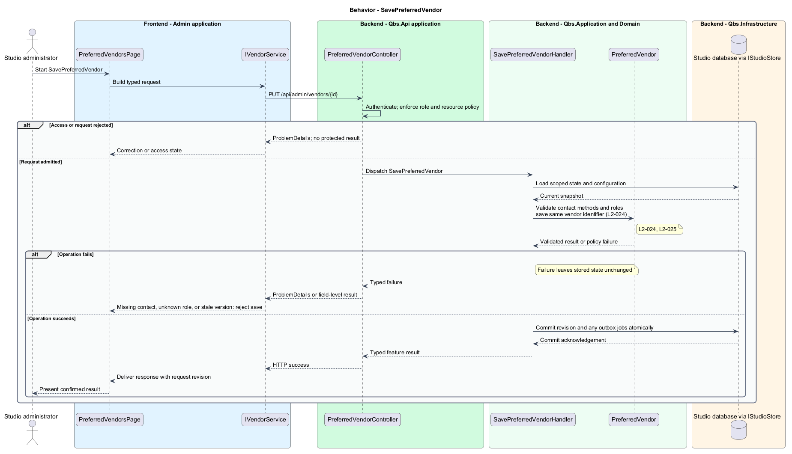

# Manage preferred vendors

## Overview

Quinntyne Brown Studio supports photography discovery, studio administration, and client deliverables. A preferred vendor is a studio-maintained contact for external photography support. Roles identify makeup artists, second shooters, and assistants. Administrators maintain the contact list without initiating procurement or outreach.

## Description

Status: designed for production and implemented in this repository. Delivered handler and service names consolidate some participants shown below; the [implementation report](../../../implementation/README.md) and the [acceptance register](../../acceptance.md) record the delivered structure and the evidence that remains open.

`PreferredVendorsPage` edits names, contact information, and a set of supported roles. A vendor can hold more than one role. `VendorRole` contains `MakeupArtist`, `SecondShooter`, and `Assistant`. The handler requires a name, at least one contact method, and at least one valid role.

`SavePreferredVendorHandler` changes an existing identifier's contact information atomically. Lists expose records only to administrators. No automatic email, staffing assignment, or procurement operation follows a save.

Acceptance covers every required role, multi-role records, contact updates retaining identity, malformed contact values, and rejected client access.

`IVendorService` is the Angular service interface consumed through its injection token. Its HTTP implementation calls `PreferredVendorController`. The controller dispatches its route operations to the corresponding named handlers. Shared-route delegation follows the [interface catalog](../../contracts.md#route-ownership); worker operations execute from durable jobs.

**Interfaces**

- `GET /api/admin/vendors → PreferredVendor[]`
- `GET /api/admin/vendors/{id} → PreferredVendor for its editor`
- `POST /api/admin/vendors; PUT /api/admin/vendors/{id} ← name, email?, phone?, roles[], expectedVersion → PreferredVendor`

**Behavior ownership**

| Operation | Owner | Responsibility |
| --- | --- | --- |
| `GetPreferredVendors` | `GetPreferredVendorsHandler` | Return identifying details, contacts, and roles. |
| `SavePreferredVendor` | `SavePreferredVendorHandler` | Validate contact methods and roles; save same vendor identifier. |

The [shared architecture](../../architecture.md) defines authorization, wire conventions, persistence, environment boundaries, and delivery constraints. The [decision baseline](../../../specs/decisions.md) supplies exact policies and remaining evidence gates. Shared architecture requirements `L2-038` through `L2-045` and delivery requirements `L2-049` through `L2-054` apply to the implemented layers of this slice.

**Acceptance mapping**

The [acceptance register](../../acceptance.md) lists each applicable scenario with its implementing layer and current status. Feature tests exercise the success and failure behaviors described here. No production acceptance test exists merely because its scenario is designed.

## Requirements

Source: [L2 requirements](../../../specs/L2.md). Shared interface and delivery obligations have primary coverage in the engineering-delivery slice.

| L2 ID | Refines (L1) | Requirement |
| --- | --- | --- |
| `L2-001` | `L1-001` | The public and administrative applications shall support their specified tasks across the agreed desktop, tablet, and mobile viewport matrix. |
| `L2-002` | `L1-001` | The platform's interfaces shall use generous white space, clear task hierarchy, and controls limited to the specified workflows. |
| `L2-003` | `L1-001` | The platform shall restrict administrative content and operations to authorized studio administrators. This is a derived access requirement for the administrative application. |
| `L2-024` | `L1-007` | Administrators shall be able to add, view, and update preferred-vendor records containing identifying and contact information. |
| `L2-025` | `L1-007` | Preferred-vendor management shall support makeup artist, second shooter, and assistant roles. |
| `L2-066` | `L1-001` | Platform interfaces shall follow the approved HTML prototype at 390, 768, and 1440 CSS-pixel widths across Chromium, Firefox, and WebKit, with keyboard-operable controls and readable validation and failure states. |

## Diagrams

The context identifies the people and systems involved in this capability. External services participate only where the description requires their data or effects.

The container view locates the participating applications and their deployed dependencies. It preserves the separation between browser interaction and persisted or background work.

The component view assigns the feature responsibilities to their architectural homes. `PreferredVendor` provides the domain structure described in this slice.

The class view shows typed fields and relationships for `PreferredVendor`. Application ports separate the model from provider implementations.

`GetPreferredVendors`: Return identifying details, contacts, and roles. Empty directory: empty list; no sample vendor fallback.

`SavePreferredVendor`: Validate contact methods and roles; save same vendor identifier. Missing contact, unknown role, or stale version: reject save.

